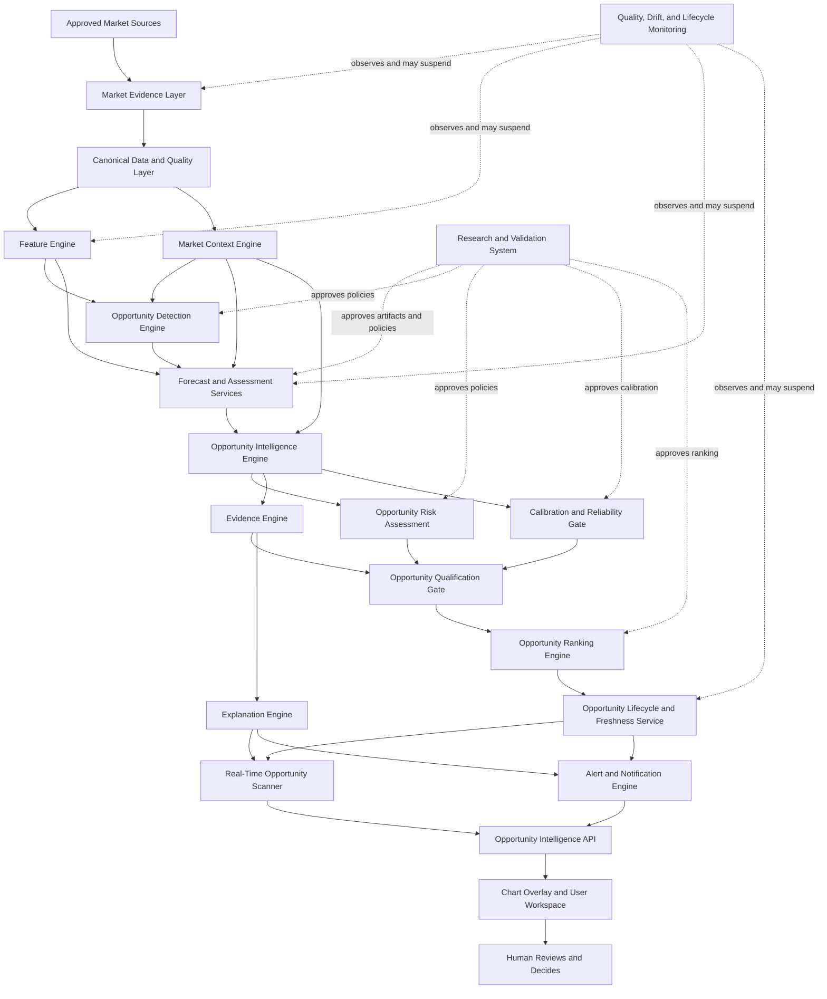
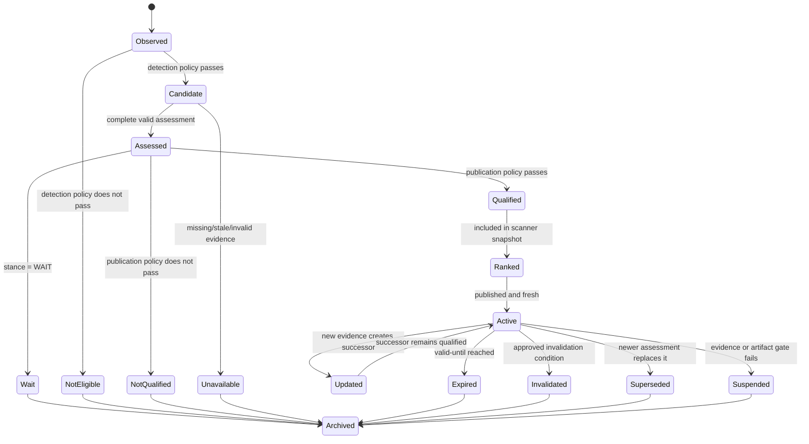

# AlphaLens v2 Architecture Evolution

**Document type:** Strategic architecture evolution  
**Date:** 2026-07-31  
**Baseline:** `ALPHALENS_V2_STRATEGIC_ARCHITECTURE_REVIEW.md`  
**Implementation status:** No implementation authorized  
**Normative status:** Advisory. This document does not amend any frozen
contract, governance document, quantitative policy, or approved baseline.

---

## 1. Purpose

This document evaluates how the AlphaLens v2 architecture should evolve under
the clarified product philosophy:

> AlphaLens continuously researches markets, discovers and ranks statistically
> attractive opportunities, explains their evidence and risk/reward, and
> alerts users. The user alone decides whether to act.

AlphaLens is not an autonomous trading system, broker, trading bot, portfolio
manager, position-sizing service, order router, or execution engine. It never
places an order, allocates capital, manages an open trade, or overrides a user.

This review does not choose a label, model, feature, score, confidence
definition, alert threshold, opportunity threshold, or trading-plan formula.
Where those decisions remain unresolved, they remain unresolved.

---

## 2. Architectural Conclusion

The refined philosophy produces a stronger long-term architecture.

The earlier phrase “generate BUY/SELL predictions” puts the model output at the
center of the product. That framing is too narrow and creates three risks:

1. it implies that every observation should produce a directional prediction;
2. it makes a model output appear equivalent to a user action; and
3. it underrepresents the contextual, evidential, freshness, ranking, and
   lifecycle work required for a useful opportunity.

The better architectural center is:

> Continuously discover, assess, rank, explain, monitor, and retire market
> opportunities.

This is not merely a terminology change. It changes the primary domain object
from a transient prediction to a versioned **Opportunity Assessment** with:

- market and timeframe identity;
- point-in-time evidence cutoff;
- detected, assessed, available, updated, and expiration timestamps;
- an assessed stance of `BUY`, `SELL`, or `WAIT`;
- eligibility and freshness state;
- market context;
- evidence and limitations;
- optional opportunity-plan information;
- optional confidence only when separately calibrated and authorized;
- ranking metadata that is explicitly not confidence;
- immutable lifecycle history.

The existing canonical Decision Contract remains useful. Its `BUY`, `SELL`, and
`WAIT` values are best understood as the directional **assessment result inside
an opportunity evaluation**, not the user's final trading decision. The
contract already says that `SELL` is a directional opportunity rather than an
exit command, `WAIT` is a completed evaluation rather than a failure, and no
field may imply execution. Those semantics align with the refined vision.

Therefore:

- the **product architecture should evolve** from a Decision Engine-centered
  architecture to an Opportunity Intelligence-centered architecture;
- the **canonical decision object should not be silently renamed or modified**;
- a future contract-change process may determine whether its public name should
  become `OpportunityAssessment`, while preserving its approved semantics and
  historical identity;
- model predictions, opportunity assessments, ranked opportunities, alerts,
  and user decisions must remain distinct objects.

---

## 3. Evidence From the Existing Baseline

The refined vision is an evolution of existing intent, not a new product.

### 3.1 Existing alignment

`ALPHALENS_V2_PRODUCT_CONTRACT.md:19-33` already defines AlphaLens as a system
that identifies, ranks, and explains statistically favorable intraday market
opportunities. It prioritizes opportunity quality over signal frequency and
makes `WAIT` first-class.

`ALPHALENS_V2_PRODUCT_CONTRACT.md:87-118` already excludes brokerage, exchange,
execution, portfolio management, position sizing, and paper trading from the v2
product boundary.

`ALPHALENS_V2_DECISION_CONTRACT.md:54-103` defines:

- `BUY` as a qualifying upward opportunity, not an order;
- `SELL` as a qualifying downward opportunity, not an exit instruction;
- `WAIT` as a valid evaluation with no qualifying directional opportunity;
- operational failure as distinct from `WAIT`.

`ALPHALENS_V2_DECISION_CONTRACT.md:432-457` prohibits any field from implying
that AlphaLens placed, routed, simulated, or managed a trade.

`ALPHALENS_V2_CONFIDENCE_POLICY.md:347-359` already separates ranking from
confidence and forbids relabeling a rank or score as confidence.

`TARGET_ARCHITECTURE.md:35-37` explicitly centers opportunity identification,
not execution. Its existing Opportunity Ranking Engine and AI Opportunity
Scanner are directly compatible with the refined vision.

`ALPHALENS_V2_STRATEGIC_ARCHITECTURE_REVIEW.md:533-670` already recommends
separate context, decision, opportunity-plan, evidence, ranking, scanner, and
monitoring concerns.

### 3.2 Existing implementation boundary

The v2 implementation currently stops at deterministic intraday data and
features:

- Kraken BTC/USD OHLCV at 5m and 15m;
- deterministic 10m derivation from complete 5m candles;
- pipeline `2.0.0`;
- registry-versioned candle geometry and true range;
- immutable feature runs, source membership, result hashes, and provenance.

There is no v2 model-ready dataset, trained model, calibrated confidence,
runtime assessment, opportunity ranking, scanner, alerting system, or overlay.
This is the correct point to clarify the architecture because later systems do
not yet depend on an incorrect opportunity abstraction.

### 3.3 Legacy boundary

The repository also contains legacy daily prediction, paper-trading, portfolio,
order simulation, and execution-risk modules. They are useful engineering and
research evidence but are not the AlphaLens v2 product.

The refined philosophy makes this boundary even clearer:

- legacy `BUY/HOLD/EXIT` is an execution-oriented vocabulary;
- v2 `BUY/SELL/WAIT` is an opportunity-assessment vocabulary;
- legacy paper positions and trades must not become v2 opportunity state;
- legacy risk rules for capital allocation, concurrent positions, stop
  execution, and daily portfolio loss are outside the v2 runtime boundary.

---

## 4. Core Domain Distinctions

Architectural correctness depends on keeping the following concepts separate.

### 4.1 Market observation

A point-in-time market fact received from an approved source. Examples include
a completed candle, trade, quote, or later-approved contextual datum.

It is not an indicator, forecast, opportunity, or decision.

### 4.2 Feature

A deterministic, versioned transformation of evidence available no later than
its declared availability timestamp.

It describes an input. It does not claim predictive value or recommend an
action.

### 4.3 Market context

A structured, point-in-time description of market state. Potential future
examples include trend, volatility regime, support/resistance zones, market
structure, liquidity conditions, time/session context, and multi-timeframe
alignment.

Context is evidence. It is not an opportunity by itself.

### 4.4 Forecast or model output

The direct output of an approved inference artifact. It may be a class score,
return estimate, barrier-outcome estimate, or another explicitly approved
quantity.

It is not automatically:

- a `BUY`, `SELL`, or `WAIT` assessment;
- an opportunity;
- confidence;
- a rank;
- a trade plan;
- an alert.

### 4.5 Opportunity candidate

A point-in-time market state that satisfies an approved detection policy and is
eligible for deeper assessment.

Detection is a computational and operational filter. It does not establish that
the candidate is statistically attractive.

### 4.6 Opportunity assessment

The canonical evaluation of a candidate using approved research evidence,
forecast outputs, context, policies, and availability constraints.

The existing Decision Contract's `BUY`, `SELL`, or `WAIT` is the directional
stance of this assessment:

- `BUY`: qualifying upward opportunity;
- `SELL`: qualifying downward opportunity;
- `WAIT`: valid evaluation, but no qualifying directional opportunity.

The assessment does not tell the user what they must do.

### 4.7 Actionable opportunity

An opportunity assessment eligible for scanner publication under an approved
qualification policy. It is:

- directionally `BUY` or `SELL`;
- fresh and unexpired;
- fully evidenced;
- not blocked by data, artifact, scope, or policy failures;
- complete for every field the publication policy requires.

An assessment may be valid without becoming an actionable opportunity.

### 4.8 Opportunity score and rank

An opportunity score is a value defined by a future approved ranking policy.
A rank is the deterministic order resulting from that policy.

Neither is confidence. Neither is a probability. Neither is position size.
Neither establishes economic value without separate evidence.

### 4.9 Alert

A delivery event stating that an opportunity reached, changed, or left an
approved notification state.

An alert is not an instruction or order. It references the immutable
opportunity assessment and communicates its current status, evidence, and
limitations.

### 4.10 User decision

The human's private choice to ignore, inspect, monitor, or act outside
AlphaLens.

AlphaLens does not infer that an alert was accepted, does not translate a user
view into an order, and does not manage consequences after the user acts.

---

## 5. Recommended Terminology Evolution

Terminology should reduce execution implications while preserving frozen
contract semantics.

| Existing term | Recommended architectural term | Disposition | Reason |
| --- | --- | --- | --- |
| Decision Engine | **Opportunity Intelligence Engine** | Evolve the layer name | The system assesses opportunities; it does not make the user's trading decision. |
| Decision | **Opportunity Assessment** in product architecture | Preserve `decision` inside the frozen contract until formally migrated | Distinguishes the system assessment from the human decision. |
| Prediction | **Forecast** or **Model Output** | Use for direct artifact output only | Prevents raw model output from becoming a recommendation. |
| Prediction API | **Opportunity Intelligence API** or **Opportunity API** | Future v2 name; do not rename legacy API implicitly | The v2 API serves assessments, opportunity state, evidence, rank, and freshness—not merely predictions. |
| Signal | **Opportunity State** or **Assessment Result** | Avoid as a primary domain noun | “Signal” commonly implies an action trigger and hides lifecycle/evidence. |
| Trade | **Opportunity** | Use unless referring to an actual external human action | AlphaLens does not execute or own trades. |
| Trade setup | **Opportunity Plan** | Align with existing Decision Contract | Entry/stop/objectives are informational and optional. |
| Trade quality | **Opportunity quality** | Preferred | Avoids implying realized execution or profitability. |
| Trade-quality score | **Opportunity score** | Only after an approved ranking specification | Keeps scoring separate from trade outcomes and confidence. |
| Risk Engine | **Opportunity Risk Assessment Engine** | Replace for v2 | Evaluates market/opportunity risk; never sizes capital or controls a portfolio. |
| Confidence Engine | **Calibration and Reliability Gate** | Preferred | Confidence is optional evidence with strict availability gates, not a generic engine output. |
| Explainability Engine | **Explanation Engine** backed by an **Evidence Engine** | Split responsibilities | Evidence is factual provenance; explanation is a constrained representation of it. |
| Scanner | **Real-Time Opportunity Scanner** | Clarify | Continuously presents fresh ranked opportunities, not raw model predictions. |
| Alert signal | **Opportunity Notification** | Preferred | Communicates state without implying execution. |
| BUY prediction | **Upward opportunity assessment (`BUY`)** | Preferred external description | Retains the canonical value while clarifying meaning. |
| SELL prediction | **Downward opportunity assessment (`SELL`)** | Preferred external description | Avoids confusion with “exit an existing position.” |
| WAIT prediction | **No qualifying opportunity (`WAIT`)** | Preferred external description | Expresses valid abstention, not model failure. |

### 5.1 Terms that must remain distinct

The architecture must not use these pairs interchangeably:

- forecast and opportunity assessment;
- assessment and user decision;
- score and confidence;
- rank and confidence;
- reason and evidence;
- limitation and failure;
- expiration and invalidation;
- `SELL` and exit;
- `WAIT` and unavailable;
- opportunity plan and executable order;
- market risk and user portfolio risk.

### 5.2 Compatibility rule

The current Product, Decision, and Confidence Contracts are frozen. New
terminology should first exist at the architectural layer as aliases with
explicit mappings. Any future contract rename must include:

- a documented architectural issue;
- exact semantic equivalence or intentional difference;
- impact on persisted identities, APIs, research artifacts, and consumers;
- compatibility and migration strategy;
- rollback strategy;
- explicit human approval.

No historical `decision` record should be rewritten merely because the
preferred architectural noun becomes `opportunity_assessment`.

---

## 6. Recommended Logical Architecture

The target architecture should evolve from a linear “features to prediction”
flow into an evidence-centered opportunity lifecycle.



This diagram defines logical responsibilities. It does not require a
microservice per box. A modular monolith remains appropriate until measured
load, latency, failure isolation, or ownership justifies extraction.

---

## 7. Layer Responsibilities and Boundaries

### 7.1 Market Evidence Layer

**Responsibility**

- receive approved market observations;
- retain provider, venue, event time, retrieval time, and availability;
- preserve immutable raw or source-equivalent evidence;
- expose no inferred market meaning.

**Inputs**

- approved provider observations.

**Outputs**

- immutable source observations and source-quality evidence.

**Boundary**

- no features, repairs, forecasts, or opportunity logic.

**Existing alignment**

The Kraken provider abstraction, ingestion batches, candle provenance, and
validation reports are reusable. Future trade, quote, book, derivatives, or
on-chain evidence requires separately approved data contracts.

### 7.2 Canonical Data and Quality Layer

**Responsibility**

- validate chronology, uniqueness, completeness, price/volume constraints, and
  interval alignment;
- derive only approved canonical observations such as 10m candles from complete
  5m evidence;
- fail closed on missing or ambiguous source evidence;
- create reproducible snapshots.

**Boundary**

- gaps and invalid observations are reported, never silently fabricated.

### 7.3 Feature Engine

**Responsibility**

- execute registered, versioned, deterministic feature definitions;
- enforce warm-up, continuity, availability, dependency order, precision,
  prefix invariance, and provenance;
- produce numeric or categorical feature evidence.

**Evolution**

The current Feature Registry remains valid. It should not absorb complex
geometric market objects merely to keep one registry. Numeric feature
definitions and context-object definitions may share availability and
provenance primitives while retaining separate semantic contracts.

**Boundary**

- a feature never becomes a recommendation, rank, or explanation by itself.

### 7.4 Market Context Engine

**Responsibility**

- create structured descriptions of market state using only evidence available
  at the assessment cutoff;
- align 5m, 10m, and 15m evidence without incomplete higher-timeframe leakage;
- potentially represent approved trend, volatility, structure, liquidity,
  support/resistance, session, and historical-similarity context.

**Outputs**

- immutable, versioned context objects;
- `available_at`;
- time and price scopes;
- source evidence references;
- definition and configuration hashes;
- explicit limitations.

**Boundary**

- context is descriptive;
- context does not independently emit `BUY`, `SELL`, `WAIT`, rank, confidence,
  entry, stop, or objective levels.

**Multi-timeframe rule**

A context object may use a higher-timeframe value only after that
higher-timeframe candle or context object is complete and available. A 15m
value must never be joined retrospectively to a 5m assessment created before
the 15m close.

### 7.5 Opportunity Detection Engine

**Responsibility**

- determine which current market states are eligible for deeper assessment;
- reduce unnecessary inference and ranking work;
- record why a candidate was detected or not detected.

**Inputs**

- fresh feature and context snapshots;
- approved detection policy.

**Outputs**

- candidate identity;
- detection timestamp;
- evidence cutoff;
- detector version and hash;
- reason codes;
- eligibility state.

**Boundary**

- detection does not assert quality;
- a detection threshold cannot be invented from model results;
- detection failures are not `WAIT`;
- a system may assess every eligible interval initially if no detection policy
  has been approved.

### 7.6 Forecast and Assessment Services

**Responsibility**

- load only approved immutable inference artifacts;
- produce the artifact's explicitly defined forecast;
- apply the approved assessment policy to produce the canonical
  `BUY`/`SELL`/`WAIT` stance.

**Separation**

The forecast service and assessment policy are distinct:

- the model can change without changing the stable opportunity-assessment
  contract;
- the assessment policy can abstain even when a forecast exists;
- model failure or missing input produces no assessment, not `WAIT`.

**Boundary**

- no capital allocation;
- no order semantics;
- no ranking by raw forecast unless a ranking policy explicitly approves it.

### 7.7 Opportunity Intelligence Engine

**Responsibility**

The Opportunity Intelligence Engine is the orchestrating domain layer. It
assembles a complete opportunity assessment from:

- candidate evidence;
- feature and context snapshot;
- forecast output;
- canonical stance;
- opportunity-risk assessment;
- evidence and explanations;
- optional calibrated confidence;
- limitations;
- availability and validity state.

It enforces atomicity: a published assessment either satisfies its complete
contract or is unavailable.

**Why it replaces “Decision Engine” as the architectural center**

The engine does not decide for the user. It creates market intelligence that
the user may consider. `BUY`, `SELL`, and `WAIT` remain the approved assessment
vocabulary inside that intelligence.

### 7.8 Opportunity Risk Assessment Engine

**Responsibility**

- describe risk inherent in the opportunity and current market context;
- evaluate the completeness and coherence of optional entry, invalidation,
  objective, duration, and reward-to-risk evidence;
- disclose volatility, liquidity, gap, freshness, ambiguity, and regime risks
  when approved definitions exist;
- withhold the entire opportunity plan when its policy requirements are not
  met.

**Outputs**

- opportunity-risk facts and limitation codes;
- optional complete opportunity plan under a future approved policy;
- risk evidence references.

**Prohibited**

- user risk tolerance;
- account balance;
- percentage allocation;
- fixed allocation;
- fractional position sizing;
- maximum portfolio exposure;
- concurrent-position controls;
- portfolio drawdown controls;
- order rejection or forced exit.

Those belong to a trader or broker, not AlphaLens v2.

### 7.9 Evidence Engine

**Responsibility**

- construct the immutable evidence graph supporting an assessment;
- link source data, feature/context runs, artifact identity, policy identity,
  forecast, risk assessment, calibration evidence, and limitations;
- validate hashes, availability, scope, and provenance before publication.

**Outputs**

- ordered evidence references;
- lineage graph;
- reproducibility manifest;
- evidence integrity state.

**Boundary**

- evidence contains facts and provenance, not a persuasive narrative.

### 7.10 Explanation Engine

**Responsibility**

- translate verified evidence and policy traces into concise factual reasons;
- distinguish market context, model behavior, policy application, and
  limitations;
- generate chart annotation objects under an approved ontology.

**Permitted explanation forms**

- deterministic reason codes and templates;
- factual context summaries;
- model-local attribution when valid for the model family;
- historical-similarity references with exact retrieval provenance;
- explicit statements of missing or unavailable evidence.

**Prohibited**

- causal claims unsupported by causal evidence;
- natural-language invention;
- converting feature importance, SHAP magnitude, agreement, or narrative
  strength into confidence;
- concealing contradictory evidence.

### 7.11 Calibration and Reliability Gate

**Responsibility**

- attach confidence only when the frozen Confidence Policy's complete gate is
  satisfied;
- verify estimand, population scope, calibration evidence, continuing validity,
  and exact decision-time scope;
- suspend or omit confidence when evidence is stale or mismatched.

**Default**

Confidence is absent.

**Boundary**

- opportunity score, model score, forecast magnitude, rank, similarity, and
  reason count are not substitutes.

### 7.12 Opportunity Qualification Gate

**Responsibility**

- determine whether a valid assessment is eligible to become a scanner
  opportunity;
- require directionality, freshness, evidence integrity, policy completeness,
  and any future approved publication criteria;
- retain excluded or `WAIT` assessments for audit without presenting them as
  actionable opportunities.

**Boundary**

- qualification rules require research and explicit approval;
- no thresholds are defined by this document.

### 7.13 Opportunity Ranking Engine

**Responsibility**

- order qualified opportunities deterministically;
- preserve component-level ranking evidence;
- resolve ties deterministically;
- prevent stale or invalid items from ranking;
- produce a valid empty result when no opportunity qualifies.

**Potential future score dimensions**

The architecture may support separately versioned components such as
opportunity quality, evidence completeness, forecast relevance, risk/reward
quality, freshness, market-context support, and stability. This list is an
interface capability, not approval to use any dimension or formula.

**Boundary**

- rank is not confidence;
- rank does not authorize user action;
- rank must not be optimized against the protected test;
- opportunity frequency is not a success metric.

### 7.14 Opportunity Lifecycle and Freshness Service

**Responsibility**

- maintain immutable versions of an opportunity;
- determine whether it is current, stale, expired, invalidated, superseded, or
  archived under approved rules;
- expose latest state while preserving full history;
- ensure updates never rewrite original evidence.

This service is essential. A prediction is a momentary value; an opportunity is
a time-bounded object whose relevance changes.

### 7.15 Real-Time Opportunity Scanner

**Responsibility**

- continuously request assessments for supported market/timeframe scopes;
- display only current, qualified, ranked opportunities;
- expose scanner coverage, last successful cycle, source freshness, and partial
  failure state;
- allow no-op cycles when nothing qualifies.

**Boundary**

- “real time” means as current as the approved data and processing availability
  permit;
- it must not imply tick-level or low-latency behavior when using completed
  candles;
- scanner failure must not become `WAIT`;
- it does not execute.

### 7.16 Alert and Notification Engine

**Responsibility**

- notify on approved opportunity lifecycle events;
- deduplicate repeated identical states;
- retain delivery audit without interpreting user action;
- link directly to the current chart and evidence.

**Candidate event categories**

The architecture should be able to represent:

- opportunity became active;
- rank materially changed under an approved rule;
- opportunity assessment updated;
- opportunity plan updated;
- confidence became available, suspended, or retired;
- opportunity expired or was invalidated;
- opportunity was superseded;
- system or evidence quality prevents assessment.

The exact notification policy, channels, throttles, and thresholds remain
unresolved.

**Boundary**

- notifications are informational;
- no “execute,” “place order,” “size,” or “auto-trade” action;
- acknowledgements are delivery state, not trades.

### 7.17 Opportunity Intelligence API and User Workspace

**Responsibility**

- expose immutable assessments, latest opportunity state, ranking snapshots,
  evidence, explanations, freshness, limitations, and system health;
- render opportunity context on the primary chart;
- keep user-facing computation out of the frontend.

**Human workflow**

The workspace should support:

1. receive or discover an opportunity;
2. inspect the chart, context, evidence, risk, limitations, freshness, and
   optional confidence;
3. compare ranked opportunities;
4. dismiss, watch, or independently act;
5. see later updates or expiration.

AlphaLens stops before the user's execution choice.

---

## 8. Opportunity Lifecycle

### 8.1 Lifecycle model



These are architectural states, not a frozen state vocabulary. Exact names and
transition rules require a future Opportunity Lifecycle Contract.

### 8.2 Opportunity identity

A stable opportunity identity should distinguish the continuing opportunity
from its immutable revisions. A future contract should define:

- `opportunity_id`;
- `assessment_id`;
- instrument and timeframe;
- detection-policy identity;
- assessment-policy identity;
- evidence cutoff;
- initial detection time;
- revision number or successor reference;
- superseded assessment;
- current lifecycle state.

Two assessments should not be merged merely because they share a direction and
instrument. Identity and continuation rules remain unresolved.

### 8.3 Freshness

Freshness is not one timestamp. The architecture should preserve:

- source event time;
- source retrieval time;
- source availability time;
- feature/context availability;
- evidence cutoff;
- candidate detection time;
- assessment availability time;
- ranking snapshot time;
- notification creation and delivery time;
- last verified time;
- valid-until or expiration time.

Freshness must be computed under an approved policy that accounts for timeframe
and source expectations. This document does not choose a tolerance.

### 8.4 Expiration

Expiration means the opportunity is no longer eligible for current
presentation because its approved validity period ended. It is not evidence
that the opportunity was wrong.

Expiration rules may depend on:

- timeframe;
- forecast horizon;
- market-context validity;
- opportunity-plan validity;
- availability of successor evidence.

Those dependencies require future approval.

### 8.5 Invalidation

Invalidation means an approved condition made the opportunity thesis no longer
valid before ordinary expiration. It must be based on evidence observed after
publication and must create a new immutable lifecycle event.

An informational stop-loss in an opportunity plan might eventually be one
invalidation reference, but this architecture does not authorize that policy.
Invalidation is not an executed exit.

### 8.6 Updates and supersession

New evidence never mutates the historical assessment. It produces a new
assessment or lifecycle revision that:

- references its predecessor;
- records the new evidence cutoff;
- recomputes only under approved current policies;
- retains old reasons, scores, rank, confidence, and plan as historical facts;
- triggers notification only under an approved update policy.

Direction changes require explicit successor semantics. A new `SELL`
assessment must not be portrayed as an order to close a user's earlier `BUY`
because AlphaLens does not know or manage the user's position.

---

## 9. Multi-Timeframe Opportunity Reasoning

Multi-timeframe reasoning should be a first-class context capability, not a
post-processing vote among three predictions.

### 9.1 Required principles

- Each timeframe retains its independent evidence and availability.
- A lower timeframe may consume higher-timeframe context only after the higher
  timeframe is complete.
- Derived 10m evidence retains its shared 5m provenance.
- Shared source observations are recorded so evidence is not treated as
  statistically independent.
- Agreement is descriptive confluence, not confidence.
- Disagreement is evidence and must not be hidden.
- The primary opportunity timeframe remains explicit.
- Context timeframes do not silently change the label horizon or assessment
  meaning.

### 9.2 Recommended representation

A future multi-timeframe context object should contain:

- primary timeframe;
- context timeframe;
- context evidence cutoff;
- availability timestamp;
- source run and hash;
- context definition and version;
- structured value or state;
- alignment rule;
- staleness state;
- limitations;
- shared-source reference.

### 9.3 Prohibited shortcuts

- using the final value of an incomplete 15m candle for a 5m assessment;
- forward-filling higher-timeframe values before their first availability;
- majority voting and labeling it confidence;
- treating 5m, derived 10m, and 15m evidence as independent confirmations;
- choosing a confluence rule after reviewing protected outcomes.

---

## 10. Liquidity and Market-Context Representation

The current OHLCV evidence cannot directly represent executable liquidity,
spread, order-book imbalance, or price-at-volume.

The architecture should support future context families without claiming they
already exist:

| Context family | Required evidence boundary | Architectural treatment |
| --- | --- | --- |
| Trend and volatility | Completed candles and approved features | Versioned context objects |
| Support/resistance | Deterministic point-in-time zone definitions | Geometry with price/time scope and confirmation availability |
| Market structure | Approved pivot and transition ontology | Versioned structural events; no repainting |
| Fair Value Gaps | Approved deterministic candle-geometry ontology | Context object with creation, fill, invalidation, and availability |
| Order blocks | Formal non-discretionary definition required | Defer until falsifiable specification exists |
| Candle-level volume context | OHLCV volume | Explicitly identified proxy |
| True VWAP and Volume Profile | Trade price/size evidence | Add only after approved trade-data contract |
| Liquidity zones and imbalance | Quote/book/trade evidence | Add only after approved microstructure contract |
| Session context | UTC time evidence; BTC is continuous | Descriptive time context, not assumed exchange sessions |
| Regime context | Approved point-in-time estimators | Continuous values plus separately approved states |

Every context object must say whether it is observed, deterministically derived,
or a proxy. A proxy must never be displayed under the name of the unobserved
quantity.

---

## 11. Historical Similarity Retrieval

Historical similarity can improve explanation and research, but it must not
become an ungoverned source of confidence.

### 11.1 Architectural role

A future Similarity Retrieval Service may:

- retrieve prior feature/context states comparable to the current assessment;
- return immutable references to historical observations;
- describe the distance function, feature schema, normalization, population,
  index snapshot, and retrieval time;
- expose subsequent historical outcomes only when the use case permits them.

### 11.2 Point-in-time separation

Two distinct modes are required:

**Research mode**

- may inspect outcomes of historical neighbors;
- must remain inside approved development partitions;
- must respect purge, embargo, and protected-test isolation;
- any similarity definition used by a model or assessment becomes part of the
  preregistered research configuration.

**Runtime explanation mode**

- may retrieve only from an approved historical reference corpus;
- must not include future information relative to each historical origin's
  feature construction;
- must identify when the corpus snapshot was frozen;
- cannot present observed neighbor outcomes as a probability or confidence
  without an approved calibration protocol.

### 11.3 Risks

- distance concentration and arbitrary scaling;
- changing neighbors when the corpus grows;
- hidden look-ahead through normalization or index construction;
- regime mismatch;
- multiple-testing and narrative cherry-picking;
- confusing analogy with causal evidence.

The service should therefore be optional evidence, never the system's
unexamined core.

---

## 12. Opportunity Quality, Scoring, and Ranking

### 12.1 Architectural distinction

The architecture should distinguish:

- **eligibility:** may this state be assessed?
- **stance:** `BUY`, `SELL`, or `WAIT`;
- **qualification:** may this assessment be published as an opportunity?
- **opportunity score:** a future policy-defined ordering value;
- **rank:** relative deterministic order in a scanner snapshot;
- **confidence:** an optional calibrated statistical quantity;
- **risk/reward:** optional plan-derived information;
- **realized outcome:** later evidence, never known at publication.

### 12.2 Scoring design principle

Do not create one opaque “AI score.” If opportunity scoring is later approved,
the stored result should preserve:

- score policy identity and version;
- component names and values;
- required inputs;
- component availability;
- normalization population and snapshot;
- missing-component policy;
- aggregate formula;
- tie-breaking;
- configuration and result hashes;
- evidence references;
- limitations.

The displayed aggregate must never conceal a failed mandatory component.

### 12.3 Trade-quality terminology

“Trade quality” should be avoided because AlphaLens does not observe or own the
user's execution. “Opportunity quality” is the correct architectural term.
Even opportunity quality is not self-defining; it requires an approved
estimand and evaluation methodology.

### 12.4 Ranking stability

Ranking should record:

- the complete candidate set;
- exclusions;
- score components;
- ordering and tie rules;
- snapshot timestamp;
- source freshness;
- rank changes;
- result hash.

A rank can change because another opportunity appears even if the underlying
assessment does not. Rank change and assessment change are distinct events.

---

## 13. Human-in-the-Loop Model

The human remains final because the system boundary ends at intelligence
delivery.

### 13.1 AlphaLens responsibilities

- continuously collect and validate approved evidence;
- discover candidates;
- assess opportunities;
- abstain when no opportunity qualifies;
- rank current opportunities;
- explain supporting and conflicting evidence;
- disclose limitations, freshness, expiration, and optional calibrated
  confidence;
- notify users of material lifecycle events;
- preserve reproducibility and audit history.

### 13.2 Human responsibilities

- interpret the information in their own context;
- decide whether to ignore, monitor, or act;
- choose venue, order type, timing, capital, leverage, and position size outside
  AlphaLens;
- manage any resulting position and risk outside AlphaLens.

### 13.3 Explicitly absent bridge

The architecture must contain no internal path from:

- `BUY` or `SELL` to an order;
- opportunity rank to capital allocation;
- confidence to leverage;
- entry/stop/objective information to broker instructions;
- an alert acknowledgement to a trade;
- a user's historical action to automatic future execution.

### 13.4 User feedback

Future feedback may be useful for product usability, such as whether an
explanation was clear. It must not silently become:

- a market label;
- a model target;
- ground-truth profitability;
- an implicit trade record;
- a reason to tune against protected evidence.

Any research use of user feedback requires a separate approved data and
research protocol.

---

## 14. Real-Time Scanning, Ranking, and Notifications

### 14.1 Continuous cycle

An approved runtime cycle should logically perform:

1. verify provider and source freshness;
2. ingest new complete observations;
3. validate and promote canonical evidence;
4. compute new feature and context snapshots;
5. detect eligible candidates;
6. generate approved forecasts;
7. create opportunity assessments;
8. evaluate opportunity risk and evidence completeness;
9. attach confidence only when authorized;
10. qualify and rank opportunities;
11. create immutable lifecycle updates;
12. publish scanner snapshots;
13. emit deduplicated notifications;
14. record monitoring and provenance.

This sequence is conceptual. It does not authorize scheduling, thresholds, or
runtime implementation.

### 14.2 Failure semantics

| Condition | Correct state | Incorrect representation |
| --- | --- | --- |
| No new complete candle | No new assessment | `WAIT` |
| Provider unavailable | Operationally unavailable | `WAIT` |
| Feature/context incomplete | Assessment unavailable | `WAIT` |
| Valid assessment finds no opportunity | `WAIT` | Error |
| Assessment valid but publication gate fails | Not qualified | `WAIT` unless the assessment itself is WAIT |
| Opportunity too old | Stale/expired | `WAIT` |
| Confidence unavailable | Confidence field absent | Zero confidence |
| No qualified opportunities | Valid empty scanner | System failure |
| Notification delivery fails | Delivery failure; opportunity unchanged | Opportunity invalid |

### 14.3 Scheduling and concurrency

The architecture should eventually define:

- per-timeframe close schedules;
- source and processing lateness expectations;
- cycle identity and idempotency;
- single-writer or lease semantics;
- retry and backoff;
- partial timeframe failure;
- deterministic ordering under concurrent completion;
- recovery from missed cycles;
- duplicate notification suppression.

No specific scheduler or infrastructure technology is selected here.

### 14.4 Notification content

An opportunity notification should be a projection of canonical evidence, not a
new source of business logic. It may include only fields already valid in the
referenced opportunity version:

- market and timeframe;
- assessed stance;
- concise reason summary;
- detected/available time;
- freshness and expiration;
- optional complete opportunity plan;
- optional authorized confidence;
- current rank and ranking timestamp;
- material limitations;
- deep link to chart and evidence.

---

## 15. Contradictions and Required Reconciliation

The refined vision is mostly compatible with frozen contracts. The following
issues require deliberate future reconciliation.

### 15.1 “Decision” may be mistaken for the user's decision

**Existing text**

- Product Contract asks, “What is the current decision?”
- Target Architecture names a Decision Engine.
- Decision Contract names the canonical object and field `decision`.

**Issue**

The semantics are correct, but the noun can imply that AlphaLens decides
whether the user should trade.

**Recommended resolution**

- use Opportunity Intelligence Engine as the architectural layer;
- describe the canonical `decision` value as an assessed directional stance;
- consider a future contract alias or versioned migration to
  `OpportunityAssessment` only through Phase 1 change control;
- preserve historical field meanings.

**Evidence**

- `ALPHALENS_V2_PRODUCT_CONTRACT.md:26-33,67-72`
- `ALPHALENS_V2_DECISION_CONTRACT.md:34-104`
- `TARGET_ARCHITECTURE.md:141-170`

### 15.2 “Prediction API” is narrower than the intended v2 interface

**Existing text**

`TARGET_ARCHITECTURE.md:274-303` names a Prediction API while describing
opportunity, decision, rank, scanner, and overlay payloads.

**Issue**

The name centers model output and can conflate forecast with opportunity.

**Recommended resolution**

Name the future v2 public boundary Opportunity Intelligence API or Opportunity
API. Preserve the existing legacy Prediction API as a versioned historical
interface until explicitly retired.

**Evidence**

- `TARGET_ARCHITECTURE.md:274-303`
- `backend/app/api/application.py:331-452` serves legacy forward-log-return
  prediction semantics
- Strategic Review `:364-382`

### 15.3 Product pillars still call the subsystem “AI Decision Engine”

**Existing text**

`ALPHALENS_V2_PRODUCT_CONTRACT.md:67-72`.

**Issue**

The product contract's intent is opportunity assessment, but the layer name is
less precise under the refined philosophy.

**Recommended resolution**

Do not edit it in this phase. Record this as a candidate architectural issue
for the formal contract-change process, with Opportunity Intelligence Engine as
the preferred replacement name.

### 15.4 BUY/SELL/WAIT labels and assessments share vocabulary

**Existing text**

Candidate C uses `BUY`, `SELL`, and `WAIT` as future-outcome research labels.
The Decision Contract uses the same values as runtime assessment semantics.

**Issue**

A ground-truth label and a runtime assessment are different objects. Identical
strings can lead to accidental conflation.

**Recommended resolution**

Use explicit type names such as `OutcomeLabel` and `OpportunityStance`.
Retain the approved string vocabulary but never infer that the label generator
is the decision engine.

**Evidence**

- `backend/app/labels/contracts.py:33-44`
- `ALPHALENS_V2_LABELING_SPECIFICATION.md`
- `ALPHALENS_V2_DECISION_CONTRACT.md:34-104`

### 15.5 Legacy risk and paper-trading architecture conflicts with v2

**Existing implementation**

`backend/app/backtesting/risk/`, `backend/app/paper_trading/`, portfolio
simulation, order execution, trade history, and related frontend pages.

**Issue**

These modules manage capital and simulated execution concepts that the refined
vision explicitly excludes.

**Recommended resolution**

Preserve them as immutable legacy engineering artifacts but do not reuse them
as v2 Opportunity Risk Assessment. Future removal or archival must follow the
approved migration order and must not delete historical research evidence.

**Evidence**

- `backend/app/backtesting/risk/config.py`
- `backend/app/backtesting/risk/portfolio.py`
- `backend/app/paper_trading/portfolio.py`
- `frontend/app/paper-trading/`
- `frontend/app/portfolio/`
- Product Contract `:87-118`

### 15.6 Entry, stop, take-profit, and risk/reward can resemble execution

**Existing text**

The Decision Contract permits an optional informational opportunity plan.

**Issue**

Without careful language, users may interpret the plan as an executable order
or individualized risk instruction.

**Recommended resolution**

Keep the existing atomic opportunity-plan contract. Place it under Opportunity
Risk Assessment, prohibit position sizing and account context, and preserve its
informational status. A separate approved quantitative policy remains required.

**Evidence**

- `ALPHALENS_V2_DECISION_CONTRACT.md:287-307,386-402`
- Strategic Review `:463-478`

### 15.7 “Confidence,” “quality,” and “rank” remain easy to conflate

**Issue**

The refined vision introduces opportunity scoring and trade-quality language,
which could create an uncalibrated confidence proxy.

**Recommended resolution**

Use opportunity score only under a ranking policy, keep component meanings
explicit, and never display it as confidence. Confidence remains absent until
the frozen policy is satisfied.

**Evidence**

- `ALPHALENS_V2_CONFIDENCE_POLICY.md:347-371,441-461`
- Phase 3 Baseline `:541-565`

### 15.8 Alerting is required by the refined vision but not contracted

**Issue**

The current target architecture includes scanner freshness but no complete
alert/notification lifecycle contract.

**Recommended resolution**

Add a future logical Alert and Notification Engine plus a notification
contract. Do not select channels, thresholds, delivery guarantees, or
deduplication policies until approved.

**Evidence**

- `TARGET_ARCHITECTURE.md:206-238`
- no v2 notification contract or implementation exists

---

## 16. Concepts That Should Remain Unchanged

The refined philosophy strengthens rather than weakens the following approved
principles:

1. inspect and understand before implementation;
2. frozen architecture and contract change control;
3. statistically defensible, auditable, explainable, reproducible research;
4. no fabricated data, predictions, probability, confidence, metrics, or
   functionality;
5. no look-ahead bias or future information;
6. chronological validation only;
7. explicit leakage, survivorship-bias, and data-snooping safeguards;
8. exact point-in-time availability;
9. complete-candle semantics;
10. immutable provenance and SHA-256 identities;
11. prefix invariance;
12. deterministic repeatability;
13. fail-closed behavior;
14. explicit warm-up and missing-data handling;
15. `WAIT` as first-class;
16. operational failure distinct from `WAIT`;
17. confidence unavailable by default;
18. ranking distinct from confidence;
19. historical records superseded, never silently overwritten;
20. no trading execution or capital management.

---

## 17. Architectural Decision Summary

| Question | Conclusion |
| --- | --- |
| Is the refined philosophy stronger? | Yes. It makes opportunity quality, evidence, lifecycle, and human agency primary. |
| Should the product evolve beyond “generate BUY/SELL predictions”? | Yes. The primary workflow should continuously discover and rank high-quality opportunities. |
| Should BUY/SELL/WAIT disappear? | No. They remain valid assessed stances inside the canonical opportunity assessment. |
| Should Decision Engine remain the central layer name? | No. Opportunity Intelligence Engine is architecturally clearer. |
| Should the frozen Decision Contract be edited now? | No. Any rename requires formal change control and compatibility analysis. |
| Is a raw model prediction an opportunity? | No. It is one possible input to assessment. |
| Is rank confidence? | No. |
| Is an opportunity score confidence? | No. |
| Does a plan authorize execution? | No. It is optional informational context. |
| Should AlphaLens size positions or manage capital? | No. |
| Is a Market Context Engine needed? | Yes. It should be descriptive, versioned, point-in-time, and separate from assessment. |
| Is an Opportunity Detection Engine needed? | Yes, as an approved eligibility layer; it does not establish quality. |
| Is an Evidence Engine needed? | Yes, to own lineage and integrity independently from narrative explanation. |
| Is an Opportunity Risk Assessment Engine needed? | Yes, but it must exclude portfolio and capital management. |
| Is a lifecycle service needed? | Yes. Opportunity freshness, updates, expiration, invalidation, and supersession are core domain concerns. |
| Is an Alert and Notification Engine needed? | Yes, as informational delivery with immutable audit and no execution path. |
| Is historical similarity useful? | Potentially, as governed evidence/retrieval—not as automatic confidence. |
| Does this document approve any score, threshold, model, or policy? | No. |

---

## 18. Recommended Future Contract Work

This list identifies architecture dependencies only. It does not authorize
their creation.

1. **Opportunity Assessment compatibility specification**  
   Map the frozen Decision Contract to the opportunity-centric architecture
   without changing historical semantics.

2. **Market Context Contract**  
   Define context object identity, availability, geometry, provenance,
   limitations, and multi-timeframe alignment.

3. **Opportunity Detection Contract**  
   Define candidate identity, eligibility, reason codes, and failure states.

4. **Opportunity Lifecycle Contract**  
   Define identity, revisions, freshness, expiration, invalidation,
   supersession, suspension, and archival.

5. **Opportunity Qualification and Ranking Specification**  
   Define eligible population, score meanings, components, ordering, ties,
   stability, and evaluation without inventing confidence.

6. **Opportunity Risk and Plan Specification**  
   Define market/opportunity risk and optional plan semantics while explicitly
   excluding capital allocation and execution.

7. **Evidence and Explanation Contract**  
   Define evidence graphs, reason taxonomies, annotations, factual language,
   attribution, and limitations.

8. **Alert and Notification Contract**  
   Define lifecycle events, deduplication, freshness, delivery evidence,
   failure states, and human-safe content.

9. **Runtime Monitoring and Suspension Policy**  
   Define data, feature, artifact, assessment, confidence, scanner, and
   notification health gates.

Every item must preserve Phase 1 change control and research governance.

---

## 19. Assumptions and Unknowns

### Verified

- AlphaLens v2 is opportunity-oriented and does not execute trades.
- The existing Product Contract already prioritizes opportunity quality and
  ranking.
- The Decision Contract already defines non-executable BUY/SELL/WAIT semantics.
- The Confidence Policy already separates confidence from rank.
- The current v2 implementation has no decision, ranking, scanner, alert, or
  overlay runtime.
- Current v2 market evidence is completed-candle OHLCV only.

### Unresolved

- whether the frozen Decision Contract will eventually be renamed or merely
  wrapped by an Opportunity Assessment contract;
- opportunity identity and continuation rules;
- detection and publication policies;
- freshness tolerances;
- expiration and invalidation rules;
- update and notification thresholds;
- opportunity-quality estimand;
- score components and ranking formula;
- market-context ontologies;
- multi-timeframe reasoning policy;
- opportunity-plan quantitative definitions;
- historical-similarity distance, corpus, and use;
- confidence estimand and calibration protocol;
- alert channels, delivery guarantees, and rate limits;
- scanner cadence and scheduling technology;
- future market-data providers and microstructure evidence.

### Human approval required

Every unresolved item above requires research, a specification, or both before
implementation. This document supplies no default value.

---

## 20. Final Architecture Position

AlphaLens should evolve from a system conceptually centered on model
predictions into a system centered on **living, evidence-backed market
opportunities**.

The architectural unit presented to a user should not be “a model predicted
BUY.” It should be:

> At this evidence cutoff, AlphaLens identified and assessed this market
> opportunity; here is the directional stance, supporting and conflicting
> context, risk and optional plan, freshness, limitations, rank, and—only when
> statistically authorized—confidence.

The user then decides.

This evolution preserves the repository's strongest principles:

- evidence before narrative;
- context before recommendation;
- assessment before ranking;
- abstention before forced output;
- calibration before confidence;
- immutable history before mutable dashboards;
- human agency before automation.

The existing logical architecture does not need to be discarded. It needs to
be re-centered:

```text
Market evidence
    ↓
Canonical data quality
    ↓
Features + market context
    ↓
Opportunity detection
    ↓
Forecast + opportunity assessment
    ↓
Evidence + opportunity risk + optional calibrated confidence
    ↓
Qualification + ranking
    ↓
Lifecycle + freshness
    ↓
Scanner + notifications + chart explanation
    ↓
Human review and decision
```

There is intentionally no execution arrow after the human.

---

## 21. Scope Confirmation

This architecture evolution:

- modifies no code;
- modifies no contract;
- modifies no governance document;
- creates no quantitative policy;
- chooses no feature, model, threshold, score, confidence meaning, or alert
  rule;
- creates no migration or database change;
- authorizes no implementation.

It is a strategic architecture recommendation only.
