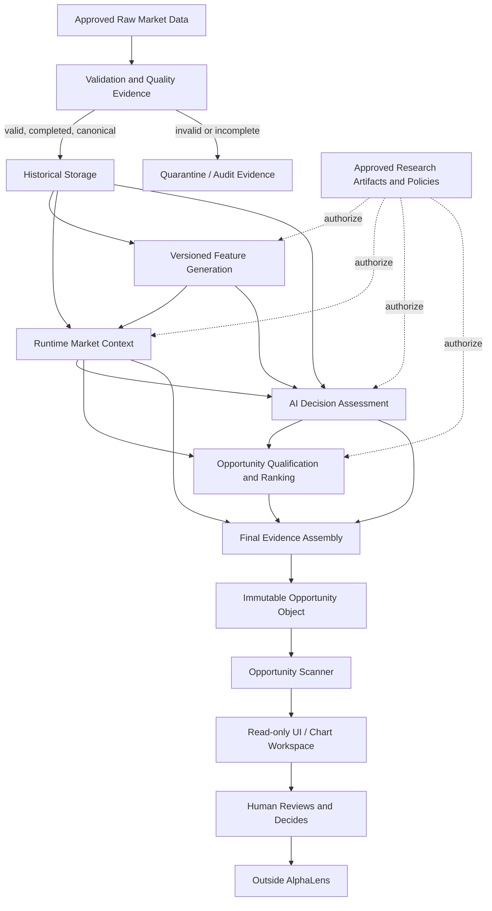
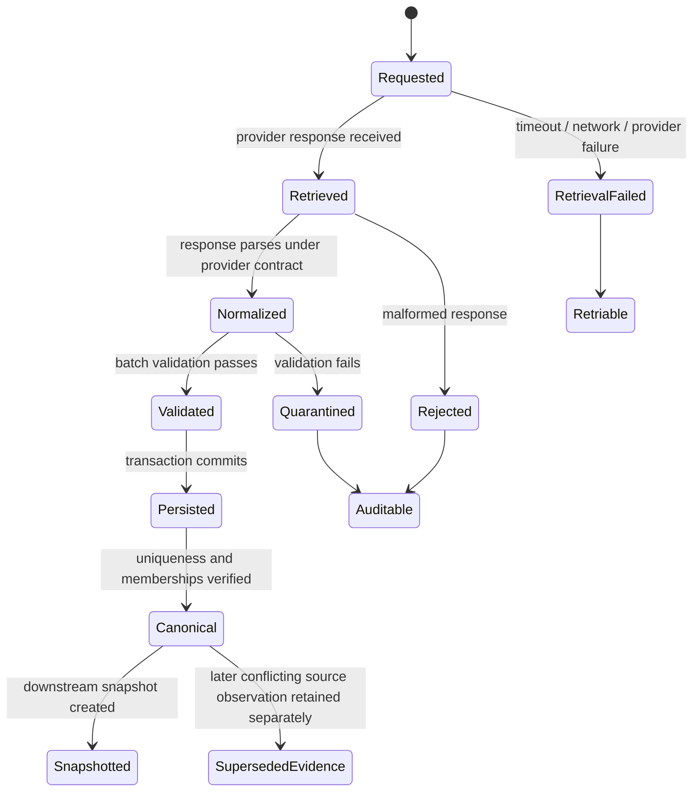
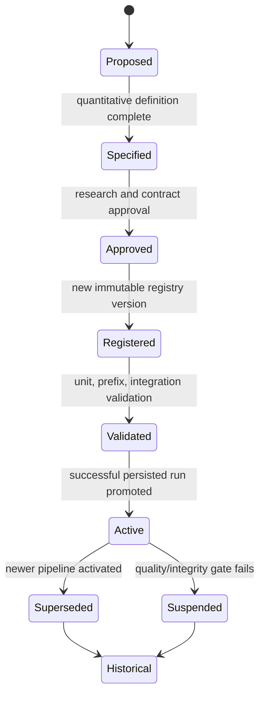
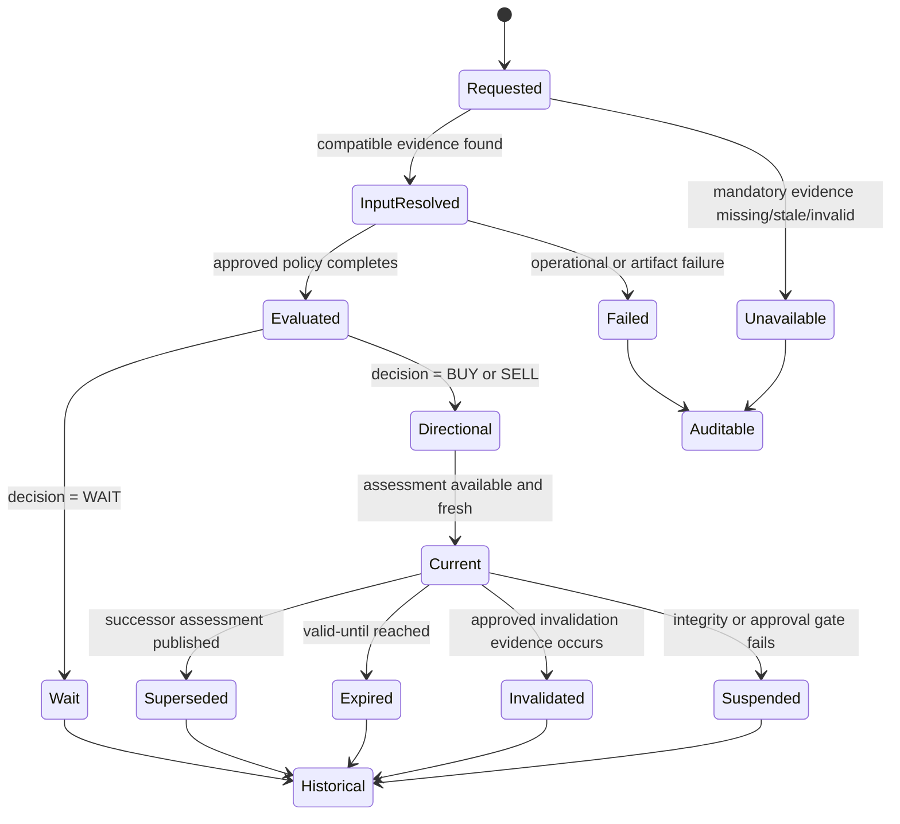
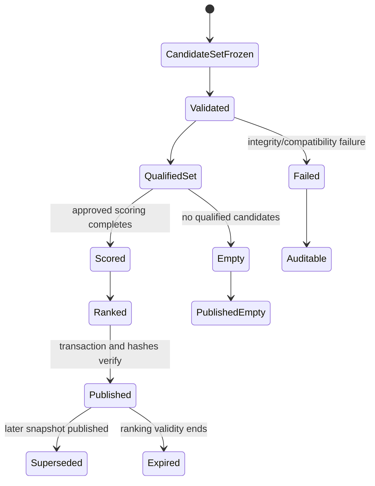
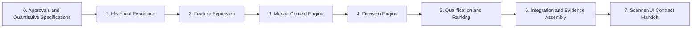

# AlphaLens v2 Core Intelligence Specification

**Document type:** Engineering architecture specification

**Status:** Proposed implementation blueprint; requires approval before implementation

**Scope:** Core intelligence pipeline from approved market evidence through ranked opportunities

**Product boundary:** Read-only market intelligence and human decision support

---

## 0. Purpose, Authority, and Scope

This specification defines how five AlphaLens v2 systems must interact:

1. v2 Intraday Historical Data Expansion;
2. v2 Intraday Feature Expansion;
3. Runtime Market Context Engine;
4. AI Decision Engine; and
5. Opportunity Ranking Engine.

It extends the approved repository architecture. It does not replace the
Product Contract, Decision Contract, Confidence Policy, phase baselines,
research governance, migration blueprint, implementation order, component
audit, or risk assessment. Those artifacts remain authoritative within their
respective scopes.

This document defines responsibilities, boundaries, contracts, lifecycles,
compatibility rules, implementation sequencing, and acceptance gates. It does
not approve:

- a new market-data provider;
- a new quantitative feature formula;
- feature parameters or thresholds;
- a model family or trained artifact;
- a runtime `BUY`, `SELL`, or `WAIT` policy;
- an entry, stop-loss, take-profit, risk/reward, or hold-time policy;
- a confidence meaning or calibration method;
- an opportunity score, weight, threshold, or ranking formula;
- a service decomposition, queue, cache product, or deployment topology; or
- scanner, alert, API, chart, or frontend implementation.

Those decisions require their own approved research or contract artifacts.
Where this specification needs such a value, it defines the interface and
marks the value as unresolved rather than guessing.

### 0.1 Governing references

The following repository artifacts govern this specification:

- `AGENTS.md`;
- `RESEARCH_CONSTITUTION.md`;
- `ALPHALENS_V2_PROJECT_CONSTITUTION.md`;
- `ALPHALENS_V2_PRODUCT_CONTRACT.md`;
- `ALPHALENS_V2_DECISION_CONTRACT.md`;
- `ALPHALENS_V2_CONFIDENCE_POLICY.md`;
- `ALPHALENS_V2_PHASE_1_BASELINE.md`;
- `ALPHALENS_V2_INTRADAY_DATA_CONTRACT.md`;
- `ALPHALENS_V2_PHASE_3_BASELINE.md`;
- `ALPHALENS_V2_TIER_A_FEATURE_SPECIFICATION.md`;
- `ALPHALENS_V2_RESEARCH_PROTOCOL.md`;
- `ALPHALENS_V2_DATASET_SPECIFICATION.md`;
- `ALPHALENS_V2_LABELING_SPECIFICATION.md`;
- `ALPHALENS_V2_LABELING_STRATEGY_RECOMMENDATION.md`;
- `ALPHALENS_V2_CANDIDATE_C_QUANTITATIVE_POLICY.md`;
- `ALPHALENS_V2_ARCHITECTURE_EVOLUTION.md`;
- `ALPHALENS_V2_MIGRATION_PLAN.md`;
- `COMPONENT_AUDIT.md`;
- `IMPLEMENTATION_ORDER.md`;
- `TARGET_ARCHITECTURE.md`;
- `RISK_ASSESSMENT.md`; and
- the repository technical audit in `ARCHITECTURE.md`.

### 0.2 Normative language

The terms **must**, **must not**, **required**, and **prohibited** describe
mandatory behavior. **Should** describes a preferred behavior that may be
changed only through a documented design decision. **May** describes an
allowed option, not an implemented capability.

### 0.3 Verified implementation baseline

The specification relies on, and does not duplicate, these verified
foundations:

| Foundation | Existing implementation | Required treatment |
| --- | --- | --- |
| Provider abstraction and Kraken connectivity | `backend/app/market_data/provider.py`, `kraken.py`, `models.py` | Reuse and extend only through approved provider contracts. |
| Historical and intraday acquisition | `backend/app/market_data/history.py` | Reuse pagination, progress, native 5m/15m retrieval, and deterministic 10m derivation; extend historical coverage without changing existing evidence. |
| Candle validation | `backend/app/market_data/validation.py` | Reuse chronology, duplicate, gap, completeness, OHLC, volume, and interval-alignment validation. |
| Canonical candle persistence and ingestion audit | `backend/app/persistence/candles.py`, `intraday.py`, persistence models and migrations | Preserve idempotency, immutable batches, exact values, provenance, and canonical uniqueness. |
| v2 Feature Registry and availability contract | `backend/app/features/contracts.py`, `registry.py` | Extend with approved versioned definitions; do not create anonymous features. |
| v2 Tier-A feature definitions | `backend/app/features/tier_a.py` | Preserve unchanged under the Phase 3 baseline. |
| v2 feature pipeline | `backend/app/features/intraday_pipeline.py` | Preserve pipeline `2.0.0`, prefix invariance, hashes, dependency order, and fail-closed behavior for its frozen feature set. A changed set requires a new version. |
| v2 feature persistence | `backend/app/persistence/intraday_features.py` | Reuse immutable values, source/value memberships, transactionality, active-run promotion, and result/provenance hashes. |
| v2 live feature validation | `backend/app/features/live_validation.py` | Reuse verification patterns for later approved pipeline versions. |
| Canonical decision semantics | `ALPHALENS_V2_DECISION_CONTRACT.md` | Reuse exactly; runtime implementations may not reinterpret it. |
| Confidence governance | `ALPHALENS_V2_CONFIDENCE_POLICY.md` | Enforce absence by default and the complete calibration gate. |
| PostgreSQL, migrations, configuration, logging, and tests | Existing backend persistence, Alembic, settings, observability, and test infrastructure | Reuse as platform infrastructure. |

The following are evidence or engineering patterns, not v2 runtime
implementations:

- legacy daily features in `backend/app/features/pipeline.py`,
  `moving_averages.py`, `momentum.py`, `volatility.py`, and `volume.py`;
- development-only regimes in `backend/app/research/market_regimes.py`;
- legacy regression research, explainability, residual, statistical, model
  comparison, and model selection modules;
- the packaged v1 Ridge inference artifact and prediction API;
- model-selection scoring, which ranks models rather than market
  opportunities; and
- backtesting, risk-management, and paper-trading components, whose simulated
  execution semantics are outside the v2 product boundary.

They may inform patterns only where the component audit and migration plan
permit reuse. They must not be silently promoted into v2 intelligence
services.

### 0.4 Cross-cutting invariants

Every system specified here must preserve:

1. **Point-in-time validity.** No output may use evidence available after its
   recorded cutoff.
2. **Completed-observation semantics.** Incomplete candles cannot enter
   canonical data, features, context, decisions, or ranks.
3. **Exact arithmetic.** Market values and quantitative derived values retain
   approved `Decimal` precision and rounding rules. Floating-point values may
   appear only inside separately approved methods whose serialization and
   reproducibility policies explicitly allow them.
4. **Immutability.** New evidence, definitions, and computations create new
   versions or revisions; they do not rewrite history.
5. **Provenance.** Every result retains an unbroken chain to source
   observations, definitions, configurations, code identity, and hashes.
6. **Determinism.** Canonical inputs and configuration produce canonical
   outputs, ordering, and hashes.
7. **Fail-closed behavior.** Missing, stale, invalid, incompatible, or
   unverifiable mandatory evidence makes the affected result unavailable.
8. **Semantic separation.** Data, features, context, labels, forecasts,
   decisions, score, rank, confidence, explanations, and human actions remain
   distinct.
9. **No execution.** No object or interface specified here places, simulates,
   routes, modifies, or cancels a trade.
10. **Human authority.** AlphaLens supplies evidence-backed opportunities; a
    human independently decides what to do.

---

# Part 1 — Overall Intelligence Architecture

## 1.1 End-to-end flow



There is no execution engine after the human. `Outside AlphaLens` represents
anything the user independently chooses to do. AlphaLens neither observes nor
controls that action.

The requested flow places final evidence assembly after ranking. To preserve
the approved evidence-first architecture, evidence has two stages:

- **assessment evidence** is mandatory before qualification or scoring and is
  part of the decision input; and
- **delivery evidence assembly** creates the final immutable presentation
  bundle after a ranking snapshot exists, adding rank and snapshot evidence
  without changing the underlying assessment.

Ranking can never make unsupported evidence valid.

## 1.2 Logical ownership

| Stage | Owns | Does not own |
| --- | --- | --- |
| Historical Data Expansion | Source acquisition, canonical observations, quality evidence, source availability, ingestion provenance | Features, context, decisions, scores |
| Feature Expansion | Approved deterministic numeric/categorical feature evidence | Market interpretation, decisions, confidence |
| Market Context Engine | Versioned descriptive market-state objects | Directional recommendation, rank, confidence |
| AI Decision Engine | Canonical `BUY`/`SELL`/`WAIT` assessment and optional approved decision-support plan | User action, ordering across opportunities, execution |
| Opportunity Ranking Engine | Eligibility, qualification, deterministic score components, rank snapshots | Rewriting decisions, inventing confidence, execution |
| Evidence Assembly | Immutable cross-references and presentation-ready evidence bundle | New quantitative meaning |
| Scanner and UI | Read-only discovery and presentation | Research, decision logic, ranking logic, execution |

These are logical modules. This specification does not require a microservice
per stage. The current modular monolith remains the default deployment shape
until measured operating requirements justify a separately approved change.

## 1.3 Canonical time model

Every material object must distinguish:

- **event time:** when the market observation occurred;
- **interval start and end:** the candle boundaries;
- **source retrieval time:** when AlphaLens received the provider response;
- **source availability time:** the earliest time the source was usable;
- **derived availability time:** the earliest time a feature or context was
  usable;
- **evidence cutoff:** the latest market evidence included in an assessment;
- **assessment availability time:** when the decision became available;
- **ranking snapshot time:** when the candidate set was ordered; and
- **valid-until/expiration time:** when approved policy says the current object
  is no longer publishable.

No consumer may substitute one timestamp for another. In particular, candle
timestamp, candle close, retrieval time, feature availability, and decision
availability are not interchangeable.

## 1.4 Canonical identity and hash chain

Each stage must have:

- a stable object identity;
- a semantic contract or schema version;
- a policy/definition/configuration identity;
- canonical ordered content;
- a SHA-256 configuration hash where configuration affects meaning;
- a SHA-256 result hash for immutable semantic output;
- source membership references;
- code and software identity where computation occurs; and
- predecessor/supersession references where lifecycle updates occur.

The complete chain is:

```text
source batch and canonical candle hashes
  -> feature registry, snapshot, provenance, and result hashes
  -> context definition, input-set, and result hashes
  -> decision policy, evidence-set, and decision hashes
  -> ranking policy, candidate-set, and ranking-snapshot hashes
  -> evidence-bundle and opportunity-object hashes
```

A downstream hash proves only the integrity of the content it covers. It does
not prove statistical validity, predictive quality, confidence, or economic
value.

## 1.5 Valid absence and failure

The architecture recognizes distinct outcomes:

- **not yet available:** required source or warm-up is incomplete;
- **excluded:** an approved rule excludes an observation;
- **unavailable:** mandatory evidence or an authorized artifact cannot be
  verified;
- **`WAIT`:** a valid completed decision assessment finds no qualifying
  directional opportunity;
- **not qualified:** a valid directional assessment fails an approved
  publication gate;
- **expired:** a previously valid opportunity reaches its validity boundary;
- **invalidated:** later evidence triggers a defined invalidation condition;
- **superseded:** a newer immutable assessment replaces the current revision;
- **suspended:** an integrity, quality, or operational gate prevents current
  use; and
- **empty ranking:** the scanner has no qualified current opportunities.

No operational failure may be converted into `WAIT`, a zero score, or an empty
but apparently successful response.

---

# Part 2 — v2 Intraday Historical Data Expansion

## 2.1 Purpose

The Historical Data Expansion system must produce a sufficiently deep,
continuous, point-in-time-auditable BTC/USD intraday evidence base for the
approved `5m`, `10m`, and `15m` timeframes. Its responsibility is evidence
quality and availability, not predictive interpretation.

The current keyless Kraken pipeline establishes live connectivity, canonical
validation, recent-window persistence, deterministic 10m derivation, and
provenance. It does not, by itself, establish a research-scale historical
archive beyond the provider endpoint's practical recent-window constraint.

## 2.2 Responsibilities

The system must:

- retrieve only from approved provider endpoints and contracts;
- preserve provider identity and raw/source-equivalent response evidence where
  the approved retention policy requires it;
- normalize observations into the existing `Candle` contract;
- reject incomplete candles;
- validate chronology, uniqueness, interval alignment, gaps, OHLC
  relationships, non-null values, and non-negative volume;
- preserve source precision as exact `Decimal` values;
- derive 10m candles only from two complete, adjacent, validated 5m candles
  under the approved derivation contract;
- maintain immutable ingestion batches and source memberships;
- insert only genuinely new canonical observations;
- record overlap, reuse, exclusion, invalidity, and gaps;
- synchronize canonical coverage and derived dependencies;
- expose explicit coverage, freshness, and quality evidence; and
- support reproducible snapshots for downstream computation.

It must not:

- fabricate, interpolate, forward-fill, or repair missing candles silently;
- treat an open provider candle as complete;
- rewrite a prior candle because a later retrieval differs;
- infer trade, quote, order-book, spread, or liquidity evidence from OHLCV;
- create features or context; or
- decide whether the history is statistically adequate without an approved
  adequacy policy.

## 2.3 Supported market and timeframes

The initial scope remains:

| Dimension | Required value |
| --- | --- |
| Instrument | `BTC/USD` |
| Native provider timeframes | `5m`, `15m` |
| Deterministically derived timeframe | `10m` from complete aligned `5m` pairs |
| Time standard | UTC |
| Observation eligibility | Completed canonical candles only |

Expansion to another instrument, venue, quote currency, or timeframe requires
an approved data contract and cannot be inferred from generic database fields.

## 2.4 Historical requirements

Historical expansion must support two different requirements:

1. **Operational continuity:** continuously retain new completed observations
   so the recent provider window becomes a growing local canonical history.
2. **Research adequacy:** meet the approved Phase 5 quantitative policy's
   coverage and sample requirements before labels or datasets are represented
   as eligible for research.

The Candidate C quantitative policy contains approved adequacy requirements.
The data system must report whether those requirements are satisfied, but must
not weaken or reinterpret them. If an approved historical source cannot supply
the required history, data expansion is blocked pending a provider/data-source
decision; it must not synthesize history.

## 2.5 Data lifecycle



Canonical promotion happens only after validation and transactional
verification. A retrieval attempt, provider response, rejected observation,
or quarantined batch is audit evidence, not a canonical candle.

## 2.6 Validation and quality checks

Every ingestion scope must produce a structured report covering:

- requested instrument, timeframe, start/end, and provider;
- received, parsed, completed, excluded, invalid, reused, and inserted counts;
- first and last completed candle;
- strict chronological ordering;
- duplicate timestamps within the response and against canonical data;
- interval-boundary alignment;
- expected interval continuity and exact gaps;
- impossible OHLC relationships;
- non-positive prices;
- invalid or negative volume;
- null or malformed fields;
- incomplete/uncommitted candles;
- derived 10m pair completeness and alignment;
- source revisions or conflicts;
- provider pagination progress and termination reason;
- coverage relative to approved adequacy requirements; and
- a canonical report hash.

A pass applies only to the exact batch and policy version evaluated. It does
not certify other timeframes or future observations.

## 2.7 Persistence and synchronization

The current canonical uniqueness identity—instrument/base, quote, timeframe,
and candle timestamp—must remain the idempotency boundary unless an approved
contract changes it.

Synchronization must preserve:

- independent 5m and 15m provider evidence;
- derived 10m membership in the exact two 5m source observations;
- ingestion-batch provenance for every canonical candle;
- fetch and availability times;
- completed/partial status;
- validation status and issues;
- provider provenance;
- immutable conflicts rather than overwrites; and
- a reproducible coverage snapshot.

A synchronized dataset is not merely “latest rows.” It is an immutable,
ordered membership set with an identity and hash.

## 2.8 Availability and freshness

For each timeframe, downstream consumers must be able to determine:

- most recent expected completed interval;
- most recent canonical completed interval;
- retrieval lag;
- whether a gap exists between expected and canonical coverage;
- whether the active batch passed validation;
- whether derivation dependencies are complete;
- whether the snapshot is current under an approved freshness policy; and
- why evidence is unavailable or stale.

No numeric freshness tolerance is approved by this specification. The
Historical Data Expansion implementation must support a versioned policy input
and report measured lag. Publication must remain disabled until timeframe-
specific freshness limits are explicitly approved.

## 2.9 Provenance contract

A historical snapshot supplied downstream must minimally reference:

- snapshot identity and schema version;
- instrument and timeframe;
- requested and actual coverage;
- ordered candle identities;
- ordered source batch identities;
- provider and endpoint contract versions;
- derivation policy and source memberships, when derived;
- validation policy and report identity;
- retrieval and availability times;
- canonical data hash;
- provenance hash;
- code and software identity; and
- limitations, gaps, exclusions, or conflicts.

## 2.10 Failure handling and recovery

| Failure | Required behavior | Recovery |
| --- | --- | --- |
| Network/timeout/provider non-200 | Record failed attempt; do not alter active canonical state | Deterministic bounded retry under approved operational policy |
| Malformed response | Fail the affected batch; preserve diagnostic evidence | Retry only if a new provider response is obtained |
| Incomplete final candle | Exclude and count it | Re-evaluate in a later retrieval after completion |
| Gap | Report exact missing interval; no fabrication | Retrieve missing evidence if provider supports it |
| Conflicting historical value | Reject silent overwrite; retain conflict evidence | Resolve only through an approved correction policy |
| Partial database failure | Roll back the transaction; retain no active partial batch | Safe idempotent rerun |
| Hash or membership mismatch | Mark snapshot unavailable | Recompute verification from immutable evidence; investigate discrepancy |
| Provider coverage exhausted before adequacy | Report blocked coverage | Human approval of a suitable data source is required |

## 2.11 Performance goals

No numeric service-level objective is approved. Implementations must make the
following measurable:

- candles processed per unit time;
- provider requests and pages;
- source-to-canonical latency;
- validation and persistence duration;
- database conflict/reuse rate;
- freshness lag;
- gap count;
- retry count;
- snapshot construction duration; and
- memory/resource consumption for bounded batches.

Historical ingestion must be restartable, paginated, bounded in memory, and
capable of reporting progress without changing semantic results. Performance
optimization may not weaken validation, exact arithmetic, or audit evidence.
Numerical targets require operational approval after measurement.

## 2.12 Existing infrastructure to reuse

- `MarketDataProvider` and `KrakenMarketDataProvider`;
- `Candle`, `CandleTimeframe`, and exact market models;
- `fetch_btc_usd_intraday_native`;
- `derive_btc_usd_10m_sample`;
- existing backfill progress patterns;
- `validate_candles` and timeframe alignment helpers;
- `ingest_btc_usd_intraday`;
- canonical candle and ingestion-batch persistence;
- existing database transaction, configuration, migration, and logging
  infrastructure; and
- source, validation, configuration, and result hashing patterns.

## 2.13 What remains to be built

- an approved strategy for acquiring or accumulating the required historical
  intraday depth;
- resumable historical intraday orchestration across the approved timeframes;
- explicit source-conflict/correction governance if provider history changes;
- continuous coverage and freshness assessment;
- dataset adequacy reporting against the approved quantitative policy;
- canonical historical snapshot identities and membership hashes suitable for
  downstream v2 research/runtime use;
- operating metrics and failure-state inspection; and
- end-to-end tests covering long-running pagination/restart and cross-timeframe
  synchronization.

---

# Part 3 — v2 Intraday Feature Expansion

## 3.1 Purpose

The Feature Expansion system extends the frozen Phase 3 feature foundation
with separately researched, specified, approved, registered, versioned, and
point-in-time-valid evidence. Its objective is not to maximize indicator
count. Its objective is to make every feature's meaning, availability,
dependency, quality, and provenance explicit.

Pipeline `2.0.0` is immutable and contains only:

- `candle_geometry` version `1.0.0`, producing four geometry fractions; and
- `true_range` version `1.0.0`, producing `true_range`.

Registry schema `1.0.0`, availability contract `1.0.0`, Decimal quantum
`0.000000000000000001`, 50-digit arithmetic precision, `ROUND_HALF_EVEN`, and
registry hash
`c89cdef54e4a59689259d18e0571ca5ab9dfebe713115c27dffd0818a6858aac`
remain frozen for that pipeline. Adding a feature requires a new pipeline
version and a new registry hash; it must not mutate `2.0.0`.

## 3.2 Feature ecosystem

The following table defines architectural families, not approved formulas:

| Family | Intended evidence | Current state | Required gate before implementation |
| --- | --- | --- | --- |
| Candle geometry | Body, range, upper/lower wick proportions | Implemented in v2 Tier-A | Frozen Phase 3 contract |
| True range | Current range relative to prior close | Implemented in v2 Tier-A | Frozen Phase 3 contract |
| Trend | Direction, slope, persistence, distance from reference | Legacy daily implementations exist; no v2 intraday definition approved | Feature specification with windows, seed, availability, and normalization |
| Momentum | Price-change strength and persistence | Legacy RSI/MACD code exists; no v2 intraday definition approved | Formula/parameter research and approval |
| Volatility | Range, dispersion, realized variability, regime inputs | True range exists; legacy Bollinger code is not v2 | Window, scaling, annualization, and availability policy |
| Volume | Relative activity and rolling volume context | Raw candle volume exists; legacy daily volume SMA is not v2 | Approved window/normalization and venue-scope meaning |
| ATR | Smoothed true range | Not implemented in v2 | Smoothing, seed, period, warm-up, precision, and version approval |
| VWAP | Trade-size-weighted transaction price | Required source evidence does not exist | Approved trade-level data contract; candle proxy must use a different name |
| Session | UTC time/calendar descriptors for a continuous BTC market | Not implemented | Approved session ontology and holiday/calendar semantics |
| Liquidity | Spread, depth, imbalance, or executable-liquidity context | OHLCV cannot support it | Approved quote/order-book/trade evidence contract |
| Market structure | Point-in-time structural transitions | Not implemented | Non-repainting pivot/transition ontology and confirmation rules |
| Support/resistance | Versioned time/price zones | Not implemented | Deterministic zone creation, confirmation, merge, invalidation, and expiry rules |
| Swing structure | Confirmed highs/lows and sequence state | Not implemented | Lagged confirmation policy; no retrospective repainting |
| Higher-timeframe alignment | As-of relationship between 5m, 10m, and 15m evidence | Not implemented | Cross-timeframe availability and shared-source dependency contract |
| Context features | Numeric/categorical evidence intended for context construction | Not implemented | Context ontology and approved feature definitions |

The registry may contain deterministic numeric or categorical feature
evidence. Complex zones, structural events, and lifecycle-bearing geometric
objects belong to the Market Context Engine, even if registered features are
their inputs.

## 3.3 Feature definition contract

Every new feature definition must include:

- stable identifier and semantic version;
- description and category;
- exact mathematical definition;
- required source fields and units;
- supported instrument and timeframe scope;
- output names, types, units, and valid domains;
- direct feature dependencies;
- observation-based warm-up;
- history type and continuity requirement;
- exact availability rule;
- Decimal precision and rounding;
- missing-input and invalid-input behavior;
- edge-case behavior;
- deterministic seed/initialization rule when recursive;
- prefix-invariance requirement;
- implementation reference;
- research hypothesis without asserting established usefulness;
- validation rules;
- provenance fields; and
- approval status and immutable definition digest.

An output may not exist unless its definition is present in the active
registry. There are no anonymous dataframe columns or hidden intermediate
calculations that affect downstream outputs.

## 3.4 Availability and warm-up

For a feature value at observation `t`:

```text
available_at(feature_t)
  = max(
      availability of every source observation used,
      availability of every dependency value used,
      any additional approved computation/confirmation boundary
    )
```

Mandatory rules:

- no future observation may be read;
- warm-up is counted in eligible completed observations, not calendar time;
- missing required continuity invalidates the value unless the definition
  explicitly permits discontinuity;
- insufficient warm-up produces omission, never shorter-window substitution;
- a recursive feature must declare its seed and first-valid observation;
- a confirmed swing or structure feature cannot be backdated to the pivot
  observation if confirmation occurred later;
- higher-timeframe evidence is usable only after its completed interval is
  available; and
- derived 10m and native 5m inputs retain their shared provenance.

## 3.5 Dependency execution

The registry must form a directed acyclic graph:

```text
canonical observations
  -> primitive registered features
  -> dependent registered features
  -> context-object constructors
```

Registry validation must reject:

- duplicate identifiers;
- duplicate outputs;
- missing dependencies;
- cycles;
- version ambiguity;
- unsupported timeframes;
- invalid warm-up;
- inconsistent availability;
- incompatible units/types;
- undeclared source fields; and
- nondeterministic ordering.

Execution order is a canonical topological order with a documented stable
tie-breaker. A registry hash covers definitions and order.

## 3.6 Feature groups

Feature groups are metadata for governance, validation, and context assembly.
They are not feature-selection results and do not imply predictive utility.

Required groups may include:

- price geometry;
- trend;
- momentum;
- volatility;
- volume/activity;
- temporal/session;
- multi-timeframe;
- structure/zone inputs; and
- source-quality or availability descriptors.

Each output belongs to exactly one primary semantic group and may carry
additional tags. Tags cannot change computation.

## 3.7 Versioning and lifecycle



A formula, parameter, seed, warm-up, availability rule, precision rule,
dependency, or output meaning change requires a new feature-definition
version. Any registry membership/order change requires a new registry and
pipeline version. Historical values remain bound to their original versions.

## 3.8 Validation strategy

Every feature must pass:

- exact formula examples;
- boundary and domain tests;
- malformed/null/invalid input tests;
- supported-timeframe tests;
- warm-up and first-valid timestamp tests;
- availability timestamp tests;
- missing/gapped history tests;
- prefix invariance;
- future-suffix mutation isolation;
- repeated-run equality;
- Decimal precision and canonical serialization tests;
- registry dependency/order tests;
- provenance completeness and hash tests;
- persistence immutability/idempotency tests; and
- cross-timeframe as-of tests where applicable.

Pipeline-level validation must verify:

- input snapshot hash and memberships;
- active registry identity and hash;
- exact expected output coverage after legitimate warm-up omissions;
- no duplicate output identity;
- every output time is within source coverage;
- every availability time is no earlier than all dependencies;
- canonical output order;
- deterministic result hash; and
- complete transaction before activation.

## 3.9 Persistence and provenance

The existing feature-run model must be extended, not replaced. Every run must
retain:

- pipeline and registry identities;
- exact feature definition versions;
- source snapshot identity and hash;
- all source batch and candle memberships;
- all value memberships;
- computation time and code/software identity;
- configuration, provenance, and result hashes;
- validation result;
- active/superseded status; and
- limitations or exclusions.

Canonical feature values are immutable under the identity defined by the
approved persistence contract. A rerun with identical semantics reuses the
same values and creates no contradictory duplicate. A changed semantic version
creates distinct values.

## 3.10 Feature quality rules

A feature is usable only if:

- its definition and pipeline are approved for the exact instrument and
  timeframe;
- registry and implementation digests match;
- source data are valid and complete;
- dependencies are present and compatible;
- warm-up and continuity are satisfied;
- availability is no later than the consumer's evidence cutoff;
- value type/domain/precision are valid;
- source and result hashes verify; and
- the run is active and not suspended for the requested as-of time.

Predictive usefulness is not a feature-quality property. It belongs to
chronologically valid research.

## 3.11 What is reused and what is extended

**Reuse unchanged**

- Phase 3 contracts and pipeline `2.0.0` as historical immutable evidence;
- registry, availability, feature-definition, source-snapshot, pipeline-result,
  and feature-value contracts;
- prefix-invariance and deterministic hashing patterns;
- transaction and membership persistence;
- active-run promotion and rollback semantics; and
- live verification orchestration patterns.

**Extend through new approved versions**

- registry entries and dependency graph;
- feature pipeline version;
- validation coverage;
- context-compatible metadata;
- cross-timeframe source memberships; and
- data-source contracts where true VWAP or liquidity features require evidence
  beyond OHLCV.

**Do not silently reuse as v2**

- legacy daily feature versions/formulas;
- research-time transformations;
- selected v1 model input schema; or
- legacy regime thresholds.

---

# Part 4 — Runtime Market Context Engine

## 4.1 Purpose

The Runtime Market Context Engine produces immutable, structured,
point-in-time descriptions of market conditions. It is the interpretive layer
between registered evidence and opportunity assessment.

It is not a prediction engine. It does not emit `BUY`, `SELL`, `WAIT`,
confidence, rank, or execution instructions.

## 4.2 Responsibilities

The engine must:

- resolve the latest compatible canonical data and feature snapshots for an
  explicit as-of time;
- enforce completed-candle and cross-timeframe availability;
- evaluate approved context definitions;
- represent trend, momentum, volatility, volume/activity, structure, session,
  liquidity, risk, and higher-timeframe alignment when their required evidence
  and definitions are approved;
- preserve raw measures separately from categorical interpretations;
- expose supporting and conflicting context;
- record freshness, limitations, unavailable components, and source quality;
- produce deterministic context objects and hashes;
- support immutable revisions as new market evidence arrives; and
- make context retrievable for decisions, explanations, and audit.

## 4.3 Inputs

Required input categories are:

- a canonical market snapshot;
- one or more compatible active feature runs;
- an approved context-definition set;
- the requested instrument, primary timeframe, and evidence cutoff;
- optional higher-timeframe feature/context snapshots whose availability is no
  later than the cutoff;
- approved source-quality evidence; and
- configuration/code identities.

Liquidity, true VWAP, Volume Profile, or order-book context may not be
constructed from candle OHLCV alone. Those components remain explicitly
unavailable until approved evidence contracts exist.

## 4.4 Context snapshot contract

A technology-agnostic `MarketContextSnapshot` must contain:

| Field group | Required content |
| --- | --- |
| Identity | Context ID, contract version, definition-set identity/version |
| Scope | Instrument, primary timeframe, context timeframes |
| Time | Evidence cutoff, available-at, generated-at, valid-until if defined |
| Inputs | Canonical data snapshot, feature-run identities, context-input memberships |
| Components | Ordered typed context component records |
| Quality | Completeness, freshness, unavailable/limited components, validation report |
| Provenance | Definition/configuration/code/software identities and source references |
| Integrity | Input-set hash, configuration hash, result hash |
| Lifecycle | Status, predecessor/supersession reference |

Each `ContextComponent` must include:

- stable component type and version;
- semantic category;
- structured value or state;
- units/domain;
- time scope;
- optional price scope;
- evidence references;
- available-at and freshness state;
- whether it is observed, deterministically derived, or a proxy;
- limitations;
- configuration and result digests; and
- status: available, unavailable, stale, invalid, or not applicable.

## 4.5 Context families

| Context | Required representation | Critical boundary |
| --- | --- | --- |
| Trend | Continuous measures plus separately approved categorical state | No unapproved threshold; no future slope endpoint |
| Volatility | Current measures, reference distribution identity, optional approved regime | Expanding/rolling reference must be point-in-time |
| Momentum | Registered measures and approved state | No interpretation from legacy thresholds without approval |
| Volume/activity | Candle-volume context tied to venue/provider | Must not claim global market volume |
| Liquidity | Spread/depth/imbalance/zone objects | Unavailable without appropriate microstructure evidence |
| Market structure | Confirmed events and current structural state | Confirmation time is availability time; no repainting |
| Support/resistance | Versioned zones with creation, confirmation, update, invalidation, expiry | Historical geometry is immutable |
| Swing structure | Confirmed swing identities and sequence | Pivot time and confirmation time remain distinct |
| Session | Approved UTC session/calendar tags | BTC is continuous; no assumed exchange close |
| Risk | Opportunity-independent market hazards such as volatility/data quality | Must not become user portfolio risk or position sizing |
| Higher-timeframe alignment | Per-timeframe context and explicit relationship | Incomplete higher timeframe cannot leak |

## 4.6 Multi-timeframe alignment

For a primary assessment cutoff `T`, every context input must satisfy:

```text
input.available_at <= T
```

The engine must use as-of joins, never retrospective time-bucket joins.

Example: at a 5m cutoff occurring before a 15m candle closes, the latest
eligible 15m context is the last fully completed 15m context. The future final
value of the currently forming 15m candle is prohibited.

The alignment record must identify:

- primary and context timeframes;
- selected observation/context identities;
- availability times;
- alignment rule version;
- staleness;
- shared source evidence;
- disagreement/confluence state, if separately approved; and
- limitations.

Agreement is descriptive evidence. It is not confidence.

## 4.7 Freshness, caching, and expiration

Context freshness derives from:

- source freshness;
- feature freshness;
- definition-specific validity;
- primary timeframe;
- context timeframe;
- evidence cutoff; and
- current evaluation time.

No tolerance is defined here. A future freshness policy must be versioned and
approved.

Caching may be used only as a derived performance optimization:

- the immutable persisted snapshot remains the source of truth;
- cache keys include instrument, timeframes, evidence cutoff, input hashes,
  definition version, and configuration hash;
- cache entries never outlive the earliest mandatory input or context
  expiration;
- a cache miss changes latency, not semantics;
- a cache hit must verify identity and result hash; and
- stale or unverifiable cache entries fail closed.

No cache technology is selected by this specification.

## 4.8 Integration boundaries

**Feature Engine integration**

- consumes only registered, compatible, valid feature values;
- may not calculate hidden features;
- records every feature input membership;
- reports unavailable components rather than substituting values.

**Decision Engine integration**

- supplies an immutable context snapshot;
- does not tailor context after seeing a decision result;
- preserves both supporting and conflicting components;
- cannot provide confidence or an opportunity score.

**Evidence/Explanation integration**

- exposes structured facts and references;
- does not generate causal narrative;
- retains proxy/limitation markers.

## 4.9 Public logical interfaces

These are conceptual capabilities, not REST endpoint requirements:

| Interface | Input | Output |
| --- | --- | --- |
| Build context | Scope, evidence cutoff, data snapshot, feature runs, definition set | Immutable context snapshot or structured unavailability |
| Resolve context | Context ID/hash | Verified immutable snapshot |
| Resolve latest eligible context | Scope and as-of time | Latest compatible non-stale snapshot, never a future snapshot |
| Validate context | Snapshot and expected contracts | Validation report |
| Inspect provenance | Context ID | Full input memberships and hash chain |

## 4.10 Failure behavior

- Missing mandatory input: entire context unavailable.
- Missing optional component: component unavailable with reason; aggregate
  context may remain usable only if the consuming policy declares it optional.
- Stale mandatory input: context stale and ineligible.
- Hash mismatch: context invalid and suspended.
- Definition incompatibility: context unavailable; no coercion.
- Higher-timeframe incompleteness: omit the current incomplete context and use
  only a still-fresh previous one if policy permits.
- Conflicting contexts: retain the conflict; do not force consensus.
- Persistence failure: no active context revision.

## 4.11 Context quality metrics

The engine must measure, without inventing quality thresholds:

- build success/unavailability counts;
- mandatory and optional component coverage;
- source and feature staleness;
- context build latency;
- cache hit/miss/invalid counts;
- version/hash mismatches;
- supersession frequency;
- context age at decision use;
- cross-timeframe alignment lag; and
- reason-coded failures.

These are operational and integrity measures, not predictive performance or
confidence.

## 4.12 Existing and missing implementation

**Reusable**

- feature snapshots, availability timestamps, registry versions, and source
  memberships;
- deterministic/hashing/persistence patterns;
- legacy regime code only as a research pattern for point-in-time expanding
  state, not as an approved runtime definition.

**Not yet implemented**

- the context contract and definition registry;
- runtime context construction;
- cross-timeframe as-of alignment;
- structure/zone/session/liquidity ontologies;
- context persistence, lifecycle, cache policy, and APIs;
- context quality monitoring; and
- approved quantitative definitions for context states.

---

# Part 5 — AI Decision Engine

## 5.1 Purpose and boundary

The AI Decision Engine produces the canonical AlphaLens assessment defined by
`ALPHALENS_V2_DECISION_CONTRACT.md`. It turns approved point-in-time evidence
into exactly one valid stance:

- `BUY`;
- `SELL`; or
- `WAIT`.

It creates opportunity assessments. It never executes a trade, simulates an
order, sizes a position, allocates capital, or makes the human's decision.

The phrase “AI Decision Engine” is retained for Product Contract
compatibility. Architecturally, it is the assessment-producing portion of the
broader Opportunity Intelligence flow. A system assessment is not the user's
decision.

## 5.2 Decision semantics

The frozen Decision Contract governs the exact semantics:

- `BUY` means an approved policy found a qualifying upward opportunity;
- `SELL` means an approved policy found a qualifying downward opportunity and
  is not an exit instruction;
- `WAIT` means a valid evaluation completed but no qualifying directional
  opportunity was found; and
- an operational failure, missing artifact, stale input, or invalid evidence
  is not `WAIT`.

The Candidate C label policy is a research target definition. It does not
automatically become the runtime decision policy. Runtime production requires
separately approved model/assessment evidence and policy.

## 5.3 Inputs

The engine may consume only:

- an immutable canonical market snapshot;
- compatible active feature run(s);
- a compatible immutable market-context snapshot;
- an approved runtime assessment policy;
- approved forecast/model artifacts, if the policy requires them;
- an approved historical-similarity corpus/index, if required;
- approved opportunity-plan policy, if plan fields are produced;
- approved confidence/calibration evidence, only if confidence is produced;
- source quality/freshness evidence; and
- exact code/software/configuration identities.

Every input must be available by the assessment's `evidence_cutoff`.

## 5.4 Decision lifecycle



Exact runtime lifecycle vocabulary requires a later lifecycle contract. Until
approved, these states describe architecture and must not be encoded as a new
public contract.

## 5.5 Evaluation flow

1. Resolve scope, requested assessment time, and compatible versions.
2. Verify source, feature, context, policy, and artifact hashes.
3. Enforce evidence cutoff and freshness.
4. Verify required input coverage and schema order.
5. Execute only the approved deterministic assessment policy.
6. Produce `BUY`, `SELL`, or `WAIT`, or a separate operational unavailability.
7. Assemble ordered reasons and evidence references.
8. Compute optional opportunity-plan fields only under an approved plan
   policy.
9. Attach confidence only when every Confidence Policy gate is satisfied.
10. Validate the complete Decision Contract and cross-field invariants.
11. Persist the immutable decision and provenance.
12. Expose it to qualification/ranking without mutation.

## 5.6 Evidence and reasoning

Every reason must use the Decision Contract's versioned taxonomy and reference
immutable evidence. Reasoning must:

- distinguish observations, features, context, forecasts, and policy outcomes;
- contain both material supporting and conflicting evidence;
- explain exclusions and missing optional evidence;
- use deterministic templates or an approved reproducible explanation method;
- avoid causal claims unless separately supported;
- avoid confidence language when confidence is absent; and
- never infer facts not present in the evidence bundle.

Free-form generated text, if ever approved, is a presentation derived from
structured evidence. It cannot be the source of truth and cannot alter the
decision.

## 5.7 Historical similarity

Historical similarity is optional and unavailable by default.

If approved, a similarity record must include:

- corpus identity and frozen snapshot time;
- input schema and normalization identity;
- distance/similarity definition;
- eligible historical population;
- retrieved neighbor identities and distances;
- point-in-time construction evidence;
- outcome-visibility mode;
- configuration and result hashes; and
- limitations.

Research mode may examine later outcomes only inside approved chronological
partitions. Runtime explanation may retrieve approved historical analogues,
but analogue outcomes do not become confidence or causal evidence without a
separately approved protocol.

## 5.8 Opportunity plan

The Decision Contract permits an optional informational plan for `BUY` or
`SELL`:

- reference price;
- entry range;
- stop-loss/invalidation level;
- take-profit/objective levels;
- risk/reward values; and
- expected hold period.

This specification does not define their formulas. The approved Candidate C
label barriers and horizon must not be silently reused as runtime entry,
stop, take-profit, or duration policy.

An approved plan policy must specify:

- eligible decisions and scopes;
- evidence inputs and cutoff;
- reference-price source;
- direction-aware level geometry;
- precision/rounding;
- ambiguity and gap behavior;
- availability and validity;
- invalidation and expiration;
- deterministic risk/reward computation;
- limitation language; and
- research evidence supporting publication.

Plan values remain informational. They do not create orders, fills, positions,
or capital decisions.

## 5.9 Confidence inputs

Confidence is absent unless the complete Confidence Policy is satisfied for
the exact instrument, timeframe, decision class, decision-policy version,
outcome, horizon, and population.

The engine must not treat any of the following as confidence:

- raw model output;
- distance from a boundary;
- ensemble agreement;
- rank or score;
- risk/reward;
- historical similarity;
- feature importance;
- explanation count;
- directional strength; or
- recent empirical accuracy.

When confidence is authorized, the atomic Confidence Contract includes value,
meaning, population scope, and immutable calibration reference. Any mismatch
removes the entire field.

## 5.10 Invalidation, freshness, and expiration

A decision's validity depends on:

- source and context freshness;
- assessment-policy scope;
- approved validity horizon;
- optional opportunity-plan validity;
- artifact approval/suspension state; and
- successor evidence.

New evidence never mutates a decision. It creates a successor decision whose
`supersedes_decision_id` points to the prior immutable record.

Expiration means the approved validity period ended. Invalidation means a
separately approved condition disproved or ended the current thesis.
Supersession means a newer assessment became current. None means a trade was
closed.

## 5.11 Operational failure separation

| Condition | Canonical result |
| --- | --- |
| Valid evaluation, no directional qualification | `WAIT` |
| Missing required feature or context | Unavailable |
| Stale evidence | Unavailable/stale |
| Artifact or schema hash mismatch | Failed/suspended |
| Unsupported instrument/timeframe | Rejected as out of scope |
| Confidence gate fails | Decision may exist; confidence field absent |
| Optional plan policy unavailable | Decision may exist only if policy allows plan absence |
| Persistence fails | No published decision |
| Explanation evidence incomplete | Decision cannot be published if explanation is mandatory |

## 5.12 Decision contract and provenance

The engine must produce the frozen canonical fields, including:

- contract/version and decision identity;
- instrument and timeframe;
- decision;
- evidence cutoff, available-at, and optional valid-until;
- decision-policy reference;
- reasons and evidence;
- optional atomic confidence;
- optional opportunity plan;
- optional expected hold period;
- annotations and limitations; and
- optional supersession reference.

The persisted engine evidence must additionally make reproducibility possible:

- input snapshot and membership hashes;
- context identity/hash;
- feature pipeline/registry versions and hashes;
- assessment artifact/model identity, if used;
- policy/configuration hash;
- code/software identity;
- deterministic seed, if any;
- decision result hash; and
- validation status.

## 5.13 Existing and missing implementation

**Reusable**

- the canonical Decision Contract and Confidence Policy;
- immutable experiment/artifact/provenance patterns from legacy research;
- read-only inference boundary patterns only if a future approved v2 artifact
  is packaged;
- structured API validation/error patterns; and
- persistence, hashing, configuration, and observability infrastructure.

**Not a v2 decision implementation**

- the legacy forward-log-return Ridge artifact and prediction API;
- paper-trading BUY/HOLD/EXIT signals;
- Candidate C label declarations; and
- legacy model-selection outcomes.

**Still required**

- approved v2 dataset and model research sufficient for runtime use;
- approved runtime decision policy;
- decision engine orchestration and persistence;
- evidence and reason taxonomies;
- plan, freshness, lifecycle, and invalidation policies;
- optional similarity service contract;
- optional confidence calibration approval; and
- contract and end-to-end validation.

---

# Part 6 — Opportunity Ranking Engine

## 6.1 Purpose

The Opportunity Ranking Engine creates deterministic, immutable snapshots that
order qualified current opportunities. It helps the scanner show the most
relevant approved opportunities without changing the underlying decisions.

It ranks opportunities, not models, trades, users, portfolios, or confidence.

## 6.2 Canonical opportunity object

The canonical delivery object is a versioned wrapper around an immutable
Decision Contract record and its publication evidence. It must contain:

- opportunity and assessment identities;
- instrument and primary timeframe;
- `BUY` or `SELL` stance for ranked actionable opportunities;
- decision reference and integrity digest;
- context reference and integrity digest;
- evidence cutoff and availability;
- freshness, valid-until, expiration, and lifecycle state;
- optional approved informational plan;
- optional approved confidence record;
- ordered reasons, evidence, annotations, and limitations;
- qualification result and policy reference;
- score components and score-policy reference, if scoring is approved;
- ranking snapshot identity, rank, and candidate-set size;
- predecessor/successor references;
- provenance chain; and
- object result hash.

`WAIT` remains a canonical decision and audit result but is not represented as
an actionable ranked opportunity. A valid empty ranking is expected when all
current decisions are `WAIT`, unavailable, expired, or unqualified.

## 6.3 Eligibility and qualification

Eligibility answers whether an assessment may enter qualification. Minimum
structural eligibility requires:

- supported instrument/timeframe;
- `BUY` or `SELL` decision;
- valid Decision Contract;
- verified source, feature, context, and decision hashes;
- current, non-expired evidence;
- no suspended mandatory artifact;
- required explanation evidence;
- approved decision policy; and
- no unresolved mandatory field.

Qualification applies an approved publication policy. It must be separate from
score and rank and must record:

- policy identity/version/hash;
- each gate and pass/fail/unavailable status;
- evidence references;
- exclusions with reason codes;
- overall result; and
- result hash.

This specification does not approve qualification thresholds.

## 6.4 Scoring

Scoring is unavailable until a quantitative scoring policy is approved.

An approved policy must define:

- the opportunity-quality estimand;
- eligible population and scope;
- ordered component definitions;
- units and valid domains;
- normalization populations and frozen snapshots;
- missing-component behavior;
- component weights or aggregation formula;
- direction/timeframe comparability;
- minimum/maximum bounds if any;
- precision and rounding;
- deterministic tie-breaking;
- chronology and availability;
- research validation;
- configuration/result hashing; and
- limitations.

The stored record must preserve every component. A single opaque “AI score” is
prohibited. Score, rank, confidence, and risk/reward remain distinct.

## 6.5 Ranking

Given a qualified candidate set and approved scoring policy, ranking must:

1. freeze the complete candidate membership;
2. verify all candidate freshness and compatibility at a common ranking
   cutoff;
3. compute or resolve policy-defined score components;
4. exclude candidates with failed mandatory components;
5. order by the approved primary score direction;
6. apply predeclared deterministic tie-breakers;
7. assign rank and candidate-set size;
8. persist the complete snapshot and exclusions;
9. compute candidate-set, configuration, and result hashes; and
10. publish only after transactional verification.

Tie-breaking must never use nondeterministic database order. A future policy
must predeclare the full stable key. Until approved, no tie-break key or
ranking formula is authorized.

## 6.6 Filtering

Filters must be typed and divided into:

- **scope filters:** instrument/timeframe;
- **integrity filters:** invalid or unverifiable evidence;
- **lifecycle filters:** stale, expired, superseded, invalidated, suspended;
- **qualification filters:** approved minimum evidence/quality gates; and
- **presentation filters:** user-requested view constraints that do not change
  canonical rank.

Presentation filtering cannot rewrite the canonical ranking snapshot. A
filtered view references the source snapshot and records its filter
configuration.

## 6.7 Freshness and expiration

Ranking uses the earliest relevant validity boundary across:

- market data;
- feature run;
- context snapshot;
- decision;
- optional plan;
- optional confidence approval;
- qualification result; and
- ranking snapshot policy.

An opportunity that expires after ranking must no longer appear as current,
even if the old immutable snapshot remains auditable. Removing an expired item
from a current view does not rewrite its historical rank.

## 6.8 Ranking snapshots

A `RankingSnapshot` must contain:

- snapshot identity and contract version;
- ranking-policy identity/version;
- as-of and generated-at timestamps;
- scope;
- complete eligible candidate memberships;
- complete qualified memberships;
- exclusions and reason codes;
- ordered ranked memberships;
- component values and ranks;
- decision/context/evidence references;
- freshness/expiration evidence;
- candidate-set hash;
- configuration hash;
- result hash;
- predecessor snapshot reference; and
- code/software identity.

A rank change caused by another opportunity entering or leaving the set is
different from a changed assessment. The lifecycle record must preserve that
distinction.

## 6.9 Ranking lifecycle



## 6.10 Logical ranking interfaces

| Interface | Purpose |
| --- | --- |
| Qualify candidate set | Produce immutable per-candidate gate results |
| Build ranking snapshot | Freeze, score, order, and hash qualified candidates |
| Resolve ranking snapshot | Retrieve and verify an immutable snapshot |
| Resolve current ranking | Return latest compatible non-expired snapshot or a valid empty result |
| Resolve opportunity | Return the immutable opportunity/evidence object |
| Inspect exclusions | Explain why candidates did not enter a snapshot |
| Compare snapshots | Report rank/membership changes without changing source assessments |

These are domain interfaces. A later API contract decides transport and route
shape.

## 6.11 Evidence integration

Ranking consumes verified evidence but does not generate new market facts.
Final Evidence Assembly must include:

- the underlying decision and reasons;
- context facts and limitations;
- qualification gates;
- score components;
- rank and candidate set;
- freshness/lifecycle state;
- optional confidence exactly as approved; and
- complete hashes/provenance.

Explanations must distinguish “why the decision was produced” from “why this
opportunity ranked above another.”

## 6.12 Quality metrics

Without assigning thresholds, the engine must measure:

- candidates evaluated, qualified, excluded, ranked, expired, and suspended;
- reason-coded exclusions;
- snapshot build latency and age;
- deterministic rerun agreement;
- score-component missingness;
- tie frequency;
- rank churn between snapshots;
- hash/provenance failures;
- stale candidate attempts; and
- valid empty-snapshot frequency.

None is confidence or evidence of predictive performance.

## 6.13 Existing and missing implementation

No v2 opportunity-ranking engine currently exists. Legacy
`model_selection_scoring.py`, model comparison, and final model selection rank
research models and cannot be used as opportunity ranking.

Reusable patterns include:

- canonical scoring payloads;
- immutable report persistence;
- deterministic hashes;
- explicit tie-breaking;
- provenance;
- transactionality; and
- reproducibility tests.

Still required are opportunity, qualification, scoring, ranking, freshness,
lifecycle, evidence-bundle, persistence, and API contracts plus approved
quantitative policies.

---

# Part 7 — System Integration

## 7.1 Interface map

| Producer | Consumer | Canonical handoff | Mandatory checks |
| --- | --- | --- | --- |
| Historical Data Expansion | Feature Expansion | Canonical candle snapshot | Scope, continuity, completion, validation, availability, memberships, hashes |
| Historical Data Expansion | Market Context | Canonical market/quality snapshot | Freshness, availability, gaps, source scope |
| Feature Expansion | Market Context | Active compatible feature run | Registry/pipeline version, availability, coverage, hashes |
| Historical Data Expansion | Decision Engine | Market evidence references | Evidence cutoff and source integrity |
| Feature Expansion | Decision Engine | Approved feature snapshot | Schema/order/version, warm-up, availability |
| Market Context | Decision Engine | Context snapshot | Definition/version, completeness, freshness, hashes |
| Decision Engine | Ranking | Canonical decision assessment | Contract validity, stance, freshness, evidence, policy |
| Market Context | Ranking | Context reference | Compatibility, current lifecycle state |
| Ranking | Evidence Assembly | Ranking snapshot and qualification evidence | Candidate-set and result hashes |
| Evidence Assembly | Scanner/UI | Immutable opportunity object | Complete provenance, freshness, no execution semantics |

## 7.2 End-to-end sequence

```mermaid
sequenceDiagram
    participant P as Approved Provider
    participant D as Data Expansion
    participant F as Feature Engine
    participant C as Context Engine
    participant A as Decision Engine
    participant R as Ranking Engine
    participant E as Evidence Assembly
    participant S as Scanner
    participant U as UI
    participant H as Human

    P->>D: Source observations
    D->>D: Normalize, validate, persist, hash
    D-->>F: Canonical snapshot
    F->>F: Resolve registry, compute, validate, persist
    F-->>C: Feature snapshot
    D-->>C: Market/quality snapshot
    C->>C: Build point-in-time context
    C-->>A: Immutable context snapshot
    F-->>A: Feature evidence
    D-->>A: Source evidence
    A->>A: Verify policy/artifact, assess, explain
    A-->>R: Immutable BUY/SELL/WAIT assessment
    C-->>R: Context and freshness
    R->>R: Qualify and deterministically rank
    R-->>E: Ranking snapshot
    A-->>E: Decision evidence
    C-->>E: Context evidence
    E-->>S: Immutable opportunity object
    S-->>U: Current ranked read model
    U-->>H: Evidence-backed opportunity
    Note over H: Human independently decides; AlphaLens stops here
```

## 7.3 Ownership boundaries

- The data layer owns truth about observations and source quality.
- The feature layer owns truth about registered computations.
- The context layer owns descriptive interpretation under context definitions.
- The decision layer owns stance and decision reasons under a decision policy.
- The ranking layer owns qualification and relative ordering under a ranking
  policy.
- Evidence Assembly owns the delivery bundle, not the source meanings.
- Scanner/UI own read projections and presentation, not computation.

Consumers may reject upstream evidence but may not repair or reinterpret it.

## 7.4 State propagation

An upstream state constrains downstream state:

```text
invalid source
  -> no valid feature snapshot
  -> no valid context
  -> no decision
  -> no ranked opportunity

stale context
  -> decision unavailable or expired according to policy
  -> opportunity excluded from current ranking

valid decision = WAIT
  -> auditable decision exists
  -> no actionable ranked opportunity
  -> scanner may validly be empty
```

Downstream unavailability does not retroactively invalidate valid upstream
evidence. Each layer records its own failure.

## 7.5 Error propagation

Every error crossing a boundary must include:

- stable error code and taxonomy version;
- originating layer;
- object/scope identity;
- timestamp;
- retryability;
- affected output;
- evidence references;
- safe diagnostic detail; and
- correlation identity.

Errors must not contain secrets or raw sensitive configuration.

| Error class | Propagation rule |
| --- | --- |
| Invalid source evidence | Stop all dependent computation for that scope |
| Optional feature/context unavailable | Continue only when downstream policy explicitly marks it optional |
| Contract/version incompatibility | Fail closed; no implicit conversion |
| Integrity/hash mismatch | Suspend affected object and dependents |
| Persistence failure | Publish no new active revision |
| Operational timeout | Preserve prior current object only while independently fresh |
| No qualifying opportunity | Publish valid empty ranking, not an error |

## 7.6 Recovery and idempotency

Recovery must be based on immutable inputs:

- retrieval retries produce new attempt evidence;
- pipeline reruns with identical content produce identical semantic hashes;
- persistence uses transactions and deterministic uniqueness;
- active pointers move only after complete verification;
- failed activation leaves the previous valid active object unchanged;
- rebuilding a derived object verifies existing content or creates a new
  version; and
- recovery never changes historical objects in place.

## 7.7 Version compatibility

Every consumer must declare supported contract versions. Compatibility is
explicit, not inferred.

Required compatibility dimensions include:

- market-data contract and derivation policy;
- feature availability contract;
- feature definition, registry, and pipeline;
- context contract and definition set;
- decision contract and policy;
- confidence specification/calibration, if present;
- opportunity-plan policy, if present;
- qualification and ranking contracts/policies;
- evidence taxonomy; and
- canonical hash/serialization version.

An additive optional field is compatible only when the contract says unknown
fields may be safely ignored. A semantic change requires a new version and
migration plan.

## 7.8 Evidence compatibility matrix

Before a decision or rank is published, the system must verify that:

- all inputs cover the same instrument;
- each timeframe role is explicit;
- each input was available by the consumer cutoff;
- shared 5m/derived-10m evidence is not treated as independent;
- all policy scopes match;
- every mandatory version is supported;
- source and derived hashes verify;
- no input is suspended or expired; and
- all optional fields satisfy their own atomic contracts.

## 7.9 Observability

Cross-system observability must expose:

- current active versions and hashes;
- last successful object per scope;
- source-to-opportunity latency by stage;
- freshness and expiration;
- batch/run/snapshot identities;
- failure and exclusion reason counts;
- deterministic verification status;
- active/superseded/suspended states;
- dependency health; and
- audit correlation from opportunity to source.

Logs and metrics are operational projections. Immutable database evidence
remains authoritative.

---

# Part 8 — Implementation Strategy

## 8.1 Dependency order

Implementation must follow this order:



Milestone 7 defines the handoff only. Scanner and UI implementation are
outside this specification.

## 8.2 Prerequisite approval milestone

Before implementation that depends on unresolved semantics:

- approve an intraday historical source/accumulation strategy sufficient for
  the existing quantitative adequacy policy;
- approve each expanded feature definition and parameter set;
- approve context ontologies and thresholds;
- approve cross-timeframe alignment/freshness policies;
- complete approved Phase 5 labels/dataset before model research;
- complete statistically governed model research before runtime assessment;
- approve runtime decision and reason policies;
- approve opportunity-plan policy if plan fields are required;
- approve confidence only through the frozen Confidence Policy;
- approve qualification, scoring, tie-break, freshness, and lifecycle
  policies.

Independent infrastructure may be built only where it does not encode an
unresolved value.

## 8.3 Milestones

### Milestone 1 — Historical expansion

1. Freeze source acquisition and correction policy.
2. Add resumable intraday historical orchestration.
3. Add canonical coverage snapshots and adequacy reports.
4. Verify 5m/15m native and 10m derived synchronization.
5. Validate repeatability, restart, idempotency, and failure recovery.
6. Promote no dataset until coverage/quality gates pass.

### Milestone 2 — Feature expansion

For each approved feature tranche:

1. freeze the mathematical specification;
2. add versioned registry declarations;
3. implement isolated formulas;
4. prove warm-up, availability, precision, and prefix invariance;
5. issue a new registry/pipeline version;
6. persist immutable runs and memberships;
7. validate across approved timeframes; and
8. freeze a new feature baseline.

### Milestone 3 — Market context

1. Freeze context and component contracts.
2. Implement definition registry and input compatibility.
3. Implement point-in-time single-timeframe components.
4. Implement higher-timeframe as-of alignment.
5. Add lifecycle, freshness, persistence, and provenance.
6. Validate conflicts, missing components, staleness, and repeatability.

Context families lacking evidence or definitions remain unavailable rather
than blocking independently valid families.

### Milestone 4 — Decision engine

1. Complete approved chronological research and package approved runtime
   artifacts without modifying research history.
2. Freeze runtime decision, evidence, reason, and lifecycle policies.
3. Implement contract validation and input resolution.
4. Implement assessment orchestration.
5. Add optional plan only after its policy is approved.
6. Keep confidence absent unless its separate gate passes.
7. Persist immutable decisions and prove reproducibility.

### Milestone 5 — Opportunity qualification and ranking

1. Freeze opportunity/lifecycle contracts.
2. Freeze qualification and score policies.
3. Implement eligibility and qualification separately.
4. Implement score components and deterministic tie-breaking.
5. Persist immutable candidate sets, exclusions, and ranking snapshots.
6. Verify empty rankings, expiration, supersession, and rank changes.

### Milestone 6 — Integration and evidence assembly

1. Add strict version-compatibility checks.
2. Build final evidence bundle and opportunity object.
3. Add end-to-end audit traversal.
4. Add recovery and partial-failure tests.
5. Measure stage latency and freshness without weakening semantics.
6. Produce scanner/API handoff contracts.

## 8.4 Testing strategy

Testing must include:

- unit tests for every formula, validator, state transition, and hash;
- contract tests between every producer/consumer pair;
- property tests for chronology, ordering, precision, and idempotency where
  appropriate;
- prefix-invariance tests for every time-dependent computation;
- fault-injection tests for provider, database, cache, artifact, and hash
  failures;
- migration upgrade and rollback tests where safely supported;
- deterministic replay tests;
- live provider validation isolated from deterministic unit suites;
- performance/resource benchmarks with recorded environments;
- historical audit reconstruction from opportunity to sources;
- multi-timeframe leakage tests;
- stale/expired/superseded lifecycle tests; and
- negative tests proving no execution or unsupported confidence surface exists.

Test totals are not a substitute for coverage of the specified invariants.

## 8.5 Migration strategy

- Preserve v1 research artifacts and Phase 3 v2 artifacts unchanged.
- Add new contract/pipeline versions alongside old versions.
- Backfill new derived objects only from immutable verified source snapshots.
- Use active pointers to promote verified new versions.
- Dual-read or shadow-compare old/new derived outputs only where semantics are
  explicitly comparable.
- Never present legacy Ridge regression or paper-trading output as v2
  opportunities.
- Keep legacy routes/components available until their scheduled migration or
  removal phase.
- Record every compatibility boundary and consumer cutover.

## 8.6 Rollback strategy

Rollback means:

- stop activation of the new version;
- return the active pointer to the last verified compatible immutable version
  where doing so remains fresh and valid;
- preserve new failed/suspended evidence for audit;
- disable dependent publication if no valid prior version exists;
- reverse schema changes only through tested migrations and without deleting
  historical evidence; and
- never rewrite already published opportunities.

Quantitative definitions cannot be “rolled back” by mutating them. A prior
version may be reactivated only through an explicit, auditable approval.

## 8.7 Validation strategy

Each milestone requires:

1. specification review;
2. registry/contract validation;
3. deterministic test evidence;
4. chronological leakage review;
5. provenance and hash verification;
6. database migration verification;
7. live or replay validation where appropriate;
8. failure-mode validation;
9. compatibility review;
10. documented unresolved limitations; and
11. explicit human approval before the dependent milestone.

## 8.8 Repository impact

Implementation should extend current module boundaries:

- `backend/app/market_data/` for approved acquisition/normalization;
- `backend/app/features/` for registered feature definitions and pipelines;
- `backend/app/persistence/` and Alembic for immutable storage;
- new focused backend packages for context, decision orchestration,
  opportunity lifecycle/ranking, and evidence assembly;
- existing settings and observability for configuration and operations; and
- `backend/tests/` for unit, integration, migration, replay, and contract
  tests.

Exact file names are implementation decisions. No package may duplicate
existing validation, persistence, hashing, or contract behavior.

---

# Part 9 — Acceptance Criteria

## 9.1 Historical Data Expansion

### Definition of Done

- Approved BTC/USD `5m`, `10m`, and `15m` historical policy is implemented.
- Coverage meets or explicitly fails the approved research adequacy policy.
- Every canonical candle is complete, valid, exact, unique, and traceable.
- 10m observations have complete two-candle 5m memberships.
- Ingestion is resumable, idempotent, and auditable.
- Coverage/freshness snapshots and hashes are reproducible.
- No invalid or conflicting observation is silently promoted.

### Required tests

- provider parsing and pagination termination;
- resume after interruption;
- duplicates, gaps, malformed values, invalid OHLC/volume;
- incomplete-candle exclusion;
- 10m derivation alignment and source memberships;
- conflicting history handling;
- transaction rollback;
- repeated-ingestion idempotency;
- snapshot/hash repeatability; and
- adequacy/coverage reporting.

### Documentation and review

- provider/source policy;
- normalization and correction policy;
- data dictionary;
- lifecycle and failure codes;
- operating procedure and recovery;
- coverage evidence; and
- research-governance sign-off.

### Performance and observability

- progress, page/request count, throughput, lag, gaps, failures, and resource
  use are measured;
- agreed budgets are met once separately approved; and
- performance changes preserve exact semantics.

### Mandatory failure cases

- provider unavailable;
- coverage exhausted;
- malformed page;
- duplicate/conflicting candle;
- missing derivation member;
- database rollback;
- hash mismatch; and
- stale canonical coverage.

## 9.2 Intraday Feature Expansion

### Definition of Done

- Every feature has an approved specification and registry entry.
- The new registry/pipeline version does not mutate `2.0.0`.
- Warm-up, availability, dependencies, precision, and missing-data behavior
  are explicit.
- Every feature is prefix-invariant and deterministic.
- Runs and values are immutable, provenance-complete, and transactionally
  activated.
- No unregistered or hidden feature affects downstream computation.

### Required tests

- formula and edge cases;
- registry uniqueness/DAG/order;
- warm-up/first-valid timestamps;
- missing/gapped source behavior;
- availability and higher-timeframe leakage;
- prefix invariance and suffix mutation;
- Decimal precision;
- deterministic serialization/hashes;
- persistence immutability/idempotency/rollback; and
- complete provenance traversal.

### Documentation and review

- feature specification and research hypothesis;
- registry/pipeline version manifest;
- source and dependency dictionary;
- validation report;
- migration/cutover note; and
- explicit statement that implementation does not establish predictive value.

### Performance and observability

- compute/persistence duration, coverage, missingness, failures, and freshness
  are measured per feature/timeframe;
- approved budgets are met; and
- optimization cannot change outputs or hashes.

### Mandatory failure cases

- unsupported timeframe;
- incomplete or discontinuous input;
- missing dependency;
- registry mismatch;
- output domain violation;
- availability violation;
- duplicate/conflicting value;
- hash mismatch; and
- partial persistence failure.

## 9.3 Runtime Market Context Engine

### Definition of Done

- Context and component contracts are approved and versioned.
- Every component is evidence-backed, point-in-time, and typed as observed,
  derived, or proxy.
- Multi-timeframe joins use completed as-of evidence.
- Context snapshots are immutable, fresh under an approved policy,
  provenance-complete, and reproducible.
- Missing/stale/conflicting components are explicit.
- The engine emits no decisions, ranks, or confidence.

### Required tests

- context definition validation;
- single- and multi-timeframe availability;
- incomplete higher-timeframe exclusion;
- structure confirmation/no-repaint behavior;
- component conflict retention;
- missing mandatory/optional inputs;
- freshness, expiration, cache verification;
- deterministic replay and hashes;
- persistence/supersession; and
- provenance traversal.

### Documentation and review

- component ontology;
- context contract;
- definition/version manifest;
- freshness/alignment policy;
- proxy and evidence limitations;
- failure taxonomy; and
- quantitative/research approval for every state definition.

### Performance and observability

- build latency, input age, coverage, alignment lag, cache behavior, failures,
  and supersessions are measurable;
- numerical budgets require approval; and
- cached and uncached results are semantically identical.

### Mandatory failure cases

- stale source/feature;
- unsupported versions;
- incomplete higher timeframe;
- unavailable liquidity evidence;
- hash mismatch;
- definition suspension;
- persistence failure; and
- contradictory components.

## 9.4 AI Decision Engine

### Definition of Done

- Approved runtime assessment policy and artifacts exist.
- Every output validates against the frozen Decision Contract.
- `BUY`, `SELL`, `WAIT`, and operational failure remain distinct.
- Evidence and reasons are complete and point-in-time.
- Optional plan fields use an approved policy.
- Confidence is absent unless the complete Confidence Policy is satisfied.
- Decisions are immutable, reproducible, fresh, and supersedable.
- No execution, position sizing, capital allocation, or user automation exists.

### Required tests

- all Decision Contract fields and cross-field invariants;
- schema/order/version mismatch;
- input cutoff and freshness;
- BUY/SELL/WAIT semantics;
- WAIT versus failure;
- deterministic artifact replay;
- evidence/reason integrity;
- optional plan direction geometry;
- confidence atomicity and default absence;
- expiration/invalidation/supersession;
- persistence rollback; and
- end-to-end provenance/hash verification.

### Documentation and review

- decision policy;
- reason/evidence taxonomy;
- model/artifact evidence if used;
- lifecycle/freshness policy;
- optional plan policy;
- confidence approval reference if present;
- operational runbook; and
- human-boundary review.

### Performance and observability

- assessment latency, evidence age, decision counts, WAIT rate, unavailable
  reasons, hash failures, and expiration/supersession are measured;
- predictive metrics remain research evidence, not runtime health metrics; and
- performance budgets require explicit approval.

### Mandatory failure cases

- missing/stale input;
- artifact mismatch;
- unsupported policy scope;
- explanation evidence failure;
- unavailable optional plan under a mandatory-plan policy;
- confidence scope mismatch;
- persistence failure; and
- model/runtime exception.

## 9.5 Opportunity Ranking Engine

### Definition of Done

- Opportunity, qualification, score, ranking, freshness, and lifecycle
  contracts are approved.
- Only current valid `BUY`/`SELL` assessments enter actionable ranking.
- Qualification and score are separate.
- Every component, exclusion, tie-break, and candidate membership is retained.
- Ordering is deterministic and repeatable.
- Empty rankings are valid and explicit.
- Snapshots are immutable, provenance-complete, and hash-verified.
- Rank, confidence, and risk/reward are never conflated.

### Required tests

- eligibility and every qualification gate;
- invalid/stale/WAIT exclusion;
- missing score components;
- score calculation under approved fixtures;
- deterministic tie-breaking;
- canonical candidate-set ordering;
- empty snapshot;
- freshness/expiration;
- rank change versus assessment change;
- persistence/idempotency/rollback;
- repeated snapshot hash equality; and
- complete evidence bundle traversal.

### Documentation and review

- opportunity/lifecycle contract;
- qualification policy;
- score estimand/components/normalization;
- tie-break and filtering policy;
- ranking snapshot schema;
- API handoff contract;
- failure/exclusion taxonomy; and
- research validation of the score policy.

### Performance and observability

- candidate count, qualification/exclusion, build latency, snapshot age, ties,
  churn, stale attempts, failures, and empty results are measured;
- deterministic output is verified under load; and
- numeric budgets require operational approval.

### Mandatory failure cases

- incompatible candidate versions;
- expired decision/context;
- hash mismatch;
- failed mandatory component;
- tie without approved tie-break;
- candidate-set mutation during build;
- persistence failure; and
- no qualified candidates.

## 9.6 Integrated review checklist

Before the complete intelligence pipeline is approved:

- [ ] Every upstream object is retrievable from a ranked opportunity.
- [ ] Every timestamp and availability boundary is explicit.
- [ ] Every contract/version compatibility check is enforced.
- [ ] Every hash in the provenance chain verifies.
- [ ] Multi-timeframe processing has no incomplete-candle leakage.
- [ ] No missing value is fabricated or silently substituted.
- [ ] `WAIT`, unavailable, unqualified, empty, expired, and failed are distinct.
- [ ] Confidence is absent unless explicitly approved for the exact scope.
- [ ] Entry/stop/objective fields are absent unless an approved plan policy
      exists.
- [ ] Ranking exposes components and deterministic tie-breaking.
- [ ] Historical evidence is immutable and supersession is auditable.
- [ ] Recovery leaves no partially active state.
- [ ] Scanner/UI consumers cannot modify intelligence semantics.
- [ ] No route, service, object, or workflow executes or simulates a trade.
- [ ] The human remains the final decision maker.

---

# Unresolved Decisions and Approval Gates

The following remain deliberately unresolved:

1. the source and operational policy for research-adequate intraday history;
2. source correction/revision handling;
3. timeframe-specific freshness and latency budgets;
4. every v2 feature beyond the frozen Phase 3 Tier-A set;
5. ATR period/smoothing/seed and all rolling parameters;
6. trade-level evidence for true VWAP and Volume Profile;
7. quote/book/trade evidence for liquidity;
8. session ontology for continuous BTC trading;
9. non-repainting swing, structure, support/resistance, Fair Value Gap, and
   order-block definitions;
10. higher-timeframe context alignment details beyond the completed-as-of rule;
11. categorical context thresholds and regime definitions;
12. context validity and expiration policy;
13. runtime model/artifact and decision policy;
14. evidence and reason taxonomies;
15. historical-similarity definition and approved corpus;
16. entry, stop-loss, take-profit, risk/reward, and expected-hold policy;
17. confidence estimand, calibration, thresholds, and approval;
18. opportunity identity/continuation and lifecycle vocabulary;
19. qualification gates and quality thresholds;
20. opportunity-score estimand, components, weights, normalization, and
    formula;
21. deterministic ranking tie-breakers;
22. scanner cadence and alert policy;
23. transport/API schemas for downstream consumers; and
24. quantitative and operational performance budgets.

No implementation may choose these values silently.

---

# Final Architectural Position

AlphaLens v2 core intelligence is an evidence chain, not a monolithic
prediction function:

```text
validated market evidence
  -> immutable canonical history
  -> registered point-in-time features
  -> structured market context
  -> canonical BUY / SELL / WAIT assessment
  -> qualified deterministic opportunity ranking
  -> complete immutable evidence bundle
  -> read-only scanner and chart presentation
  -> human decision
```

The current repository already provides strong deterministic data, feature,
persistence, hashing, migration, and audit foundations. This specification
preserves them. It adds the missing boundaries needed for deeper intraday
history, expanded approved evidence, runtime market interpretation, canonical
opportunity assessment, and deterministic ranking.

No stage may manufacture unavailable evidence, confidence, or certainty. No
stage may cross the human decision boundary. Implementation may begin only in
dependency order and only after the unresolved quantitative meanings required
by that milestone have been explicitly approved.
