# AlphaLens v2 Implementation Plan

**Document type:** Dependency-aware engineering backlog

**Status:** Proposed execution plan; individual phases still require explicit approval

**Scope:** AlphaLens v2 implementation from intraday history expansion through governed continuous learning

---

## 0. Plan Controls

This plan translates the approved AlphaLens v2 architecture into reviewable
engineering work. It does not change product semantics, architecture,
quantitative definitions, or governance.

### 0.1 Governing execution rules

1. Tasks execute only after all listed dependencies are complete.
2. A task marked **Approval gate** produces or receives an approved policy,
   specification, or review record; implementation that depends on it cannot
   infer a value.
3. Existing immutable evidence is extended by new versions, never rewritten.
4. Phase 3 pipeline `2.0.0`, its registry, and its approved Tier-A values
   remain frozen.
5. Legacy v1 research and simulation modules are not v2 runtime substitutes.
6. Confidence remains absent until Phase 6 completes for the exact approved
   scope.
7. No task creates market execution, portfolio management, position sizing,
   broker connectivity, or autonomous user action.
8. Every milestone requires explicit review before its dependent milestone.

### 0.2 Complexity scale

| Value | Planning meaning |
| --- | --- |
| Small | Isolated change with a narrow contract and limited integration |
| Medium | Several modules, a migration, or meaningful integration behavior |
| Large | Cross-cutting quantitative, persistence, lifecycle, or product-boundary work |

Complexity estimates describe implementation difficulty, not calendar time.

### 0.3 Status notation

- **Existing baseline:** already approved and reused; not reimplemented.
- **Approval gate:** human/research decision required before dependent code.
- **Engineering task:** independently implementable, reviewable, and testable.
- **Conditional:** implemented only if its governing policy/data source is
  approved.

---

# Phase 1 — v2 Intraday Historical Data Expansion

## Phase objective

Extend the approved BTC/USD `5m`, derived `10m`, and `15m` data foundation into
a research-adequate, resumable, synchronized historical evidence source
without replacing existing provider, validation, provenance, or persistence
infrastructure.

## Starting baseline

Reuse:

- `backend/app/market_data/provider.py`;
- `backend/app/market_data/kraken.py`;
- `backend/app/market_data/models.py`;
- `backend/app/market_data/history.py`;
- `backend/app/market_data/validation.py`;
- `backend/app/persistence/candles.py`;
- `backend/app/persistence/intraday.py`;
- relevant models and migrations in `backend/app/persistence/models.py` and
  `backend/alembic/versions/`; and
- existing settings, database, logging, and test infrastructure.

## Tasks

### P1-01 — Freeze historical acquisition and correction policy

- **Type:** Approval gate
- **Objective:** Approve the source/accumulation method needed to satisfy the
  existing Candidate C adequacy policy, plus source-revision, retry, retention,
  and conflict handling.
- **Repository modules involved:** `ALPHALENS_V2_INTRADAY_DATA_CONTRACT.md`,
  `ALPHALENS_V2_CANDIDATE_C_QUANTITATIVE_POLICY.md`, future approved policy
  artifact only.
- **Dependencies:** Approved Phase 3 baseline and Core Intelligence
  Specification.
- **Complexity:** Medium
- **Acceptance criteria:** Exact provider/source scope, attainable coverage,
  correction semantics, retry limits, source retention, and failure boundary
  are approved; no synthetic history is permitted.
- **Required tests:** None for the approval record; proposed policies must
  include testable examples for revisions, gaps, pagination exhaustion, and
  unavailable coverage.

### P1-02 — Add immutable historical coverage snapshots

- **Type:** Engineering task
- **Objective:** Represent an ordered canonical candle membership, coverage,
  gaps, validation identity, and data/provenance hashes as an immutable
  snapshot.
- **Repository modules involved:** `backend/app/market_data/`,
  `backend/app/persistence/models.py`, a focused persistence module,
  Alembic migrations, backend tests.
- **Dependencies:** P1-01.
- **Complexity:** Medium
- **Acceptance criteria:** A snapshot resolves exact BTC/USD timeframe
  membership, first/last timestamp, gaps, source batches, derivation evidence,
  validation report, and deterministic hashes.
- **Required tests:** Canonical ordering, duplicate membership rejection,
  hash repeatability, membership/hash mismatch, empty coverage, gap reporting,
  migration upgrade/downgrade safety.

### P1-03 — Implement resumable intraday historical orchestration

- **Type:** Engineering task
- **Objective:** Extend the existing acquisition path with bounded,
  progress-reporting, resumable historical collection under P1-01.
- **Repository modules involved:** `backend/app/market_data/history.py`,
  provider abstraction, new focused orchestration module if necessary,
  settings, observability, tests.
- **Dependencies:** P1-01, P1-02.
- **Complexity:** Large
- **Acceptance criteria:** Retrieval is bounded in memory, records page/window
  progress, resumes from a verified checkpoint, terminates deterministically,
  and never promotes a partial attempt as canonical.
- **Required tests:** Pagination/window termination, interrupted restart,
  repeated page, overlapping response, provider timeout/non-200, malformed
  response, checkpoint corruption, deterministic progress evidence.

### P1-04 — Implement immutable source-conflict handling

- **Type:** Engineering task
- **Objective:** Detect when newly received evidence conflicts with an existing
  canonical timestamp and apply the approved correction policy without silent
  overwrite.
- **Repository modules involved:** market-data validation, candle persistence,
  persistence models, migration if required, tests.
- **Dependencies:** P1-01, P1-02.
- **Complexity:** Medium
- **Acceptance criteria:** Identical observations are reused; differing
  observations create auditable conflict evidence; active canonical state
  changes only under the approved policy.
- **Required tests:** Exact duplicate, precision-equivalent value, true value
  conflict, provider/source mismatch, concurrent conflict, rollback, historical
  evidence retention.

### P1-05 — Synchronize 5m, derived 10m, and 15m coverage

- **Type:** Engineering task
- **Objective:** Produce compatible coverage snapshots while preserving native
  5m/15m independence and exact 10m-to-5m source membership.
- **Repository modules involved:** `backend/app/market_data/history.py`,
  `backend/app/persistence/intraday.py`, snapshot persistence, validation,
  tests.
- **Dependencies:** P1-02, P1-03, P1-04.
- **Complexity:** Medium
- **Acceptance criteria:** Every 10m candle references two adjacent complete
  5m candles; cross-timeframe coverage differences are reported, not hidden;
  no incomplete interval is synchronized.
- **Required tests:** UTC boundaries, odd/incomplete 5m pair, source gap,
  native 15m divergence, repeated synchronization, shared-source provenance,
  point-in-time membership.

### P1-06 — Implement freshness and adequacy reporting

- **Type:** Engineering task
- **Objective:** Calculate observed coverage, expected completed interval,
  retrieval lag, gaps, and satisfaction/failure of approved dataset adequacy
  rules without inventing operational thresholds.
- **Repository modules involved:** market-data quality module, snapshot
  persistence/read models, settings only for approved policies, observability,
  tests.
- **Dependencies:** P1-02, P1-05.
- **Complexity:** Medium
- **Acceptance criteria:** Reports distinguish measured lag from approved
  pass/fail policy, cover each timeframe independently, and retain policy and
  result hashes.
- **Required tests:** Exact adequacy boundary, below-boundary coverage, current
  open candle, gap within range, stale latest candle, policy-version mismatch,
  deterministic report.

### P1-07 — Add safe operational trigger and inspection surface

- **Type:** Engineering task
- **Objective:** Provide the minimum internal/API mechanism to trigger approved
  backfill and inspect progress, coverage, conflicts, and failures without
  exposing data mutation beyond ingestion.
- **Repository modules involved:** `backend/app/main.py` or approved API
  application boundary, schemas, errors, metrics, settings, tests.
- **Dependencies:** P1-03 through P1-06.
- **Complexity:** Medium
- **Acceptance criteria:** Requests validate scope, operations are idempotent,
  progress and terminal state are inspectable, and error responses preserve
  failure semantics.
- **Required tests:** Request validation, unsupported scope, concurrent
  request behavior, progress retrieval, retryable/non-retryable errors,
  request-size/security limits.

### P1-08 — Execute historical expansion validation

- **Type:** Engineering task
- **Objective:** Verify the complete expansion path against approved real
  evidence and freeze a Phase 1 expansion baseline.
- **Repository modules involved:** integration tests, validation runner,
  persistence inspection, baseline documentation produced under phase
  approval.
- **Dependencies:** P1-01 through P1-07.
- **Complexity:** Medium
- **Acceptance criteria:** Coverage, counts, date ranges, gaps, conflicts,
  incomplete exclusions, source memberships, hashes, repeatability, and
  adequacy are reported honestly for all three timeframes.
- **Required tests:** Full deterministic suite, database integration,
  restart/replay, live-provider validation isolated from unit tests, provenance
  traversal, regression against frozen Phase 2/3 behavior.

## Phase 1 validation gate

- **Unit:** provider pages, checkpoints, conflicts, coverage, freshness,
  adequacy, derivation.
- **Integration:** provider-to-canonical persistence, interruption/restart,
  transactional rollback, cross-timeframe synchronization.
- **Regression:** existing intraday ingestion, daily ingestion, Phase 3 live
  feature source loading, Alembic history.
- **Phase acceptance:** P1-08 passes and the approved adequacy policy is either
  satisfied or explicitly records a blocker. Phase 2 research use cannot
  proceed on inadequate data.

---

# Phase 2 — v2 Intraday Feature Expansion

## Phase objective

Add approved feature tranches through the existing registry, availability,
pipeline, persistence, provenance, and validation infrastructure. Pipeline
`2.0.0` remains immutable.

## Tasks

### P2-01 — Approve the next feature tranche

- **Type:** Approval gate
- **Objective:** Freeze exact definitions, parameters, warm-ups, dependencies,
  availability, Decimal policy, edge cases, and hypotheses for the next
  smallest feature tranche.
- **Repository modules involved:** approved feature-specification artifact;
  no source changes.
- **Dependencies:** P1-08; Phase 3 baseline.
- **Complexity:** Medium
- **Acceptance criteria:** Every proposed output is drawn from approved product
  scope, has complete metadata, and resolves all formula parameters.
- **Required tests:** The specification contains formula fixtures,
  first-valid examples, missing-data examples, and expected availability.

### P2-02 — Register the approved tranche

- **Type:** Engineering task
- **Objective:** Add versioned declarations to the existing Feature Registry
  without implementing hidden calculations.
- **Repository modules involved:** `backend/app/features/contracts.py`,
  `registry.py`, focused definition metadata modules, registry tests.
- **Dependencies:** P2-01.
- **Complexity:** Small
- **Acceptance criteria:** New declarations pass uniqueness, dependency DAG,
  ordering, timeframe, warm-up, and availability validation; a new registry
  hash is deterministic.
- **Required tests:** Duplicate identifier/output, dependency cycle, missing
  dependency, invalid version/timeframe/warm-up, ordering and hash fixtures.

### P2-03 — Implement primitive trend and momentum features

- **Type:** Conditional engineering task
- **Objective:** Implement only trend/momentum definitions present in the
  approved P2-01 tranche.
- **Repository modules involved:** new or existing focused modules under
  `backend/app/features/`, registry integration, unit tests.
- **Dependencies:** P2-02 and explicit approval of each included definition.
- **Complexity:** Medium
- **Acceptance criteria:** Exact formula, seed, warm-up, Decimal, missing-data,
  and availability behavior match the specification.
- **Required tests:** Formula fixtures, flat/rising/falling series, seed and
  boundary cases, prefix invariance, suffix mutation, deterministic repeat.

### P2-04 — Implement volatility and volume/activity features

- **Type:** Conditional engineering task
- **Objective:** Implement approved ATR/volatility/volume definitions only;
  retain provider/venue scope.
- **Repository modules involved:** feature modules, registry, tests.
- **Dependencies:** P2-02 and approved definitions.
- **Complexity:** Medium
- **Acceptance criteria:** No legacy daily formula is silently reused; true
  range dependency and every smoothing/window rule are explicit.
- **Required tests:** Zero range/volume, discontinuity, rolling/recursive
  warm-up, precision, domain constraints, prefix invariance.

### P2-05 — Implement temporal/session features

- **Type:** Conditional engineering task
- **Objective:** Implement deterministic time/session descriptors only after a
  BTC-continuous-market session ontology is approved.
- **Repository modules involved:** feature modules, registry, tests.
- **Dependencies:** P2-02 and session-policy approval.
- **Complexity:** Small
- **Acceptance criteria:** UTC and calendar semantics are explicit; no exchange
  close is assumed; availability is no earlier than source availability.
- **Required tests:** UTC day/week boundaries, leap day, timezone rejection,
  ontology version, deterministic categorical encoding.

### P2-06 — Gate source-dependent VWAP and liquidity features

- **Type:** Approval gate / conditional
- **Objective:** Prevent OHLCV proxies from being named true VWAP, Volume
  Profile, spread, depth, imbalance, or executable liquidity.
- **Repository modules involved:** feature specifications and registry
  validation; market-data contracts if a new evidence source is approved.
- **Dependencies:** P1-01 and separate trade/quote/book data approval.
- **Complexity:** Large
- **Acceptance criteria:** Features remain unavailable unless their required
  source contract exists; any candle proxy has distinct approved semantics.
- **Required tests:** Source-type mismatch, missing trade/book membership,
  proxy labeling, venue scope, point-in-time source availability.

### P2-07 — Release a new immutable pipeline version

- **Type:** Engineering task
- **Objective:** Integrate the approved registry tranche into a new pipeline
  version while preserving `2.0.0`.
- **Repository modules involved:** `backend/app/features/intraday_pipeline.py`
  or versioned successor, registry, pipeline tests.
- **Dependencies:** P2-02 and completed applicable P2-03 through P2-05.
- **Complexity:** Medium
- **Acceptance criteria:** Canonical dependency order, warm-up omission,
  availability, prefix invariance, input/output hashes, and exact output
  coverage verify.
- **Required tests:** Pipeline version mismatch, full dependency graph,
  future-candle mutation, missing dependency, repeated result hash,
  old-pipeline regression.

### P2-08 — Extend feature persistence and active-run promotion

- **Type:** Engineering task
- **Objective:** Persist the new pipeline's definitions, values, source/value
  memberships, registry/snapshot/provenance/result hashes, and active state.
- **Repository modules involved:** `backend/app/persistence/intraday_features.py`,
  models, Alembic only if existing schema is insufficient, persistence tests.
- **Dependencies:** P2-07.
- **Complexity:** Medium
- **Acceptance criteria:** Values are immutable, activation is transactional,
  reruns are idempotent, and `2.0.0` evidence remains retrievable.
- **Required tests:** Insert/reuse/conflict, rollback before activation,
  concurrent run, supersession, membership parity, hash verification,
  migration compatibility.

### P2-09 — Validate the expanded pipeline across 5m/10m/15m

- **Type:** Engineering task
- **Objective:** Verify deterministic computation and persistence on the
  approved historical snapshot for each timeframe.
- **Repository modules involved:** live/replay validation module, integration
  tests, persistence inspection.
- **Dependencies:** P1-08, P2-08.
- **Complexity:** Medium
- **Acceptance criteria:** First and repeated runs have expected insert/reuse
  behavior, exact first-valid timestamps, identical semantic hashes, complete
  provenance, and no incomplete input.
- **Required tests:** Unit and integration suite, live/replay validation,
  cross-timeframe provenance, source gap, active-run and result-hash
  verification.

## Phase 2 validation gate

- **Unit:** every approved formula, registry metadata, warm-up, precision,
  deterministic hash.
- **Integration:** snapshot-to-feature run, dependencies, persistence,
  activation, supersession.
- **Regression:** frozen pipeline `2.0.0` outputs and hashes remain unchanged.
- **Phase acceptance:** a new approved feature baseline is frozen; no feature
  is claimed predictive merely because it computes correctly.

---

# Phase 3 — Runtime Market Context Engine

## Phase objective

Implement approved point-in-time descriptive context using canonical data and
registered feature evidence. Context must not emit decisions, scores, ranks,
or confidence.

## Tasks

### P3-01 — Freeze context contracts and first component tranche

- **Type:** Approval gate
- **Objective:** Approve context snapshot/component schemas, component
  ontology, required versus optional status, freshness policy, and the first
  deterministic context definitions.
- **Repository modules involved:** new approved contract/specification
  artifacts only.
- **Dependencies:** P2-09.
- **Complexity:** Large
- **Acceptance criteria:** Trend, volatility, momentum, activity, session,
  structure, risk, and higher-timeframe meanings are either fully specified or
  explicitly unavailable; no unapproved categorical threshold remains.
- **Required tests:** Specification fixtures for as-of alignment, staleness,
  conflicts, missing optional/mandatory evidence, confirmation timing.

### P3-02 — Implement context definition registry and validators

- **Type:** Engineering task
- **Objective:** Register immutable component definitions and validate
  identities, dependencies, types, scope, availability, and DAG order.
- **Repository modules involved:** new focused context package, existing
  feature contract primitives where reusable, tests.
- **Dependencies:** P3-01.
- **Complexity:** Medium
- **Acceptance criteria:** Invalid/duplicate/cyclic/incompatible definitions
  fail closed; registry and configuration hashes are deterministic.
- **Required tests:** Registry validity, cycles, unsupported scope,
  incompatible feature version, missing availability, canonical ordering.

### P3-03 — Add immutable context persistence

- **Type:** Engineering task
- **Objective:** Persist context runs, components, memberships, lifecycle
  status, definitions, limitations, and hashes.
- **Repository modules involved:** persistence models, focused context
  repository, Alembic migration, tests.
- **Dependencies:** P3-02.
- **Complexity:** Medium
- **Acceptance criteria:** Historical revisions remain immutable; activation
  occurs only after transactional verification; provenance traverses to
  feature and candle evidence.
- **Required tests:** Migration, insert/reuse/conflict, component memberships,
  rollback, activation/supersession/suspension, hash mismatch.

### P3-04 — Implement single-timeframe context construction

- **Type:** Engineering task
- **Objective:** Build approved context components from one timeframe's
  compatible active snapshot.
- **Repository modules involved:** context package, feature/source resolvers,
  persistence, tests.
- **Dependencies:** P3-02, P3-03.
- **Complexity:** Medium
- **Acceptance criteria:** Components use only evidence available by cutoff,
  preserve raw measures and categorical state separately, and label proxy
  evidence.
- **Required tests:** Exact fixtures, prefix invariance, unavailable optional
  and mandatory inputs, conflicting components, deterministic replay.

### P3-05 — Implement higher-timeframe as-of alignment

- **Type:** Engineering task
- **Objective:** Join 5m/10m/15m context without incomplete higher-timeframe
  leakage and retain shared-source relationships.
- **Repository modules involved:** context alignment module, snapshot
  resolvers, tests.
- **Dependencies:** P3-04 and approved alignment policy from P3-01.
- **Complexity:** Large
- **Acceptance criteria:** Every selected context has `available_at <= cutoff`;
  incomplete 15m values never enter earlier 5m context; disagreement is
  retained rather than hidden.
- **Required tests:** Every boundary permutation, stale previous context,
  shared 5m/10m evidence, no eligible higher timeframe, future-data mutation.

### P3-06 — Implement context freshness and lifecycle

- **Type:** Engineering task
- **Objective:** Apply approved freshness, validity, expiration, supersession,
  and suspension policies.
- **Repository modules involved:** context lifecycle module, persistence,
  observability, tests.
- **Dependencies:** P3-03 through P3-05.
- **Complexity:** Medium
- **Acceptance criteria:** Current, stale, unavailable, expired, superseded,
  and suspended are distinct and auditable; new evidence never mutates an old
  snapshot.
- **Required tests:** Exact boundaries, successor creation, policy/version
  suspension, stale mandatory/optional components, clock normalization.

### P3-07 — Add verified context caching

- **Type:** Conditional engineering task
- **Objective:** Add a derived cache only if measured performance requires it;
  persisted immutable context remains authoritative.
- **Repository modules involved:** context resolver, settings, observability,
  tests; no cache technology without separate approval.
- **Dependencies:** P3-04 through P3-06 and a measured performance need.
- **Complexity:** Medium
- **Acceptance criteria:** Cache keys include all semantic identities; hit and
  miss return identical result hashes; stale/invalid entries fail closed.
- **Required tests:** Hit/miss equality, expiration, key collision, hash
  mismatch, cache unavailable, concurrent fill.

### P3-08 — Add internal context interfaces and integration validation

- **Type:** Engineering task
- **Objective:** Expose build, resolve, latest-as-of, validate, and provenance
  interfaces for downstream decision use.
- **Repository modules involved:** context service/application interface,
  schemas/errors if transported, tests.
- **Dependencies:** P3-04 through P3-06; P3-07 if used.
- **Complexity:** Medium
- **Acceptance criteria:** Consumers cannot request future context or bypass
  compatibility/freshness checks; full provenance is inspectable.
- **Required tests:** Contract tests, unsupported versions, future cutoff,
  missing/suspended context, deterministic response, source-to-context audit.

## Phase 3 validation gate

- **Unit:** definitions, component calculations, lifecycle, freshness,
  serialization.
- **Integration:** data/feature-to-context, persistence, as-of alignment,
  optional cache.
- **Regression:** feature results are unchanged; legacy regime reports remain
  immutable and are not runtime dependencies.
- **Phase acceptance:** approved context tranche is reproducible, no-repaint,
  cross-timeframe safe, and explicitly non-decisional.

---

# Phase 4 — AI Decision Engine

## Phase objective

Build the chronologically valid research-to-runtime path that produces the
frozen canonical `BUY`/`SELL`/`WAIT` decision. This phase includes labels,
datasets, approved model research, inference packaging, reasoning, runtime,
persistence, and internal/read-only APIs.

## Tasks

### P4-01 — Complete Candidate C label generator

- **Type:** Engineering task
- **Objective:** Implement the approved First-Touch Barrier Outcome policy
  exactly, using existing label contracts and infrastructure.
- **Repository modules involved:** `backend/app/labels/`, market-data
  snapshots, label persistence models/repository, tests.
- **Dependencies:** P1-08; approved Candidate C policy.
- **Complexity:** Large
- **Acceptance criteria:** Labels are chronological, immutable, exact,
  versioned, availability-aware, and exclude ambiguous/incomplete future
  horizons exactly as approved.
- **Required tests:** Upper/lower/time first touch, equality, gaps, dual touch,
  excluded observations, horizon boundary, each timeframe, Decimal precision,
  deterministic hash.

### P4-02 — Complete label persistence and quality reports

- **Type:** Engineering task
- **Objective:** Persist policy, runs, observations, source memberships,
  availability, exclusions, statistics, provenance, and quality hashes.
- **Repository modules involved:** labels persistence, models, existing
  migration `20260730_0027` plus additive migration only if required, tests.
- **Dependencies:** P4-01.
- **Complexity:** Medium
- **Acceptance criteria:** Reruns are idempotent, conflicts fail, excluded
  observations remain auditable, and counts/statistics reproduce.
- **Required tests:** Insert/reuse/conflict, rollback, memberships, exclusion
  reasons, active/superseded run, report/hash repeatability.

### P4-03 — Implement chronological model-dataset construction

- **Type:** Engineering task
- **Objective:** Join approved feature/context evidence to eligible labels with
  exact point-in-time and provenance rules.
- **Repository modules involved:** new v2 dataset builder, persistence models
  and repository, validation utilities, tests.
- **Dependencies:** P2-09, P3-08, P4-02.
- **Complexity:** Large
- **Acceptance criteria:** Every row has complete approved inputs available by
  prediction cutoff, eligible label availability, ordered schema, exclusions,
  source memberships, and deterministic dataset hash.
- **Required tests:** Warm-up exclusions, missing context, future feature,
  label horizon, duplicate timestamp, schema order, deterministic hash,
  provenance traversal.

### P4-04 — Implement walk-forward dataset partitions

- **Type:** Engineering task
- **Objective:** Apply the approved chronological split, purge, embargo,
  overlap, and protected-test policies.
- **Repository modules involved:** v2 dataset/validation package, existing
  `backend/app/validation/splits.py` patterns, persistence, tests.
- **Dependencies:** P4-03.
- **Complexity:** Large
- **Acceptance criteria:** Development/test boundaries and every exclusion are
  immutable; protected test evidence is inaccessible to development workflows.
- **Required tests:** Boundary math, purge/embargo, overlapping labels,
  minimum adequacy, no random split, protected access rejection, split-hash
  repeatability.

### P4-05 — Freeze baseline experiment protocol and model families

- **Type:** Approval gate
- **Objective:** Approve model families, preprocessing, fixed parameters,
  metrics, minimum samples, comparison procedure, seeds, and stopping rules.
- **Repository modules involved:** approved research protocol amendment or
  experiment specification only.
- **Dependencies:** P4-04 and dataset adequacy pass.
- **Complexity:** Large
- **Acceptance criteria:** No model, parameter, metric, selection rule, or
  protected-test use remains implicit.
- **Required tests:** Protocol includes deterministic fixtures and explicit
  invalidation conditions.

### P4-06 — Implement v2 experiment registry and runner

- **Type:** Engineering task
- **Objective:** Reuse immutable experiment patterns while keeping v2
  datasets, policies, and results separate from legacy regression evidence.
- **Repository modules involved:** new v2 research package or versioned
  extension, experiment persistence, models/migration, tests.
- **Dependencies:** P4-05.
- **Complexity:** Large
- **Acceptance criteria:** Runs preserve dataset/split/context/feature/label
  identity, parameters, software, seeds, predictions, metrics, exclusions,
  configuration/result hashes.
- **Required tests:** Deterministic replay, training-only preprocessing,
  skipped split reason, prediction hash, immutable rerun, protected-test
  denial.

### P4-07 — Execute approved development research and selection

- **Type:** Engineering/research task
- **Objective:** Run only the P4-05 baselines and approved comparison procedure
  on development evidence.
- **Repository modules involved:** v2 research runner, immutable report
  persistence, tests/verification commands.
- **Dependencies:** P4-06.
- **Complexity:** Large
- **Acceptance criteria:** Results reproduce; selection follows the
  predeclared rule; no protected-test access, tuning, or post-result policy
  change occurs.
- **Required tests:** Two-run equality, configuration/result/prediction hashes,
  split provenance, metric aggregation, negative holdout-access test.

### P4-08 — Package approved v2 inference artifact

- **Type:** Engineering task
- **Objective:** Deterministically package the selected approved v2 artifact
  and ordered input schema for predict-only use.
- **Repository modules involved:** versioned model packaging and inference
  packages, persistence, tests.
- **Dependencies:** P4-07 and explicit model-selection approval.
- **Complexity:** Medium
- **Acceptance criteria:** Artifact contains all required preprocessing/model
  state, schema, versions, provenance, hashes, and no fitting interface in
  production inference.
- **Required tests:** Load/hash verification, prediction replay, input
  order/name/count rejection, software mismatch, no-fit enforcement.

### P4-09 — Freeze runtime decision, reason, and lifecycle policies

- **Type:** Approval gate
- **Objective:** Approve how model/context evidence becomes `BUY`, `SELL`, or
  `WAIT`, plus reason taxonomy, validity, supersession, and failure semantics.
- **Repository modules involved:** approved policy/contract artifacts only.
- **Dependencies:** P3-08, P4-07.
- **Complexity:** Large
- **Acceptance criteria:** Runtime policy is distinct from label definition;
  every threshold and required input is approved; WAIT and failure are
  separate.
- **Required tests:** Policy fixtures for BUY/SELL/WAIT, missing evidence,
  stale evidence, conflicting context, exact decision boundaries.

### P4-10 — Implement decision input resolver and compatibility gate

- **Type:** Engineering task
- **Objective:** Resolve exact data, feature, context, artifact, and policy
  versions for an evidence cutoff and reject incompatibility.
- **Repository modules involved:** new decision package, existing inference
  interface, context/feature/data repositories, tests.
- **Dependencies:** P4-08, P4-09.
- **Complexity:** Medium
- **Acceptance criteria:** No future/stale/suspended input is consumed; every
  membership and hash verifies; failure is structured and not WAIT.
- **Required tests:** Version matrix, cutoff boundary, stale input, hash
  mismatch, missing mandatory/optional input, shared timeframe evidence.

### P4-11 — Implement deterministic decision and reasoning orchestration

- **Type:** Engineering task
- **Objective:** Produce the frozen Decision Contract and structured evidence-
  backed reasons using predict-only inference.
- **Repository modules involved:** decision service, inference service,
  reasoning/evidence modules, tests.
- **Dependencies:** P4-10.
- **Complexity:** Large
- **Acceptance criteria:** Outputs validate all cross-field invariants,
  confidence is absent, reasons reference immutable evidence, and repeated
  inputs produce identical semantic results.
- **Required tests:** BUY/SELL/WAIT, WAIT versus failure, reason ordering,
  conflicting evidence, deterministic replay, no fit, no confidence, no
  execution semantics.

### P4-12 — Implement optional opportunity-plan fields

- **Type:** Conditional engineering task
- **Objective:** Add entry, stop, targets, risk/reward, and hold period only
  under an independently approved policy.
- **Repository modules involved:** decision plan module, policy registry,
  tests.
- **Dependencies:** P4-11 and explicit opportunity-plan policy approval.
- **Complexity:** Large
- **Acceptance criteria:** Directional geometry, availability, Decimal policy,
  ambiguity, expiration, and provenance match the policy; WAIT has no plan.
- **Required tests:** BUY/SELL geometry, equality/rounding, invalid plan, gap,
  expired inputs, policy hash, absence when unauthorized.

### P4-13 — Persist immutable decisions and lifecycle events

- **Type:** Engineering task
- **Objective:** Store decisions, evidence/reasons, optional plan, provenance,
  hashes, and supersession without mutating prior decisions.
- **Repository modules involved:** persistence models/repository, Alembic,
  decision service, tests.
- **Dependencies:** P4-11; P4-12 if approved.
- **Complexity:** Medium
- **Acceptance criteria:** Transactional publication, idempotency,
  supersession, expiration/suspension events, and audit traversal work.
- **Required tests:** Insert/reuse/conflict, rollback, successor chain,
  concurrent assessment, lifecycle events, hash/provenance verification.

### P4-14 — Add read-only decision APIs and observability

- **Type:** Engineering task
- **Objective:** Expose internal/current decision inspection without replacing
  the later scanner API.
- **Repository modules involved:** backend API application, schemas, errors,
  metrics/logging, tests.
- **Dependencies:** P4-13.
- **Complexity:** Medium
- **Acceptance criteria:** API is versioned/read-only, validates scope, reports
  unavailable separately from WAIT, and returns artifact/provenance identity.
- **Required tests:** Contract/schema, unsupported scope, stale/current
  resolution, deterministic error, request limits, audit logging, no mutation
  endpoint.

## Phase 4 validation gate

- **Unit:** labels, dataset joins, splits, inference schema, decision policy,
  reasons, lifecycle.
- **Integration:** candles/features/context-to-label/dataset, experiment replay,
  artifact-to-decision, persistence/API.
- **Regression:** v1 experiments/artifacts remain immutable; Phase 3 context and
  feature outputs remain unchanged.
- **Phase acceptance:** an approved v2 artifact produces reproducible canonical
  decisions on development/runtime-eligible evidence; protected evaluation
  and confidence remain governed separately.

---

# Phase 5 — Opportunity Ranking Engine

## Tasks

### P5-01 — Freeze opportunity, qualification, scoring, ranking, and lifecycle policies

- **Type:** Approval gate
- **Objective:** Resolve opportunity identity, continuation, qualification
  gates, score estimand/components, normalization, thresholds, tie-breaks,
  freshness, expiration, filtering, and snapshot semantics.
- **Modules:** approved policy/contract artifacts.
- **Dependencies:** P4-14.
- **Complexity:** Large
- **Acceptance criteria:** Score, rank, confidence, and risk/reward remain
  distinct; every numeric rule is approved; WAIT is not actionable.
- **Tests:** Policy fixtures for qualification, ties, empty sets, expiration,
  supersession, missing components.

### P5-02 — Implement opportunity and ranking contracts

- **Type:** Engineering task
- **Objective:** Add typed domain objects and validators for candidate,
  qualification, score components, opportunity, and ranking snapshot.
- **Modules:** new opportunity/ranking package, tests.
- **Dependencies:** P5-01.
- **Complexity:** Medium
- **Acceptance criteria:** Cross-field/version/freshness rules fail closed and
  canonical serialization is deterministic.
- **Tests:** Contract validity, duplicates, invalid WAIT candidate, missing
  component, incompatible decision/context, ordering/hash fixtures.

### P5-03 — Add immutable ranking persistence

- **Type:** Engineering task
- **Objective:** Persist candidate sets, gate results, exclusions, components,
  ordered memberships, lifecycle, provenance, and hashes.
- **Modules:** persistence models/repository, Alembic, tests.
- **Dependencies:** P5-02.
- **Complexity:** Medium
- **Acceptance criteria:** Snapshots are immutable and transactional; old ranks
  survive supersession; exclusions are auditable.
- **Tests:** Migration, insert/reuse/conflict, rollback, membership parity,
  supersession, hash verification.

### P5-04 — Implement eligibility and qualification

- **Type:** Engineering task
- **Objective:** Select structurally eligible BUY/SELL decisions and apply
  approved publication gates independently of scoring.
- **Modules:** ranking qualification module, decision/context repositories,
  tests.
- **Dependencies:** P5-02, P5-03.
- **Complexity:** Medium
- **Acceptance criteria:** WAIT, stale, invalid, incompatible, and unqualified
  assessments have explicit distinct reasons.
- **Tests:** Every gate, optional/mandatory evidence, expired/suspended input,
  valid empty set, deterministic exclusions.

### P5-05 — Implement deterministic scoring and ordering

- **Type:** Engineering task
- **Objective:** Calculate approved components and order qualified candidates
  with the complete stable tie-break.
- **Modules:** ranking/scoring module, tests.
- **Dependencies:** P5-04.
- **Complexity:** Large
- **Acceptance criteria:** No opaque score; all components and normalization
  snapshots persist; database order cannot affect rank.
- **Tests:** Formula fixtures, missing component, exact tie, permutation of
  input order, Decimal/rounding, deterministic result hash.

### P5-06 — Implement ranking lifecycle and current resolution

- **Type:** Engineering task
- **Objective:** Handle current, empty, superseded, expired, invalidated, and
  suspended ranking/opportunity state.
- **Modules:** ranking lifecycle, persistence, tests.
- **Dependencies:** P5-03 through P5-05.
- **Complexity:** Medium
- **Acceptance criteria:** Rank change is distinguished from assessment change;
  historical snapshots never mutate.
- **Tests:** Boundary expiration, candidate arrival/removal, successor
  decision, empty current snapshot, suspension and recovery.

### P5-07 — Add ranking interfaces and evidence assembly

- **Type:** Engineering task
- **Objective:** Provide build/resolve/current/exclusion/compare interfaces and
  assemble immutable delivery evidence.
- **Modules:** ranking application service, evidence assembly, schemas/errors,
  tests.
- **Dependencies:** P5-06.
- **Complexity:** Medium
- **Acceptance criteria:** An opportunity traverses to every source artifact;
  decision reasons and ranking reasons remain separate.
- **Tests:** Contract integration, provenance traversal, tampered evidence,
  filtered view versus canonical rank, deterministic assembly.

## Phase 5 validation

- **Unit:** contracts, every gate/component/tie/lifecycle transition.
- **Integration:** decision/context-to-ranking persistence and evidence bundle.
- **Regression:** decisions never change due to ranking; confidence remains
  absent.
- **Acceptance:** deterministic current/empty snapshots and full audit chain.

---

# Phase 6 — Confidence and Calibration

## Tasks

### P6-01 — Approve confidence specification and calibration protocol

- **Type:** Approval gate
- **Objective:** Resolve estimand, outcome, scope, method, partitions, metrics,
  adequacy, uncertainty, multiplicity, acceptance, suspension, and retirement.
- **Modules:** new approved calibration specification/protocol; frozen
  Confidence Policy unchanged.
- **Dependencies:** P4-07, P5-07.
- **Complexity:** Large
- **Acceptance criteria:** Every Confidence Policy gate is operationally
  testable before protected evidence is inspected.
- **Tests:** Protocol fixtures for scope match, insufficient evidence, failure,
  suspension, and exact acceptance boundary.

### P6-02 — Implement calibration experiment registry

- **Type:** Engineering task
- **Objective:** Persist immutable calibration configuration, partitions,
  predictions/outcomes, software/seeds, results, limitations, and hashes.
- **Modules:** research calibration package, persistence, Alembic, tests.
- **Dependencies:** P6-01.
- **Complexity:** Medium
- **Acceptance criteria:** Calibration is chronologically isolated from model
  selection and fully reproducible.
- **Tests:** Registry validation, duplicate/config conflict, split isolation,
  deterministic hash, rollback.

### P6-03 — Implement approved calibration and reliability evaluation

- **Type:** Engineering task
- **Objective:** Execute only the approved method and measures for the exact
  population.
- **Modules:** calibration research package, immutable reports, tests.
- **Dependencies:** P6-02.
- **Complexity:** Large
- **Acceptance criteria:** Results, uncertainty, population-specific failures,
  and acceptance decision follow the unchanged protocol.
- **Tests:** Method fixtures, chronological fit/apply boundary, missing/censored
  outcome, imbalance treatment, repeatability, protected evidence isolation.

### P6-04 — Add confidence approval and lifecycle registry

- **Type:** Engineering task plus human approval
- **Objective:** Record approved/suspended/retired scopes separately from
  favorable research results.
- **Modules:** calibration persistence, approval/lifecycle service, tests.
- **Dependencies:** P6-03 and explicit approval.
- **Complexity:** Medium
- **Acceptance criteria:** Confidence cannot activate automatically; approval
  is exact-scope and historical states are immutable.
- **Tests:** Scope mismatch, no approval, suspension, retirement, successor
  calibration, hash failure.

### P6-05 — Integrate atomic confidence into decisions and opportunities

- **Type:** Engineering task
- **Objective:** Attach confidence only when all gates match at decision time;
  otherwise omit the field completely.
- **Modules:** decision service/contracts, evidence assembly, scanner-facing
  read models, tests.
- **Dependencies:** P6-04, P4-14, P5-07.
- **Complexity:** Medium
- **Acceptance criteria:** Atomic value/meaning/population/reference contract;
  score/rank never appears as fallback confidence.
- **Tests:** Every scope dimension, partial record rejection, stale/suspended
  calibration, default absence, deterministic evidence.

## Phase 6 validation

- **Unit:** calibration method, measures, scope matching, lifecycle.
- **Integration:** experiment-to-approval-to-decision/opportunity.
- **Regression:** outputs without approved confidence are unchanged except for
  explicit absence semantics.
- **Acceptance:** confidence appears only for explicitly approved exact scopes.

---

# Phase 7 — Decision Explainability

## Tasks

### P7-01 — Freeze evidence, reason, annotation, and explanation taxonomies

- **Type:** Approval gate
- **Objective:** Define supported factual explanation forms and distinguish
  decision, context, ranking, model, and limitation evidence.
- **Modules:** approved taxonomy/contract artifacts.
- **Dependencies:** P5-07; P6-05 if confidence explanations are included.
- **Complexity:** Medium
- **Acceptance criteria:** No causal or certainty language is implied; every
  explanation maps to immutable evidence.
- **Tests:** Approved examples for supporting, conflicting, unavailable,
  limitation, and ranking explanations.

### P7-02 — Implement structured evidence graph

- **Type:** Engineering task
- **Objective:** Resolve and validate the complete source-to-opportunity graph.
- **Modules:** evidence package, persistence/read repositories, tests.
- **Dependencies:** P7-01.
- **Complexity:** Large
- **Acceptance criteria:** Every node has identity/version/hash/availability;
  cycles or missing mandatory evidence fail.
- **Tests:** Complete graph, missing/tampered node, version mismatch, canonical
  order, deterministic graph hash.

### P7-03 — Integrate approved model explainability evidence

- **Type:** Conditional engineering task
- **Objective:** Produce model-specific descriptive evidence only using methods
  approved for the selected v2 artifact and development/runtime scope.
- **Modules:** v2 explainability research/runtime adapter; legacy
  `backend/app/research/explainability.py` patterns only where applicable.
- **Dependencies:** P4-08, P7-01 and method approval.
- **Complexity:** Large
- **Acceptance criteria:** Evidence is linked to the exact artifact/input and
  does not imply causality or confidence.
- **Tests:** Method fixtures, input/schema match, deterministic replay where
  supported, unsupported artifact, scope separation.

### P7-04 — Implement deterministic explanation assembly

- **Type:** Engineering task
- **Objective:** Generate presentation-neutral structured explanations from
  approved reasons, context, model evidence, qualification, ranking, and
  limitations.
- **Modules:** explanation package, evidence assembly, tests.
- **Dependencies:** P7-02; P7-03 if approved.
- **Complexity:** Medium
- **Acceptance criteria:** No invented facts; supporting and conflicting
  evidence remain visible; wording/version and result hash are retained.
- **Tests:** Canonical ordering, conflicting evidence, missing optional
  evidence, confidence absent/present, deterministic result.

### P7-05 — Persist and expose immutable explanation artifacts

- **Type:** Engineering task
- **Objective:** Store versioned explanation artifacts and expose read-only
  resolution with provenance.
- **Modules:** persistence, Alembic if needed, read services/APIs, tests.
- **Dependencies:** P7-04.
- **Complexity:** Medium
- **Acceptance criteria:** Explanations supersede rather than mutate; consumer
  can inspect every evidence reference.
- **Tests:** Insert/reuse/conflict, rollback, supersession, API contract,
  tampered artifact.

## Phase 7 validation

- **Unit:** taxonomy, graph, method adapter, assembly.
- **Integration:** opportunity-to-explanation-to-source reconstruction.
- **Regression:** explanation cannot alter decision, rank, or confidence.
- **Acceptance:** every published opportunity has complete approved
  explanation evidence or fails closed.

---

# Phase 8 — Opportunity Scanner

## Tasks

### P8-01 — Freeze scanner, freshness, filter, and alert contracts

- **Type:** Approval gate
- **Objective:** Approve scan cadence, scope, current-snapshot semantics,
  pagination/filtering, update events, freshness, notification triggers, and
  empty-state behavior.
- **Modules:** approved scanner/API/alert contracts.
- **Dependencies:** P5-07, P7-05; P6-05 if confidence is exposed.
- **Complexity:** Medium
- **Acceptance criteria:** Scanner is read-only, deterministic, and does not
  recompute decision/rank in consumers.
- **Tests:** Contract fixtures for empty, updated, expired, suspended, and
  filtered results.

### P8-02 — Implement scan orchestration and scheduling

- **Type:** Engineering task
- **Objective:** Trigger approved data-to-ranking cycles with bounded
  concurrency, idempotency, and per-scope isolation.
- **Modules:** new scanner package, existing scheduler pattern where suitable,
  settings, observability, tests.
- **Dependencies:** P8-01.
- **Complexity:** Large
- **Acceptance criteria:** Overlapping cycles are handled under policy; one
  scope failure does not fabricate other results; complete audit correlation.
- **Tests:** Schedule boundaries, missed/overlapping cycle, cancellation,
  retry, partial scope failure, deterministic cycle identity.

### P8-03 — Implement scanner read model

- **Type:** Engineering task
- **Objective:** Materialize current ranking, opportunity, freshness,
  explanation, and evidence summaries without changing canonical objects.
- **Modules:** scanner read-model persistence/service, migration if needed,
  tests.
- **Dependencies:** P8-02.
- **Complexity:** Medium
- **Acceptance criteria:** Projection is rebuildable from immutable sources;
  valid empty state is explicit; stale entries disappear from current view.
- **Tests:** Projection rebuild, rank update, expiration, empty set, hash
  mismatch, transaction rollback.

### P8-04 — Implement versioned scanner API

- **Type:** Engineering task
- **Objective:** Expose current ranked opportunities, individual opportunity,
  evidence, exclusions, lifecycle, and health through read-only endpoints.
- **Modules:** backend API application/schemas/errors/metrics, scanner service,
  tests, API documentation.
- **Dependencies:** P8-03.
- **Complexity:** Medium
- **Acceptance criteria:** Stable deterministic pagination/order, request
  validation/limits, no mutation/training/execution routes.
- **Tests:** Endpoint contracts, filters, pagination, empty result, current
  versus historical, stale state, structured errors, security limits.

### P8-05 — Implement notification event generation

- **Type:** Conditional engineering task
- **Objective:** Produce immutable opportunity-created/updated/expired events
  under the approved policy; delivery adapters are separate.
- **Modules:** scanner lifecycle/events, persistence, tests.
- **Dependencies:** P8-01, P8-03.
- **Complexity:** Medium
- **Acceptance criteria:** Events contain evidence/freshness and never imply
  execution; duplicate delivery keys are deterministic.
- **Tests:** Trigger boundaries, duplicate suppression, supersession, direction
  change, expiration, failed delivery audit.

## Phase 8 validation

- **Unit:** cadence, projection, filters, pagination, event policy.
- **Integration:** data-to-current scanner cycle, API, lifecycle events.
- **Regression:** no v1 paper-trading path is invoked; ranking remains source
  of truth.
- **Acceptance:** scanner reliably exposes current, ranked, explained,
  evidence-backed opportunities or a valid empty state.

---

# Phase 9 — Chart Intelligence

## Tasks

### P9-01 — Freeze chart annotation and geometry contract

- **Type:** Approval gate
- **Objective:** Define chart-ready decision, plan, trend, volatility,
  structure, support/resistance, evidence, freshness, and limitation
  annotations without UI layout decisions.
- **Modules:** approved annotation ontology/chart payload contract.
- **Dependencies:** P7-05, P8-04; P4-12 for plan geometry if approved.
- **Complexity:** Medium
- **Acceptance criteria:** Time/price scopes, availability, lifecycle, and
  source references are explicit; unavailable concepts are omitted.
- **Tests:** Payload examples for BUY/SELL/WAIT, expired/superseded, missing
  optional plan, conflicting context.

### P9-02 — Implement chart evidence adapter

- **Type:** Engineering task
- **Objective:** Transform immutable opportunity/context evidence into the
  approved chart contract without new business logic.
- **Modules:** chart-intelligence backend package, evidence/context services,
  tests.
- **Dependencies:** P9-01.
- **Complexity:** Medium
- **Acceptance criteria:** Adapter cannot change decisions/ranks; every
  annotation references source evidence and has availability/time/price scope.
- **Tests:** Geometry mapping, Decimal serialization, missing/unsupported
  annotation, deterministic order/hash, no future annotation.

### P9-03 — Implement chart history and lifecycle projection

- **Type:** Engineering task
- **Objective:** Provide immutable revisions needed to render opportunity
  creation, updates, invalidation, expiration, and supersession.
- **Modules:** chart projection/read repository, scanner lifecycle, tests.
- **Dependencies:** P9-02.
- **Complexity:** Medium
- **Acceptance criteria:** Historical annotations do not repaint; current and
  historical states are distinguishable.
- **Tests:** Successor chain, late retrieval, expired zone, current/historical
  query, projection rebuild.

### P9-04 — Add chart-intelligence API contract and endpoints

- **Type:** Engineering task
- **Objective:** Expose candle series plus compatible annotation payloads for
  a selected opportunity and as-of range.
- **Modules:** API schemas/routes, chart service, tests, API documentation.
- **Dependencies:** P9-03.
- **Complexity:** Medium
- **Acceptance criteria:** Versioned read-only payload, bounded ranges/request
  sizes, stable ordering, source and artifact identity.
- **Tests:** Endpoint schema, range bounds, timeframe mismatch, empty
  annotations, historical as-of, request limits, deterministic response.

## Phase 9 validation

- **Unit:** ontology validation, geometry mapping, lifecycle projection.
- **Integration:** opportunity-to-chart API with source evidence.
- **Regression:** chart payload never modifies intelligence results.
- **Acceptance:** chart-ready intelligence is deterministic, non-repainting,
  evidence-linked, and safe for UI consumption.

---

# Phase 10 — UI Migration

## Tasks

### P10-01 — Freeze v2 UI information architecture and API mapping

- **Type:** Approval gate
- **Objective:** Map approved scanner/chart contracts to chart-first pages and
  identify v1 simulation surfaces to remove from the main product route.
- **Modules:** frontend design/contract documentation only.
- **Dependencies:** P8-04, P9-04.
- **Complexity:** Medium
- **Acceptance criteria:** No client-side decision/ranking/confidence logic;
  human boundary and empty/unavailable states are explicit.
- **Tests:** Reviewable interaction and accessibility acceptance scenarios.

### P10-02 — Add typed v2 API client and domain types

- **Type:** Engineering task
- **Objective:** Implement strict client types for scanner, opportunity,
  evidence, explanation, chart, lifecycle, and health contracts.
- **Modules:** `frontend/lib/api.ts`, `frontend/lib/types.ts` or versioned v2
  successors, frontend tests.
- **Dependencies:** P10-01.
- **Complexity:** Medium
- **Acceptance criteria:** Runtime response validation where approved,
  structured errors, no reinterpretation or fallback confidence.
- **Tests:** Contract fixtures, malformed response, unavailable/empty state,
  compatibility/version mismatch.

### P10-03 — Build opportunity scanner workspace

- **Type:** Engineering task
- **Objective:** Render deterministic ranked opportunities, filters, freshness,
  limitations, explanations, and valid empty state.
- **Modules:** `frontend/app/`, reusable `frontend/components/ui/`, new focused
  v2 components, tests.
- **Dependencies:** P10-02.
- **Complexity:** Large
- **Acceptance criteria:** Server rank/order is preserved; WAIT/failure/empty
  are not conflated; accessible responsive behavior.
- **Tests:** Component, filter/pagination integration, loading/error/empty,
  freshness, keyboard/screen-reader semantics.

### P10-04 — Build chart-first opportunity workspace

- **Type:** Engineering task
- **Objective:** Render candles and approved annotations using existing chart
  primitives and P9 contracts.
- **Modules:** existing chart components, new overlay components, pages, tests.
- **Dependencies:** P10-02, P10-03.
- **Complexity:** Large
- **Acceptance criteria:** Annotation geometry/time scope is faithful; stale,
  superseded, limitations, and missing optional fields are visible; no order
  controls.
- **Tests:** Chart adapter fixtures, annotation lifecycle, responsive layout,
  no-confidence state, visual/accessibility checks.

### P10-05 — Add evidence and explanation inspection

- **Type:** Engineering task
- **Objective:** Let users inspect reasons, supporting/conflicting evidence,
  provenance, limitations, and optional calibrated confidence.
- **Modules:** v2 frontend components/pages, API client, tests.
- **Dependencies:** P10-03, P10-04.
- **Complexity:** Medium
- **Acceptance criteria:** Confidence absence is not rendered as low
  confidence; technical evidence remains traceable and human-readable.
- **Tests:** Evidence groups, conflicting evidence, unavailable confidence,
  provenance links, long/empty limitation lists.

### P10-06 — Remove v1 simulation surfaces from the main product path

- **Type:** Engineering task
- **Objective:** Remove or archive paper trading, portfolio, risk events,
  backtest reports, and execution-oriented navigation only at the scheduled
  migration point.
- **Modules:** frontend pages/navigation; backend legacy routes only under a
  separately approved decommission task; documentation/tests.
- **Dependencies:** P10-03 through P10-05 and explicit decommission approval.
- **Complexity:** Large
- **Acceptance criteria:** v2 path is complete first; immutable evidence is not
  deleted; no broken links/routes; rollback is documented.
- **Tests:** Route/navigation regression, build, archived access if retained,
  no v2 dependency on removed surfaces.

### P10-07 — Complete frontend verification and deployment integration

- **Type:** Engineering task
- **Objective:** Verify production build, API connectivity, accessibility,
  responsiveness, security headers/CORS assumptions, and container/CI behavior.
- **Modules:** frontend tests/config, existing CI/Docker/deployment docs.
- **Dependencies:** P10-03 through P10-06.
- **Complexity:** Medium
- **Acceptance criteria:** Clean build/test/type/lint, end-to-end health, no
  secrets, and production-safe configuration.
- **Tests:** Component/integration/e2e smoke, build, container health, API
  compatibility, accessibility.

## Phase 10 validation

- **Unit:** typed adapters and UI components.
- **Integration:** scanner/chart/evidence APIs and lifecycle states.
- **Regression:** generic UI/chart primitives remain stable; no execution
  product surfaces remain on the main v2 path.
- **Acceptance:** chart-first v2 UI is read-only, accessible, responsive, and
  faithful to backend contracts.

---

# Phase 11 — Continuous Learning

## Phase objective

Implement governed continuous evidence collection and research monitoring.
This phase does not authorize an autonomously self-modifying production model.
Every model/policy change follows research, protected evaluation, approval,
versioning, and controlled promotion.

## Tasks

### P11-01 — Freeze monitoring, drift, retraining-trigger, and promotion protocol

- **Type:** Approval gate
- **Objective:** Define monitored populations/measures, reference windows,
  drift tests, adequacy, alert thresholds, research triggers, protected
  evidence, approval, rollback, and retirement.
- **Modules:** approved continuous-learning/research-governance protocol.
- **Dependencies:** P6-05, P7-05, P8-04 and sufficient runtime evidence.
- **Complexity:** Large
- **Acceptance criteria:** Monitoring cannot tune against protected evidence;
  no threshold is selected after results; triggering research does not
  activate a model.
- **Tests:** Protocol fixtures for drift/no drift, insufficient evidence,
  false alarm handling, blocked promotion.

### P11-02 — Implement immutable production evidence registry

- **Type:** Engineering task
- **Objective:** Record input scope, decision/opportunity identity, later label
  availability, calibration applicability, exclusions, and integrity without
  observing user execution.
- **Modules:** monitoring package, persistence, Alembic, tests.
- **Dependencies:** P11-01.
- **Complexity:** Large
- **Acceptance criteria:** Outcomes attach only when chronologically available;
  user trade/profit is neither inferred nor stored as model truth.
- **Tests:** Delayed outcome, missing/censored label, duplicate observation,
  scope mismatch, immutable linkage, hash repeatability.

### P11-03 — Implement data, feature, context, decision, and calibration monitoring

- **Type:** Engineering task
- **Objective:** Compute only approved integrity/performance/drift measures for
  each layer and population.
- **Modules:** monitoring services, immutable reports, observability, tests.
- **Dependencies:** P11-02.
- **Complexity:** Large
- **Acceptance criteria:** Operational failures, data drift, model behavior,
  calibration, and realized labels remain distinct; reports are reproducible.
- **Tests:** Measure fixtures, reference/current partition isolation,
  insufficient sample, scope aggregation, deterministic report.

### P11-04 — Implement governed research-trigger workflow

- **Type:** Engineering task
- **Objective:** Create an auditable research request when predeclared
  monitoring rules fire; never retrain or promote directly.
- **Modules:** monitoring lifecycle, research registry integration, tests.
- **Dependencies:** P11-03.
- **Complexity:** Medium
- **Acceptance criteria:** Trigger captures evidence/protocol/hash and requires
  approval; duplicates are idempotent; suspension can occur under approved
  safety policy.
- **Tests:** Trigger/no trigger, repeated report, threshold boundary,
  insufficient evidence, approval required.

### P11-05 — Implement candidate retraining/research pipeline

- **Type:** Conditional engineering task
- **Objective:** Re-run the approved research workflow on a new frozen dataset
  version only after an approved trigger.
- **Modules:** v2 dataset/experiment/calibration packages, orchestration,
  persistence, tests.
- **Dependencies:** P11-04 and explicit research approval.
- **Complexity:** Large
- **Acceptance criteria:** Candidate is a new immutable version; original
  artifact remains active; all chronology, purge, embargo, protected test, and
  protocol rules hold.
- **Tests:** Dataset freeze, replay, protected evidence denial, version
  separation, failure before promotion.

### P11-06 — Implement shadow evaluation and comparison

- **Type:** Conditional engineering task
- **Objective:** Evaluate a candidate under a preapproved comparison protocol
  without exposing its output as current user intelligence.
- **Modules:** research/monitoring comparison, immutable reports, tests.
- **Dependencies:** P11-05 and approved comparison protocol.
- **Complexity:** Large
- **Acceptance criteria:** Candidate does not affect production decisions,
  scores, ranks, confidence, or UI; selection is deterministic.
- **Tests:** Shadow isolation, comparison fixtures, multiplicity handling,
  repeatability, no-current-pointer mutation.

### P11-07 — Implement explicit approval, promotion, suspension, and rollback

- **Type:** Engineering task plus human approval
- **Objective:** Move active pointers only after all research, calibration,
  compatibility, explanation, and approval gates pass.
- **Modules:** artifact/policy lifecycle, decision/context/ranking
  compatibility, persistence, tests.
- **Dependencies:** P11-06 and explicit candidate approval.
- **Complexity:** Large
- **Acceptance criteria:** Promotion is atomic/auditable; prior artifacts
  remain recoverable; rollback never rewrites published decisions.
- **Tests:** Approval absent, atomic cutover, compatibility failure,
  post-promotion suspension, prior-version reactivation, audit chain.

### P11-08 — Add monitoring and governance inspection surfaces

- **Type:** Engineering task
- **Objective:** Expose read-only status, reports, active/candidate versions,
  triggers, approvals, suspensions, and provenance.
- **Modules:** backend read APIs, observability, UI system-health surface only
  if approved, tests/documentation.
- **Dependencies:** P11-03 through P11-07.
- **Complexity:** Medium
- **Acceptance criteria:** No training/promotion mutation endpoint is public;
  status is scope-specific and traceable.
- **Tests:** API contract, authorization boundary if later added, active versus
  candidate, empty history, tampered report, request limits.

## Phase 11 validation

- **Unit:** measures, triggers, lifecycle, compatibility.
- **Integration:** production evidence-to-report-to-governed candidate
  workflow.
- **Regression:** current production outputs remain unchanged until explicit
  promotion.
- **Acceptance:** continuous learning is continuous governance and research,
  not autonomous self-modification.

---

# Dependency Graph

## Critical path

```mermaid
flowchart TD
    P101[P1-01 Acquisition Policy] --> P103[P1-03 Historical Orchestration]
    P102[P1-02 Coverage Snapshots] --> P103
    P103 --> P105[P1-05 Timeframe Synchronization]
    P104[P1-04 Conflict Handling] --> P105
    P105 --> P106[P1-06 Freshness and Adequacy]
    P106 --> P108[P1-08 Expansion Baseline]

    P108 --> P201[P2-01 Feature Tranche Approval]
    P201 --> P202[P2-02 Registry]
    P202 --> P203[P2-03..05 Approved Features]
    P203 --> P207[P2-07 New Pipeline]
    P207 --> P208[P2-08 Persistence]
    P208 --> P209[P2-09 Feature Baseline]

    P209 --> P301[P3-01 Context Approval]
    P301 --> P302[P3-02 Context Registry]
    P302 --> P303[P3-03 Persistence]
    P303 --> P304[P3-04 Context Build]
    P304 --> P305[P3-05 MTF Alignment]
    P305 --> P306[P3-06 Lifecycle]
    P306 --> P308[P3-08 Context Interfaces]

    P308 --> P403[P4-03 Dataset]
    P401[P4-01 Labels] --> P402[P4-02 Label Persistence]
    P402 --> P403
    P403 --> P404[P4-04 Walk-forward Splits]
    P404 --> P405[P4-05 Experiment Approval]
    P405 --> P406[P4-06 Experiment Runner]
    P406 --> P407[P4-07 Development Research]
    P407 --> P408[P4-08 Inference Artifact]
    P407 --> P409[P4-09 Decision Policy]
    P408 --> P410[P4-10 Input Resolver]
    P409 --> P410
    P410 --> P411[P4-11 Decision Engine]
    P411 --> P413[P4-13 Decision Persistence]
    P413 --> P414[P4-14 Decision API]

    P414 --> P501[P5-01 Ranking Policies]
    P501 --> P502[P5-02 Contracts]
    P502 --> P503[P5-03 Persistence]
    P503 --> P504[P5-04 Qualification]
    P504 --> P505[P5-05 Scoring]
    P505 --> P506[P5-06 Lifecycle]
    P506 --> P507[P5-07 Ranking and Evidence]

    P507 --> P601[P6-01 Calibration Protocol]
    P601 --> P602[P6-02 Calibration Registry]
    P602 --> P603[P6-03 Calibration Evaluation]
    P603 --> P604[P6-04 Approval]
    P604 --> P605[P6-05 Confidence Integration]

    P507 --> P701[P7-01 Explainability Taxonomy]
    P605 --> P701
    P701 --> P702[P7-02 Evidence Graph]
    P702 --> P704[P7-04 Explanation Assembly]
    P704 --> P705[P7-05 Explanation Persistence]

    P705 --> P801[P8-01 Scanner Contract]
    P801 --> P802[P8-02 Scan Orchestration]
    P802 --> P803[P8-03 Read Model]
    P803 --> P804[P8-04 Scanner API]

    P804 --> P901[P9-01 Chart Contract]
    P901 --> P902[P9-02 Chart Adapter]
    P902 --> P903[P9-03 Chart Projection]
    P903 --> P904[P9-04 Chart API]

    P904 --> P1001[P10-01 UI Mapping]
    P1001 --> P1002[P10-02 API Client]
    P1002 --> P1003[P10-03 Scanner UI]
    P1003 --> P1004[P10-04 Chart UI]
    P1004 --> P1005[P10-05 Evidence UI]
    P1005 --> P1007[P10-07 Production Verification]

    P1007 --> P1101[P11-01 Continuous-Learning Protocol]
    P1101 --> P1102[P11-02 Evidence Registry]
    P1102 --> P1103[P11-03 Monitoring]
    P1103 --> P1104[P11-04 Research Trigger]
    P1104 --> P1105[P11-05 Candidate Research]
    P1105 --> P1106[P11-06 Shadow Evaluation]
    P1106 --> P1107[P11-07 Approved Promotion]
```

## Parallel work that does not shorten approval gates

- P1-03 and P1-04 may proceed after their common policy/snapshot dependencies.
- P2-03, P2-04, and P2-05 may proceed independently when their definitions are
  approved.
- P3-03 persistence can proceed alongside context calculation fixtures after
  contracts stabilize.
- P4-01/P4-02 may proceed while P3 runtime context completes, but P4-03 cannot
  finish until compatible context evidence exists.
- P4-08 packaging and P4-09 runtime policy specification may proceed after
  approved research.
- P6 and P7 research infrastructure can be prepared after P5, but confidence
  integration and published explanation remain gated by approved evidence.
- P8-05 notification events may proceed alongside P8-04 after the scanner
  contract.

---

# Working Milestones

| Milestone | Included tasks | Working, testable increment |
| --- | --- | --- |
| M1 — Historical policy and evidence identity | P1-01–P1-02 | Immutable coverage snapshot from existing canonical candles |
| M2 — Resumable historical expansion | P1-03–P1-08 | Audited synchronized historical dataset with adequacy report |
| M3 — Feature tranche registration | P2-01–P2-02 | Validated registry/version for approved definitions |
| M4 — Expanded feature pipeline | P2-03–P2-09 | Deterministic persisted feature run across 5m/10m/15m |
| M5 — Context foundation | P3-01–P3-04 | Persisted single-timeframe context snapshot |
| M6 — Runtime context | P3-05–P3-08 | Multi-timeframe as-of context with lifecycle and interfaces |
| M7 — Labels and dataset | P4-01–P4-04 | Immutable chronological v2 research dataset and splits |
| M8 — Approved model evidence | P4-05–P4-08 | Reproducible selected development artifact for predict-only use |
| M9 — Canonical decisions | P4-09–P4-14 | Persisted read-only BUY/SELL/WAIT decisions with reasons |
| M10 — Ranked opportunities | P5-01–P5-07 | Immutable deterministic ranking/evidence snapshot |
| M11 — Calibrated confidence gate | P6-01–P6-05 | Confidence absent by default and present only for approved scope |
| M12 — Explainable opportunities | P7-01–P7-05 | Immutable structured explanation linked to evidence |
| M13 — Opportunity scanner | P8-01–P8-05 | Current ranked read model and versioned scanner API |
| M14 — Chart intelligence | P9-01–P9-04 | Read-only chart-ready evidence and annotation API |
| M15 — v2 user workspace | P10-01–P10-07 | Production-buildable chart-first scanner UI |
| M16 — Governed monitoring | P11-01–P11-04 | Immutable drift/quality reports and research triggers |
| M17 — Governed model evolution | P11-05–P11-08 | Shadowed candidate and approval-only promotion workflow |

Every milestone ends with a reviewable increment. Completion does not authorize
the next milestone.

---

# Repository Impact by Phase

| Phase | Expected existing modules | Expected additive areas | Migration likelihood |
| --- | --- | --- | --- |
| 1 | `market_data/*`, `persistence/candles.py`, `persistence/intraday.py`, `models.py`, settings, main/API, tests | Historical orchestration, coverage/quality snapshot repository | Medium |
| 2 | `features/contracts.py`, `registry.py`, `intraday_pipeline.py`, `intraday_features.py`, tests | Approved feature modules and versioned pipeline | Low to medium |
| 3 | Feature/data repositories, settings, observability, tests | Context contracts, registry, builder, alignment, lifecycle, persistence | High |
| 4 | `labels/*`, validation patterns, inference patterns, API application, persistence, tests | v2 datasets, experiments, inference artifact, decision/reasoning service | High |
| 5 | Decision/context repositories, API patterns, persistence, tests | Opportunity, qualification, ranking, lifecycle, evidence assembly | High |
| 6 | Research/persistence patterns, decision/evidence assembly | Calibration experiments, approval and lifecycle registry | Medium to high |
| 7 | Existing explainability patterns where compatible, decision/ranking evidence | Evidence graph and explanation assembly | Medium |
| 8 | API application, settings, observability, scheduler pattern | Scanner orchestration, read model, API, notification events | Medium |
| 9 | Scanner/context/evidence services, API | Chart ontology adapter and projection | Medium |
| 10 | `frontend/app/*`, `frontend/components/*`, `frontend/lib/*`, tests, CI/Docker | v2 scanner/chart/evidence components | No DB migration expected |
| 11 | Dataset/research/artifact/policy lifecycle, API/observability | Monitoring, production evidence, triggers, shadow comparison | High |

Existing files are modified only when extending their approved responsibility
is reasonable. New focused modules are added where using an existing file
would mix ownership boundaries. No phase may edit immutable research artifacts.

---

# Cross-Phase Validation Matrix

| Phase | Unit tests | Integration tests | Regression tests | Required acceptance evidence |
| --- | --- | --- | --- | --- |
| 1 | Acquisition, checkpoints, conflicts, coverage | Provider → canonical DB → snapshots | Existing daily/intraday ingestion | Real coverage, gap, idempotency, adequacy and hash report |
| 2 | Registry and formulas | Snapshot → features → persistence | Pipeline `2.0.0` unchanged | 5m/10m/15m repeatability and provenance |
| 3 | Definitions, components, lifecycle | Features/data → context | Feature evidence unchanged | As-of alignment and no-repaint evidence |
| 4 | Labels, datasets, splits, decisions | Evidence → research → artifact → decision | Legacy experiments immutable | Prediction/decision hashes, no holdout leakage, no fit at runtime |
| 5 | Qualification, scores, ties | Decisions/context → ranking | Decision outputs unchanged | Candidate/exclusion memberships and repeated rank hashes |
| 6 | Calibration and scope gates | Research → approval → confidence | Confidence absent outside scope | Reliability report, approval and atomic field evidence |
| 7 | Taxonomy, graph, assembly | Opportunity → explanation | Decision/rank unchanged | Evidence traversal and deterministic explanation hash |
| 8 | Scheduling, projection, filters | Full cycle → scanner API | No paper-trading dependency | Current/empty/stale scanner behavior |
| 9 | Ontology and mapping | Opportunity → chart API | Intelligence semantics unchanged | Non-repainting chart payload and provenance |
| 10 | Types/components | API → user workflow | Generic UI/build/deployment | Build, accessibility, responsiveness, no execution UI |
| 11 | Measures/triggers/lifecycle | Runtime evidence → shadow candidate | Current artifact unchanged preapproval | Immutable monitoring and approval-only promotion evidence |

---

# Risk Tracking

| Risk ID | Risk | Affected phases | Mitigation | Verification |
| --- | --- | --- | --- | --- |
| R-01 | Provider history cannot meet approved adequacy | 1, 4 | Resolve P1-01 before implementation; report blockage; never synthesize data | Coverage/adequacy report |
| R-02 | Provider revisions silently alter history | 1 onward | Immutable conflict evidence and approved correction policy | Conflict and replay tests |
| R-03 | Incomplete or misaligned intraday candles leak | 1–5 | Completed-candle validation and explicit availability/as-of joins | Boundary and future-mutation tests |
| R-04 | Frozen pipeline `2.0.0` is mutated | 2 onward | New definition, registry, and pipeline versions only | Golden hash regression |
| R-05 | Feature proliferation without research approval | 2–4 | One approved tranche at a time; registry rejects undeclared output | Registry manifest review |
| R-06 | OHLCV proxies misrepresented as liquidity/VWAP | 2–3 | Source-type gate; distinct proxy names; unavailable by default | Source-contract negative tests |
| R-07 | Context definitions repaint or leak higher-timeframe data | 3 onward | Confirmation timestamps and completed as-of alignment | Prefix/no-repaint/MTF tests |
| R-08 | Candidate C labels are mistaken for runtime decisions | 4 | Separate label and runtime policy identities | Contract and provenance tests |
| R-09 | Protected evidence influences development | 4, 6, 11 | Access boundaries, purge/embargo, immutable protocols | Negative access and split tests |
| R-10 | Legacy Ridge or simulation logic leaks into v2 | 4, 8, 10 | Versioned v2 artifact/contracts; explicit dependency checks | Dependency and route regression |
| R-11 | WAIT is conflated with failure | 4–10 | Distinct states and structured errors | WAIT/failure API tests |
| R-12 | Score/rank is displayed as confidence | 5–10 | Separate contracts; Confidence Policy gate | Scope/default-absence tests |
| R-13 | Opportunity scoring is opaque or post-hoc | 5 | Preapproved estimand/components/normalization and full persistence | Formula fixtures and policy hashes |
| R-14 | Stale opportunity remains current | 3–10 | Versioned freshness/lifecycle policy and current-view filtering | Exact expiry tests |
| R-15 | Explanation invents causality or evidence | 7–10 | Structured evidence graph and approved taxonomy | Evidence reference and wording fixtures |
| R-16 | Scheduler duplicates or overlaps scans | 8 | Deterministic cycle identity, locking/idempotency policy | Concurrent cycle tests |
| R-17 | UI reimplements business logic | 10 | Typed read-only contracts; server rank and semantics authoritative | Client contract tests |
| R-18 | Decommission deletes historical evidence | 10 | Remove only product routes; preserve immutable DB/artifacts; explicit approval | Migration/rollback review |
| R-19 | Continuous learning becomes autonomous model mutation | 11 | Trigger → research → shadow → explicit approval → atomic promotion | No-auto-promotion tests |
| R-20 | Schema growth creates migration/rollback failures | All persistence phases | Small additive migrations, upgrade tests, no destructive evidence changes | Alembic CI and backup/recovery drill |
| R-21 | Performance optimization weakens determinism | All | Measure first; canonical outputs/hashes are acceptance constraints | Cached/uncached and before/after replay |
| R-22 | Long critical path encourages skipped gates | All | Task IDs, dependency enforcement, milestone approvals, blocker log | Phase readiness checklist |

Risks remain open until their verification evidence is approved. A mitigated
risk is not proof of predictive quality.

---

# Completion Checklist

## Governance and sequencing

- [ ] Current phase and task IDs are explicitly approved.
- [ ] Every dependency is complete and reviewed.
- [ ] Required policy/quantitative gates are approved before code.
- [ ] No unresolved value was inferred.
- [ ] Existing immutable artifacts remain unchanged.
- [ ] Change rationale and impact exist for any contract evolution.

## Phase 1 — Historical expansion

- [ ] P1-01 acquisition/correction policy approved.
- [ ] P1-02 coverage snapshots complete.
- [ ] P1-03 resumable orchestration complete.
- [ ] P1-04 conflict handling complete.
- [ ] P1-05 timeframe synchronization complete.
- [ ] P1-06 freshness/adequacy reporting complete.
- [ ] P1-07 operational inspection complete.
- [ ] P1-08 baseline validation approved.

## Phase 2 — Feature expansion

- [ ] P2-01 feature tranche approved.
- [ ] P2-02 registry declarations complete.
- [ ] Approved P2-03/P2-04/P2-05 definitions implemented.
- [ ] P2-06 source-dependent features correctly gated.
- [ ] P2-07 new pipeline version complete.
- [ ] P2-08 persistence complete.
- [ ] P2-09 5m/10m/15m validation approved.
- [ ] Pipeline `2.0.0` golden evidence unchanged.

## Phase 3 — Market context

- [ ] P3-01 contracts/definitions approved.
- [ ] P3-02 registry complete.
- [ ] P3-03 persistence complete.
- [ ] P3-04 single-timeframe context complete.
- [ ] P3-05 as-of alignment complete.
- [ ] P3-06 lifecycle/freshness complete.
- [ ] P3-07 cache either justified and complete or explicitly omitted.
- [ ] P3-08 interfaces and validation approved.

## Phase 4 — Decision engine

- [ ] P4-01/P4-02 Candidate C generation and audit complete.
- [ ] P4-03 dataset complete.
- [ ] P4-04 walk-forward/protected splits complete.
- [ ] P4-05 experiment protocol approved.
- [ ] P4-06/P4-07 experiments and selection complete.
- [ ] P4-08 predict-only artifact complete.
- [ ] P4-09 runtime decision/reason policy approved.
- [ ] P4-10 resolver complete.
- [ ] P4-11 canonical decision engine complete.
- [ ] P4-12 plan absent or separately approved and complete.
- [ ] P4-13 persistence/lifecycle complete.
- [ ] P4-14 read-only interfaces complete.

## Phase 5 — Ranking

- [ ] P5-01 all ranking policies approved.
- [ ] P5-02 contracts complete.
- [ ] P5-03 persistence complete.
- [ ] P5-04 qualification complete.
- [ ] P5-05 scoring/tie ordering complete.
- [ ] P5-06 lifecycle complete.
- [ ] P5-07 evidence assembly/interfaces complete.

## Phase 6 — Confidence

- [ ] P6-01 protocol approved.
- [ ] P6-02 calibration registry complete.
- [ ] P6-03 evaluation complete.
- [ ] P6-04 explicit scope approval recorded.
- [ ] P6-05 atomic confidence integration complete.
- [ ] Confidence remains absent everywhere else.

## Phase 7 — Explainability

- [ ] P7-01 taxonomies approved.
- [ ] P7-02 evidence graph complete.
- [ ] P7-03 model method either approved/complete or omitted.
- [ ] P7-04 explanation assembly complete.
- [ ] P7-05 persistence/interfaces complete.

## Phase 8 — Scanner

- [ ] P8-01 scanner/alert contract approved.
- [ ] P8-02 orchestration complete.
- [ ] P8-03 read model complete.
- [ ] P8-04 versioned API complete.
- [ ] P8-05 events either approved/complete or omitted.

## Phase 9 — Chart intelligence

- [ ] P9-01 annotation contract approved.
- [ ] P9-02 chart adapter complete.
- [ ] P9-03 lifecycle projection complete.
- [ ] P9-04 chart API complete.

## Phase 10 — UI migration

- [ ] P10-01 UI/API mapping approved.
- [ ] P10-02 typed client complete.
- [ ] P10-03 scanner workspace complete.
- [ ] P10-04 chart workspace complete.
- [ ] P10-05 evidence inspection complete.
- [ ] P10-06 v1 surfaces decommissioned only after approval.
- [ ] P10-07 build/deployment/accessibility verification complete.

## Phase 11 — Continuous learning

- [ ] P11-01 monitoring/promotion protocol approved.
- [ ] P11-02 production evidence registry complete.
- [ ] P11-03 monitoring complete.
- [ ] P11-04 governed triggers complete.
- [ ] P11-05 candidate research requires explicit approval.
- [ ] P11-06 shadow comparison complete.
- [ ] P11-07 promotion is explicit and atomic.
- [ ] P11-08 read-only governance inspection complete.

## Universal Definition of Done

- [ ] Implementation matches the approved task and nothing later.
- [ ] Unit, integration, regression, and negative tests pass.
- [ ] Chronology, availability, and prefix invariance are verified where
      applicable.
- [ ] Decimal precision and canonical ordering are verified.
- [ ] Configuration, provenance, membership, and result hashes verify.
- [ ] Database migrations are additive, tested, and preserve evidence.
- [ ] Failure behavior is explicit and fail-closed.
- [ ] Observability and audit traversal are complete.
- [ ] Documentation and API contracts match implementation.
- [ ] No secret, credential, cache, local database, or generated temporary
      artifact is committed.
- [ ] No confidence, execution, or unsupported claim was introduced.
- [ ] Working tree contains only intentional phase changes.
- [ ] Human review approves the milestone before dependent work begins.
