# AlphaLens v2 Phase 2 Feature Catalog

## 1. Executive Summary

**Document type:** Candidate feature catalog and Phase 2 approval input

**Catalog status:** Frozen for research review; no candidate is approved

**Implementation status:** No Phase 2 feature implementation authorized or begun

**Scope:** BTC/USD completed canonical `5m`, derived `10m`, and native `15m`
evidence, subject to the source gates recorded below

This document freezes the complete candidate universe to be considered for
AlphaLens v2 Phase 2 feature expansion. It does not approve a feature,
formula, parameter, seed, threshold, registry declaration, pipeline version,
research claim, or source expansion. A candidate can enter implementation
only through a later explicit P2-01 approval that selects the smallest useful
tranche and resolves every quantitative field required by the existing
feature-definition contract.

The catalog deliberately favors continuous, scale-aware evidence over
thresholded indicator states. Closely related outputs are retained where they
represent testable alternative hypotheses, but their expected redundancy is
made explicit. True VWAP, spread, depth, order-flow imbalance, cross-asset
relative strength, named trading sessions, and lifecycle-bearing market
structure remain gated because the approved Phase 1 archive contains only
BTC/USD candle OHLCV evidence.

The frozen pipeline `2.0.0` remains unchanged. Its two implemented Tier-A
definitions—`candle_geometry` and `true_range`—are baselines, not candidates
for reimplementation. Every new approved definition must create a new
definition/registry/pipeline identity and preserve historical evidence.

## 2. Repository Review

### 2.1 Governing baseline reviewed

The catalog was prepared after reviewing:

- `ALPHALENS_V2_PHASE_1_HISTORICAL_EXPANSION_BASELINE.md`;
- `ALPHALENS_V2_PHASE_1_ARCHITECTURE_AUDIT.md`;
- `ALPHALENS_V2_CORE_INTELLIGENCE_SPECIFICATION.md`;
- `ALPHALENS_V2_IMPLEMENTATION_PLAN.md`;
- `ALPHALENS_V2_PHASE_3_BASELINE.md`;
- `ALPHALENS_V2_TIER_A_FEATURE_SPECIFICATION.md`;
- `ALPHALENS_V2_PHASE_3_FEATURE_ENGINEERING_PLAN.md`; and
- `ALPHALENS_V2_FEATURE_CATALOG_PROPOSAL.md`.

The earlier 24-candidate proposal is reused as research input. This document
supersedes it only as the comprehensive Phase 2 candidate inventory; it does
not change any earlier immutable definition or approval.

### 2.2 Existing feature interfaces and contracts

| Concern | Existing reusable implementation | Frozen behavior relevant to Phase 2 |
| --- | --- | --- |
| Metadata | `backend/app/features/contracts.py` | Stable identifiers, semantic versions, required candle fields, supported timeframes, output metadata, warm-up, bounded/recursive history, continuity, dependencies, implementation reference, Decimal quantum. |
| Availability | `feature_available_at` and `FeatureAvailabilityRule.CANDLE_CLOSE` | For pipeline `2.0.0`, values are available exactly at completed candle close; timestamps must be aligned canonical UTC. |
| Numeric policy | `FEATURE_VALUE_QUANTUM`, `quantize_feature_value` | Decimal precision 50, quantum `0.000000000000000001`, `ROUND_HALF_EVEN`, finite values only. |
| Computation interface | `IntradayFeatureDefinition.compute` | Isolated deterministic computation from one immutable candle prefix and one approved timeframe. |
| Registry | `backend/app/features/registry.py` | Explicit code-owned order, unique definitions/outputs, dependencies registered earlier, canonical payload, SHA-256 configuration hash. |
| Pipeline | `backend/app/features/intraday_pipeline.py` | Snapshot verification, registry-only execution, warm-up coverage, prefix invariance, exact availability, deterministic output order and result hash. |
| Persistence | `backend/app/persistence/intraday_features.py` | Deterministic recomputation, immutable values, exact reuse, source/value memberships, transactionality, activation after verification, supersession without deletion. |
| Storage contract | `FeaturePipelineRunRecord`, `EngineeredFeatureRecord`, membership records | Pipeline/registry/source/provenance/result identities, Decimal values, exact availability, immutable memberships, active-run lifecycle. |
| Validation | `backend/app/features/live_validation.py` and focused tests | Independent `5m`/`10m`/`15m` execution, repeatability, idempotency, membership parity, hash verification, incomplete-candle exclusion. |

### 2.3 Architectural consequences

- Pipeline `2.0.0`, registry hash
  `c89cdef54e4a59689259d18e0571ca5ab9dfebe713115c27dffd0818a6858aac`,
  and its five outputs are immutable.
- A registry membership or order change requires a new registry hash and a
  new pipeline version.
- A formula, parameter, seed, warm-up, dependency, output, availability, or
  precision change requires a new feature-definition version.
- Existing metadata supports candle fields only. Timestamp-only, cross-
  timeframe, dependency-output, categorical, trade, quote, or order-book
  inputs may require an approved additive contract version before registration.
- Existing pipeline execution is one market and one timeframe. Multi-
  timeframe candidates are cataloged but cannot be placed into the current
  pipeline without an approved as-of alignment and shared-provenance contract.
- Complex zones, swings, break/retest lifecycles, and categorical regimes are
  better owned by the later Market Context Engine unless a later approval
  narrows them to immutable scalar feature evidence.

## 3. Existing Implemented Features

### 3.1 Frozen v2 Tier-A features

| Definition | Outputs | Inputs | Warm-up | Availability | Status |
| --- | --- | --- | ---: | --- | --- |
| `candle_geometry` `1.0.0` | `candle_body_fraction`, `candle_range_fraction`, `upper_wick_fraction`, `lower_wick_fraction` | Current completed OHLC | 1 observation | Candle close | Implemented and frozen in pipeline `2.0.0`; reuse, never reimplement. |
| `true_range` `1.0.0` | `true_range` | Current high/low and immediately preceding close | 2 consecutive observations | Current candle close | Implemented and frozen in pipeline `2.0.0`; direct dependency candidate for ATR-derived features. |

### 3.2 Legacy daily features—reference only

Pipeline `1.1.0` implements BTC/USD daily `sma_20`, `sma_50`, `ema_20`,
`ema_50`, `rsi_14`, three MACD outputs, three Bollinger outputs, and
`volume_sma_20`. These modules demonstrate deterministic Decimal calculation,
SMA-seeded EMA, Wilder-style RSI recursion, population-variance Bollinger
calculation, warm-up omission, and prefix-invariance testing. Their formulas,
parameters, identities, and persistence are not approved for intraday reuse.

| Existing module | Implemented capability | Phase 2 treatment |
| --- | --- | --- |
| `backend/app/features/moving_averages.py` | Parameterized Decimal SMA and SMA-seeded recursive EMA. | Algorithmic reference only; intraday window, seed, identity, warm-up, and normalization need approval. |
| `backend/app/features/momentum.py` | Parameterized Wilder-style RSI and SMA-seeded fast/slow/signal MACD outputs. | Algorithmic reference only; no default period or formula is inherited. |
| `backend/app/features/volatility.py` | Rolling population-variance Bollinger middle/upper/lower prices. | Algorithmic reference only; dispersion, multiplier, output geometry, and zero-width behavior remain unresolved. |
| `backend/app/features/volume.py` | Rolling candle-volume SMA. | Algorithmic reference only; venue semantics, window, and normalized output require approval. |
| `backend/app/features/pipeline.py` | Ordered daily feature set `1.1.0`, output validation, prefix invariance, deterministic ordering. | Frozen legacy pipeline; reuse validation patterns, not its executable configuration. |
| `backend/app/features/tier_a.py` | Approved intraday Candle Geometry and True Range. | Frozen v2 definitions; reuse as registered dependencies where approved. |
| `backend/app/features/intraday_pipeline.py` | Approved pipeline `2.0.0`, source snapshots, registry execution, availability, coverage and hashes. | Extend only through a new immutable pipeline version. |
| `backend/app/research/market_regimes.py` | Development-only daily trend/volatility classifications from SMA and Bollinger evidence. | Research pattern only; not a feature definition or runtime regime ontology. |

The development-only market-regime module consumes daily SMA and Bollinger
evidence to classify trend and volatility. It is research evidence, not a v2
runtime feature or approved Phase 2 regime definition.

## 4. Candidate Feature Families

Every family below is a research grouping, not a registry group or approval.

| Family | Why it exists and behavior captured | Interactions and overlap | Multicollinearity risk | Leakage and evidence boundary |
| --- | --- | --- | --- | --- |
| Return and price transforms | Supplies scale-independent price-change primitives used by momentum, volatility, and statistical features. | Feeds momentum, realized volatility, relative strength, liquidity proxies, and regimes. | High among adjacent lags, log versus arithmetic return, and normalized price changes. | Only completed closes through `t`; logarithm precision must be deterministic and no forward return may appear. |
| Price action | Describes completed-candle location, gap, direction, and shape without imposing a trade interpretation. | Interacts with breakout, range expansion, volume pressure, and structure. | High with the four implemented candle-geometry outputs. | Current candle is usable only at its close; multi-candle patterns require exact prior adjacency. |
| Trend | Measures direction, smoothness, persistence, and displacement from trailing reference prices. | Uses SMA/EMA/return primitives; informs regime and mean-reversion hypotheses. | Very high across moving-average levels, slopes, spreads, and rolling regression. | Trailing windows must end at `t`; centered filters and future slope endpoints are prohibited. |
| EMA family | Tests recency-weighted trend baselines under explicit recursive seeding. | Feeds MACD, normalized distance, trend alignment, and mean reversion. | High internally and with SMA trend features. | Seed and first-valid observation must be frozen; no full-series or library-dependent initialization. |
| Momentum | Measures persistence or acceleration of completed price changes. | Interacts with trend, RSI, MACD, breakout, and mean reversion. | High with lagged returns, ROC, RSI, and MACD histogram. | All comparison endpoints must be historical; divergence based on future-confirmed pivots cannot be backdated. |
| RSI family | Provides bounded gain/loss balance and changes in that balance. | Complements unbounded returns and MACD; may feed regime/context later. | High among RSI level, delta, slope, and threshold distances. | Exact smoothing seed and zero-gain/loss cases must be approved; overbought/oversold thresholds are not implicit. |
| MACD family | Represents fast/slow EMA separation, its signal, and change in divergence. | Depends on approved EMA definitions; overlaps trend and momentum. | Extremely high among line, signal, histogram, EMA spread, and their deltas. | Each output has a distinct warm-up; compact-series signal seeding must not shift timestamps. |
| Volatility | Measures trailing dispersion and range variability without claiming future volatility. | Feeds ATR, Bollinger, range expansion, liquidity proxies, and regime research. | High across realized, range-based, ATR, and Bollinger width measures. | Trailing returns/ranges only; annualization, estimator convention, and degrees of freedom require approval. |
| ATR-derived | Builds scale and shock measures from frozen `true_range`. | Supports normalized range expansion, plan research, and volatility context. | High with range ratios, realized volatility, and Bollinger width. | Must depend on the exact registered True Range version; recursive smoothing seed is a hard gate. |
| Bollinger family | Describes price location and envelope width relative to a rolling center and dispersion. | Combines trend, volatility, breakout, and mean-reversion evidence. | Very high between percent-B, center distance, z-score, and bandwidth variants. | Window must be trailing; zero-width behavior and population/sample variance must be frozen. |
| Volume/activity | Describes venue-scoped candle activity and its relationship with price movement. | Interacts with breakout, range expansion, VWAP proxies, and regimes. | High among relative volume, z-score, and baseline ratios. | Kraken candle volume is venue/provider scoped, not global volume or signed trade flow. |
| VWAP-derived | Tests candle-volume-weighted price references while preserving the distinction from trade-level VWAP. | Interacts with trend, mean reversion, volume, and support/resistance. | High with SMA/EMA distance and typical-price features. | True VWAP requires trade memberships and is unavailable; candle proxies must be named as proxies. |
| Liquidity | Catalogs direct microstructure evidence and carefully named OHLCV proxies. | Interacts with volatility, volume, range expansion, and execution-risk context. | High among range-per-volume and return-per-volume proxies. | Spread, depth, imbalance, and executable liquidity are unavailable without quote/book/trade contracts. |
| Range expansion | Compares current completed range with strictly trailing range baselines. | Interacts with ATR, volatility, breakout, and volume. | High among high-low ratio, True Range ratio, and Bollinger bandwidth change. | The baseline must exclude future candles; current range may be included only if the definition says so explicitly. |
| Market structure | Describes range position, ordered extrema, and confirmed structural transitions. | Supplies inputs to support/resistance, breakout, regime, and context. | High across rolling position, channels, swings, and break events. | Retrospective pivots repaint unless confirmation time is retained as availability; lifecycle objects generally belong to context. |
| Support/resistance | Represents strictly prior boundaries or versioned zones around repeated price interaction. | Depends on market structure and feeds breakout/mean-reversion context. | High between rolling extrema, channel distances, touch counts, and zones. | Current candle cannot define its own prior boundary; merging, confirmation, invalidation, and expiry require approved rules. |
| Breakout | Measures completed displacement beyond a strictly prior boundary and later retest states. | Depends on support/resistance and interacts with volume, range expansion, and momentum. | High among displacement, boundary distance, percent-B, and channel position. | Breakout exists only at current close; false-break/retest labels become available later and cannot be backdated. |
| Mean reversion | Measures deviation from a trailing center and evidence of contraction toward it. | Uses SMA/EMA/VWAP/Bollinger/statistical baselines and conflicts naturally with trend hypotheses. | Extremely high among z-score, band position, and normalized baseline distances. | Center and scale must be point-in-time; half-life estimation must not use full-sample fit. |
| Session | Allows explicitly approved continuous-market participation windows to be studied. | Interacts with time, volume, volatility, and regime. | High with time-of-day cyclic encodings and overlapping session flags. | BTC has no exchange close; named sessions and DST/calendar rules require an ontology before use. |
| Time | Encodes UTC calendar position without assuming market closure. | Supplies primitives for session effects and seasonality research. | Paired sine/cosine terms are intentionally related; multiple granular encodings may be redundant. | Timestamp is known earlier, but the current pipeline emits only at candle close; timezone and calendar version must be explicit. |
| Statistical | Measures trailing distribution shape, dependence, and information content. | Consumes returns/ranges and informs volatility/regime research. | High among moments and volatility features; unstable estimates may add noise. | Windows must be trailing; estimator conventions and minimum sample sizes must be frozen before results are inspected. |
| Relative strength | Compares price or activity performance with an explicit reference. | Interacts with momentum, trend, and multi-timeframe context. | High with return ratios and moving-average spreads. | Only self-relative BTC references exist today; cross-asset or cross-venue strength is unavailable without synchronized external evidence. |
| Multi-timeframe context | Describes relationships among eligible completed `5m`, `10m`, and `15m` evidence. | Combines most single-timeframe families and later feeds context. | Severe because `10m` derives from `5m` and is not independent. | Requires completed as-of joins, explicit shared-source membership, and no use of a forming higher-timeframe candle. |
| Market regime | Represents continuous regime inputs or later approved categorical states. | Composes trend, volatility, volume, session, and structure. | Severe because regimes summarize their component features. | Categorical thresholds and reference distributions must be frozen point-in-time; development-only legacy thresholds cannot be reused. |

### 4.1 Catalog notation and common contract

- `t` is the canonical candle-open timestamp and `D` its timeframe duration.
- `W`, `Wf`, `Ws`, `L`, `K`, and multipliers are unresolved positive
  observation-count or scalar parameters. `Wf < Ws` where both apply.
- `P_t`, `O_t`, `H_t`, `L_t`, `C_t`, and `V_t` denote an approved price
  proxy, open, high, low, close, and venue-scoped candle volume.
- `r_t` denotes an approved trailing return definition, not a future return.
- Unless a row states a later confirmation boundary, availability is no
  earlier than `t + D` and no input after `t` may be read.
- Warm-up means consecutive eligible observations. A gap fails the run; it
  does not shorten, reset, fill, or segment a window without separate approval.
- Every numeric output must be finite Decimal, canonically quantized, ordered,
  prefix-invariant, and byte-repeatable. Any transcendental operation requires
  an approved deterministic Decimal algorithm and version.
- Every output must retain definition/version, parameters, dependencies,
  source candle and batch memberships, source snapshot/data/provenance hashes,
  registry and pipeline identities/hashes, timestamp, `available_at`, Decimal
  policy, run/value membership, code identity, and result hash.
- Priorities are `P0` foundational, `P1` high, `P2` medium, `P3` exploratory,
  and `GATED` unavailable until a named approval or source contract exists.
  Priority is a recommendation for research sequencing, not approval.

## 5. Detailed Feature Catalog

The common deterministic and provenance contract in Section 4.1 applies to
every row. The per-row provenance text identifies additional memberships or
definition identities that must be retained.

### 5.1 Return and price transforms

| ID and candidate feature | Purpose and expected predictive value | Required inputs and computational dependencies | Warm-up and point-in-time availability | Output definition and deterministic/provenance requirements | Leakage and expected redundancy | Complexity / priority |
| --- | --- | --- | --- | --- | --- | --- |
| `RET-01` Lagged log-return family | Scale-independent signed movement at approved lags; may distinguish continuation from reversal. | `C_t`, `C_{t-L}`; approved Decimal logarithm implementation and lag set. | `max(L)+1`; `t+D`. | One Decimal `ln(C_t/C_{t-L})` per approved lag; retain both endpoint candle identities and logarithm implementation version. | Never use `C_{t+L}`. Highly redundant with ROC, momentum, and adjacent lags. | M / P0 |
| `RET-02` Lagged arithmetic rate of change | Interpretable percentage change over an approved lag; alternative hypothesis to log returns. | `C_t`, `C_{t-L}` and denominator policy. | `max(L)+1`; `t+D`. | `(C_t-C_{t-L})/C_{t-L}` per approved lag; retain exact endpoints and lag configuration. | Historical endpoint only. Near-perfect redundancy with log returns for small moves; approve one primary representation first. | S / P2 |
| `RET-03` Prior-close displacement fraction | Captures close-to-close movement over exactly one interval, including gaps between candle bodies. | `C_t`, `C_{t-1}`. | 2; `t+D`. | `(C_t-C_{t-1})/C_{t-1}`; exact adjacent source memberships. | No future close. Redundant with `RET-01`/`RET-02` at `L=1` and partly with candle body. | S / P1 |
| `RET-04` Representative candle price | Supplies a declared candle-price proxy for later candle-weighted calculations. | Current OHLC; exact approved proxy formula such as typical or OHLC mean remains unresolved. | 1; `t+D`. | One quote-price Decimal; retain proxy formula identity and current candle membership. | Must not be called a trade price. High redundancy with close and geometry; approve only if a dependent feature requires it. | S / P2 |
| `RET-05` Open-to-prior-close gap fraction | Separates inter-candle displacement from within-candle body movement. | `O_t`, `C_{t-1}`. | 2; `t+D`. | `(O_t-C_{t-1})/C_{t-1}`; adjacent candle membership. | Opening price is known at `t`, but uniform publication remains candle close. Correlated with one-period return and True Range. | S / P1 |

### 5.2 Price action

| ID and candidate feature | Purpose and expected predictive value | Required inputs and computational dependencies | Warm-up and point-in-time availability | Output definition and deterministic/provenance requirements | Leakage and expected redundancy | Complexity / priority |
| --- | --- | --- | --- | --- | --- | --- |
| `PA-01` Close location value | Measures closing pressure within the completed high-low range; may distinguish extreme closes from indecision. | Current `H_t`, `L_t`, `C_t`; approved zero-range rule. | 1; `t+D`. | Bounded normalized close position under an approved formula; current candle membership and zero-range policy hash. | Current close unavailable until candle completion. Derivable from geometry outputs; likely high redundancy. | S / P1 |
| `PA-02` Wick imbalance | Summarizes asymmetric rejection above versus below the body. | Implemented `upper_wick_fraction`, `lower_wick_fraction`; dependency contract must support registered outputs. | 1; max dependency availability, normally `t+D`. | Difference and/or normalized difference under approved zero-total-wick handling; retain both dependency value memberships. | No raw recomputation if approved as dependent feature. Fully determined by existing geometry and therefore intentionally redundant. | S / P2 |
| `PA-03` Inside/outside bar state | Describes whether current range contracts within or expands beyond the prior range. | Current and prior `H/L`; equality convention. | 2; `t+D`. | Deterministic categorical encoding or separate Boolean Decimal outputs; retain adjacent candle memberships and ontology version. | No future confirmation. Overlaps range expansion and rolling channel position. | S / P2 |
| `PA-04` Directional candle streak | Measures persistence in completed candle body signs. | Consecutive `O/C`; doji/reset convention and optional cap. | At least 1; exact recursive first-valid rule unresolved; `t+D`. | Signed run length or separate up/down lengths; retain recursion seed and complete prefix identity. | No future candle. Correlated with momentum persistence and lagged returns; unbounded recursion complicates snapshot starts. | M / P2 |
| `PA-05` Body-to-range ratio | Separates directional body magnitude from total candle excursion. | Existing `candle_body_fraction`, `candle_range_fraction`; zero-range rule. | 1; `t+D`. | Signed or absolute body divided by range; dependency memberships and zero-range behavior. | Entirely derived from geometry. High redundancy; useful only if research benefits from explicit compression. | S / P3 |

### 5.3 Trend

| ID and candidate feature | Purpose and expected predictive value | Required inputs and computational dependencies | Warm-up and point-in-time availability | Output definition and deterministic/provenance requirements | Leakage and expected redundancy | Complexity / priority |
| --- | --- | --- | --- | --- | --- | --- |
| `TRD-01` SMA distance | Measures normalized displacement from an equal-weighted trailing price baseline; may capture trend persistence or extension. | Consecutive closes, approved `W`, normalization. | `W`; `t+D`. | `(C_t-SMA_W(t))/approved_scale`; retain exact window candle memberships and parameter identity. | Trailing window only. High overlap with Bollinger position, z-score, EMA distance, and legacy daily SMA. | S / P1 |
| `TRD-02` SMA slope | Measures change in a trailing mean; may distinguish directional trend from a level-only baseline. | Approved `SMA_W`, slope lag `K`, normalization. | `W+K` subject to exact endpoint convention; `t+D`. | Difference or rate of change of trailing SMA endpoints; retain both window endpoint memberships. | Never use centered regression. Correlated with returns, OLS slope, EMA slope, and fast/slow spread. | M / P1 |
| `TRD-03` Rolling linear-regression slope | Estimates point-in-time close trend across a fixed trailing index grid. | `W` closes; approved OLS formula, time scaling, normalization. | `W`; `t+D`. | Decimal OLS slope and optionally fit quality as separately declared output; retain ordered window and estimator version. | Window must end at `t`; no centered fit. High overlap with SMA/EMA slopes; numerical policy needs careful fixtures. | M / P2 |
| `TRD-04` Trend efficiency ratio | Compares net displacement with total path length; may separate directional travel from noise. | `C_t`, `C_{t-W+1}`, absolute one-step changes within window; zero-path rule. | `W`; `t+D`. | `abs(net change)/sum(abs(changes))`, optionally signed; exact ordered membership and zero-path policy. | No future endpoint. Overlaps directional persistence and regime trend strength but adds path information. | S / P1 |
| `TRD-05` Directional persistence fraction | Measures fraction/balance of positive and negative completed returns in a trailing window. | Approved one-step return sign, `W`, zero-return treatment. | `W+1`; `t+D`. | Up fraction, down fraction, or signed balance; retain sign convention and ordered return memberships. | No future returns. Correlated with RSI, streak, efficiency ratio, and momentum. | S / P2 |

### 5.4 EMA family

| ID and candidate feature | Purpose and expected predictive value | Required inputs and computational dependencies | Warm-up and point-in-time availability | Output definition and deterministic/provenance requirements | Leakage and expected redundancy | Complexity / priority |
| --- | --- | --- | --- | --- | --- | --- |
| `EMA-01` EMA baseline and distance | Tests a recency-weighted reference and current displacement from it. | Closes, approved period, multiplier, seed, optional normalization. | Full approved seed period; `t+D`. | EMA level plus separately declared normalized distance; retain recursive seed, initial window, and predecessor state identity. | Full-series library initialization is prohibited. Overlaps SMA distance and legacy daily EMA. | M / P1 |
| `EMA-02` EMA slope | Captures directional change in the recursive baseline. | Approved `EMA-01`, lag `K`, normalization. | EMA seed plus `K`; `t+D`. | Difference/rate between current and lagged EMA; dependency value memberships and lag identity. | No future EMA endpoint. Strongly correlated with EMA distance, returns, and MACD. | S / P2 |
| `EMA-03` Fast/slow EMA spread | Continuous trend direction and maturity through two approved response speeds. | Two approved EMA definitions with `Wf<Ws`; normalization. | Slow EMA first-valid boundary; `t+D`. | `(EMA_f-EMA_s)/approved_scale`; both dependency identities and values. | Same primitive as MACD line if parameters match; do not register duplicate meanings. | S / P1 |
| `EMA-04` EMA ribbon dispersion | Measures agreement or separation across an approved ordered EMA set. | Three or more approved EMA definitions; dispersion/order formula. | Slowest EMA first-valid boundary; `t+D`. | Ordered spread/dispersion statistic; all EMA memberships and parameter vector. | Severe multicollinearity with component EMAs, MACD, and trend spread; exploratory only. | M / P3 |

### 5.5 Momentum

| ID and candidate feature | Purpose and expected predictive value | Required inputs and computational dependencies | Warm-up and point-in-time availability | Output definition and deterministic/provenance requirements | Leakage and expected redundancy | Complexity / priority |
| --- | --- | --- | --- | --- | --- | --- | --- |
| `MOM-01` Return acceleration | Measures change in trailing return magnitude; may identify acceleration or exhaustion. | Two eligible `RET-01` or `RET-02` values separated by `K`. | Return warm-up plus `K`; `t+D`. | Current return minus prior return, optionally scale-normalized; both dependency memberships. | No forward return. High overlap with MACD histogram delta and price acceleration. | S / P2 |
| `MOM-02` Stochastic close position | Locates close within a trailing high-low envelope as bounded momentum/position evidence. | `W` highs/lows and current close; zero-range rule. | `W`; `t+D`. | Normalized close position within trailing extrema; exact ordered window and equality policy. | Window through `t` only. Nearly identical to rolling price position and related to Williams %R; one representation should be selected. | S / P2 |
| `MOM-03` Momentum persistence | Measures consistency of returns with the net direction over a trailing window. | Approved returns and `W`; zero-return behavior. | `W+1`; `t+D`. | Fraction or signed balance of aligned one-step returns; ordered return memberships. | Historical returns only. High overlap with trend persistence, RSI, and streak. | S / P2 |
| `MOM-04` Price acceleration | Difference between recent and earlier normalized price slopes. | Two trailing slope estimates or three historical close endpoints; windows/lags unresolved. | Longest required history; `t+D`. | Difference of approved slope components; retain dependency versions and memberships. | No symmetric/centered differences. Correlated with `MOM-01`, MACD histogram, and EMA slope changes. | M / P3 |

### 5.6 RSI family

| ID and candidate feature | Purpose and expected predictive value | Required inputs and computational dependencies | Warm-up and point-in-time availability | Output definition and deterministic/provenance requirements | Leakage and expected redundancy | Complexity / priority |
| --- | --- | --- | --- | --- | --- | --- | --- |
| `RSI-01` RSI level | Bounded balance of smoothed gains and losses; may distinguish persistent from locally extended movement. | Consecutive closes; period, gain/loss smoothing, seed, zero-gain/loss rules. | Initial candle plus complete approved gain/loss seed; `t+D`. | Decimal RSI on approved bounded domain; seed window, recursive state, and zero-case policy. | No threshold semantics. Correlated with momentum persistence and rolling return balance; legacy `rsi_14` is reference only. | M / P1 |
| `RSI-02` RSI delta | Measures change in bounded momentum. | Current and lagged approved `RSI-01`; lag `K`. | RSI first-valid plus `K`; `t+D`. | `RSI_t-RSI_{t-K}`; exact dependency values and lag. | No future RSI. High overlap with return acceleration and MACD histogram. | S / P2 |
| `RSI-03` RSI distance from neutral reference | Tests symmetry around an explicitly approved neutral reference without overbought/oversold claims. | `RSI-01`; neutral reference requires approval. | Same as RSI; `t+D`. | Signed distance, optionally normalized; dependency membership and reference policy hash. | Reference cannot be inferred from data. Algebraically redundant with RSI level; low incremental information. | S / P3 |
| `RSI-04` Price/RSI divergence event | Tests disagreement between confirmed price and RSI swings. | Approved `RSI-01`, confirmed swing identities, divergence ontology. | Later of both swing confirmations; never pivot time. | Typed divergence event or scalar; retain swing/context memberships and confirmation timestamps. | Extreme repainting risk if backdated. Better suited to Market Context; unavailable until swing policy exists. | L / GATED |

### 5.7 MACD family

| ID and candidate feature | Purpose and expected predictive value | Required inputs and computational dependencies | Warm-up and point-in-time availability | Output definition and deterministic/provenance requirements | Leakage and expected redundancy | Complexity / priority |
| --- | --- | --- | --- | --- | --- | --- | --- |
| `MACD-01` Normalized MACD line | Measures fast/slow EMA separation as trend-momentum evidence. | Approved fast/slow EMA pair and normalization. | Slow EMA first-valid; `t+D`. | Normalized `EMA_f-EMA_s`; exact EMA dependencies. | Identical to `EMA-03` when parameters match; catalog approval must select one identity. | S / P2 |
| `MACD-02` MACD signal | Smooths the MACD line to describe its trailing baseline. | `MACD-01`; signal period and exact recursive seed. | MACD line warm-up plus complete signal seed; `t+D`. | Approved EMA of line with compact-series timestamp mapping; line memberships and seed. | No signal before full seed. Strongly collinear with MACD line. | M / P2 |
| `MACD-03` MACD histogram | Measures current divergence between line and signal; may represent acceleration/deceleration. | `MACD-01`, `MACD-02`. | Signal first-valid; `t+D`. | `line-signal`, normalized consistently; both dependency memberships. | No future signal. Highly correlated with return acceleration and EMA spread changes. | S / P1 |
| `MACD-04` MACD histogram delta | Measures change in divergence. | Current and lagged `MACD-03`; lag `K`. | Histogram first-valid plus `K`; `t+D`. | Difference over approved lag; dependency memberships. | Historical values only. Derivative noise and multicollinearity are high. | S / P3 |

### 5.8 Volatility

| ID and candidate feature | Purpose and expected predictive value | Required inputs and computational dependencies | Warm-up and point-in-time availability | Output definition and deterministic/provenance requirements | Leakage and expected redundancy | Complexity / priority |
| --- | --- | --- | --- | --- | --- | --- | --- |
| `VOL-01` Rolling realized volatility | Measures trailing return dispersion; may identify heteroscedastic opportunity conditions. | Approved return series, `W`, mean/centering, divisor, optional annualization. | `W` returns plus their initial close; `t+D`. | Approved variance/standard-deviation estimator; retain all return memberships and estimator policy. | Trailing window only. Correlated with ATR, range estimators, and Bollinger width. Annualization cannot be assumed across timeframes. | M / P1 |
| `VOL-02` Upside/downside semivolatility | Separates dispersion of positive and negative returns. | Approved returns, `W`, threshold/reference and denominator conventions. | `W` returns plus initial close; `t+D`. | Two non-negative Decimal outputs under exact empty-side behavior; ordered return memberships. | No later classification. Components correlate with total realized volatility and directional momentum. | M / P2 |
| `VOL-03` Parkinson range volatility | Uses high-low information to estimate trailing variability; may add information beyond closes. | Positive `H/L` over `W`; deterministic logarithm and estimator constant. | `W`; `t+D`. | Approved trailing estimator with exact Decimal log/constants; retain complete OHLC window and algorithm version. | Trailing ranges only. Sensitive to candle construction and correlated with ATR/range fraction. | L / P3 |
| `VOL-04` Volatility term ratio | Compares short and long trailing volatility to measure expansion/contraction continuously. | Two approved volatility estimates with `Wf<Ws`; zero denominator rule. | Slow estimate first-valid; `t+D`. | `vol_fast/vol_slow` or approved difference; both dependency memberships. | No categorical high/low threshold. Correlated with range-expansion and regime inputs. | S / P1 |
| `VOL-05` Volatility of volatility | Measures instability of a trailing volatility estimate. | Approved volatility series and second window `K`. | Base volatility first-valid plus `K-1`; `t+D`. | Trailing dispersion/change statistic over volatility values; nested dependency memberships. | Nested rolling windows magnify warm-up and dependence. Redundant with volatility delta and range acceleration. | M / P3 |

### 5.9 ATR-derived

| ID and candidate feature | Purpose and expected predictive value | Required inputs and computational dependencies | Warm-up and point-in-time availability | Output definition and deterministic/provenance requirements | Leakage and expected redundancy | Complexity / priority |
| --- | --- | --- | --- | --- | --- | --- | --- |
| `ATR-01` Average True Range | Smooths frozen True Range into a trailing movement-scale estimate. | Registered `true_range` `1.0.0`; approved window, smoothing type, seed. | True Range first-valid plus complete average/seed history; `t+D`. | SMA or recursive ATR exactly as approved; retain every True Range dependency, seed, and smoothing policy. | No legacy default period/smoothing. Correlated with realized volatility and range baseline. | M / P0 |
| `ATR-02` Normalized ATR | Makes ATR comparable across price levels. | `ATR-01` and approved positive price denominator. | Same as ATR; `t+D`. | `ATR/price_reference` under approved denominator and units; both dependency/source memberships. | Current close is eligible only at close. Correlated with range fraction and Bollinger bandwidth. | S / P1 |
| `ATR-03` True Range shock ratio | Measures current range shock relative to prior trailing ATR. | Current `true_range`; ATR reference explicitly ending at `t-1` or including `t`, subject to approval. | ATR reference warm-up plus current TR; `t+D`. | `TR_t/ATR_reference`; exact reference-boundary flag and dependency memberships. | Including current TR changes interpretation; must be frozen. High overlap with range expansion. | S / P1 |
| `ATR-04` ATR slope/change | Measures expansion or contraction in smoothed range scale. | Current and lagged `ATR-01`; lag `K`, normalization. | ATR warm-up plus `K`; `t+D`. | Difference/rate over approved lag; dependency memberships. | Historical ATR only. Correlated with volatility term ratio and Bollinger width delta. | S / P2 |

### 5.10 Bollinger family

| ID and candidate feature | Purpose and expected predictive value | Required inputs and computational dependencies | Warm-up and point-in-time availability | Output definition and deterministic/provenance requirements | Leakage and expected redundancy | Complexity / priority |
| --- | --- | --- | --- | --- | --- | --- | --- |
| `BB-01` Bollinger percent-B | Locates current close within a trailing mean/dispersion envelope; may distinguish extension from center proximity. | `W` closes; center, dispersion divisor, multiplier, zero-width rule. | `W`; `t+D`. | `(C_t-lower)/(upper-lower)` without implicit clipping; retain complete window and band policy. | Window through `t` only. Algebraically related to rolling z-score and center distance. | M / P1 |
| `BB-02` Bollinger bandwidth | Measures relative envelope width as volatility/compression evidence. | Same approved bands and positive center/price normalization. | `W`; `t+D`. | `(upper-lower)/approved_scale`; band dependencies and normalization policy. | No thresholded squeeze state. Correlated with realized volatility, NATR, and range baselines. | M / P1 |
| `BB-03` Bollinger center distance | Measures normalized displacement from the band center. | Current close, approved center, dispersion or price scale. | `W`; `t+D`. | `(C_t-center)/approved_scale`; center/scale memberships. | Effectively z-score or SMA distance depending scale; likely duplicate and should not coexist without evidence. | S / P3 |
| `BB-04` Bollinger bandwidth change | Measures expansion/contraction of the envelope. | Current and lagged `BB-02`; lag `K`. | Bandwidth warm-up plus `K`; `t+D`. | Difference/rate over lag; dependency memberships. | Historical only. High overlap with ATR slope, volatility ratio, and range acceleration. | S / P2 |

### 5.11 Volume and activity

| ID and candidate feature | Purpose and expected predictive value | Required inputs and computational dependencies | Warm-up and point-in-time availability | Output definition and deterministic/provenance requirements | Leakage and expected redundancy | Complexity / priority |
| --- | --- | --- | --- | --- | --- | --- | --- |
| `VOLM-01` Relative candle volume | Compares current venue-scoped activity with its trailing baseline. | Volume through `t`; `W`, baseline type, zero-baseline rule. | `W`; `t+D`. | `V_t/baseline_W`; exact volume window and provider/venue scope. | Not global volume. Correlated with volume z-score and baseline outputs; legacy volume SMA is not authorization. | S / P0 |
| `VOLM-02` Volume z-score | Measures standardized deviation from trailing activity. | `W` volumes; mean, dispersion divisor, zero-dispersion rule. | `W`; `t+D`. | `(V_t-mean_W)/std_W`; ordered volume membership and estimator policy. | Current volume is known only at close. Highly related to relative volume. | M / P2 |
| `VOLM-03` Signed volume pressure | Approximates volume associated with up/down candle bodies. | `O/C/V` over `W`; sign, doji, aggregation, normalization. | `W`; `t+D`. | Signed or separate directional aggregates; exact proxy label and ordered candle memberships. | Must not be called buyer/seller flow. Correlated with returns, volume, and candle streak. | M / P1 |
| `VOLM-04` On-balance-volume change | Tests cumulative direction-weighted volume without treating it as order flow. | Consecutive closes/volumes; tie rule, seed, difference window. | At least 2 plus approved seed/difference history; `t+D`. | Prefer bounded OBV change/slope rather than absolute path-dependent level; retain seed and full recursive provenance. | Snapshot-start sensitivity and strong trend correlation. Absolute OBV level is unsuitable without a canonical start policy. | M / P3 |
| `VOLM-05` Price-volume concordance | Measures whether unusually large price movement coincides with unusually high activity. | Approved return magnitude and relative-volume feature; combination formula. | Max dependency warm-up; `t+D`. | Product, signed product, or joint standardized statistic only after approval; both dependency memberships. | Composite duplicates its inputs and can create interaction-driven collinearity. No causal interpretation. | S / P2 |

### 5.12 VWAP-derived and candle-weighted price

| ID and candidate feature | Purpose and expected predictive value | Required inputs and computational dependencies | Warm-up and point-in-time availability | Output definition and deterministic/provenance requirements | Leakage and expected redundancy | Complexity / priority |
| --- | --- | --- | --- | --- | --- | --- | --- | --- |
| `CWP-01` Rolling candle-volume-weighted price proxy | Tests a venue-scoped weighted reference using candle-level volume. | Approved `RET-04` candle-price proxy and `V` over `W`; zero-total-volume rule. | `W`; `t+D`. | `sum(P_i V_i)/sum(V_i)` named explicitly as candle-weighted proxy; retain price-proxy version and all OHLCV memberships. | Not trade-level VWAP. Correlated with SMA/EMA and dominated by aggregation assumptions. | M / P2 |
| `CWP-02` Candle-weighted price distance | Measures current close displacement from `CWP-01`. | Current close, approved candle-weighted reference, scale normalization. | Reference first-valid; `t+D`. | `(C_t-CWP_t)/approved_scale`; reference and close memberships. | Current close unavailable until close. High overlap with SMA/EMA distance and mean-reversion z-score. | S / P2 |
| `CWP-03` Candle-weighted price slope | Measures change in the candle-weighted reference. | Current and lagged `CWP-01`; lag `K`, normalization. | Reference warm-up plus `K`; `t+D`. | Difference/rate over lag; dependency memberships. | Historical only. Correlated with trend slopes and volume trends. | S / P3 |
| `VWAP-01` True trade-level VWAP | Would represent actual transaction-size-weighted price. | Individual trades with price, size, venue, event/availability time, immutable memberships; no approved source exists. | Defined only by future trade-data contract; as-of after all included trades are available. | Exact `sum(trade_price*size)/sum(size)` under approved session/window; retain every trade/source membership. | Candle proxies cannot substitute. Trade revisions, late trades, and session boundaries are unresolved. | L / GATED |

### 5.13 Liquidity

| ID and candidate feature | Purpose and expected predictive value | Required inputs and computational dependencies | Warm-up and point-in-time availability | Output definition and deterministic/provenance requirements | Leakage and expected redundancy | Complexity / priority |
| --- | --- | --- | --- | --- | --- | --- | --- |
| `LIQ-01` Absolute-return-per-volume proxy | Coarse candle-level price-impact proxy that may identify fragile activity conditions. | Absolute approved return and candle volume; zero-volume and denomination rules. | 2 or rolling `W`; `t+D`. | Explicitly named proxy ratio or rolling average; return/volume memberships and provider scope. | Not executable impact or depth. Outliers and zero volume create instability; overlaps `LIQ-02`. | M / P3 |
| `LIQ-02` Range-per-volume proxy | Relates completed range to venue candle volume. | High-low or True Range, volume; normalization and zero-volume rule. | 1–2 or rolling `W`; `t+D`. | Explicit proxy ratio; range and volume memberships. | Not spread. Strongly correlated with range, NATR, and `LIQ-01`. | M / P3 |
| `LIQ-03` Zero-volume frequency | Describes frequency of zero reported candle volume, potentially identifying source/activity anomalies. | Volume over `W`. | `W`; `t+D`. | Fraction/count of exactly zero volumes; source/provider identity and full window. | May be data-quality rather than predictive evidence. Redundant with volume distribution; no missing=zero substitution. | S / P3 |
| `LIQ-04` Quoted spread | Would measure best-ask minus best-bid and relative spread. | Point-in-time quote stream with venue/source memberships; unavailable. | Defined by future quote snapshot policy. | Absolute and relative spread under approved sampling; every quote membership and availability time. | OHLCV high-low cannot substitute. Quote staleness and crossed markets must be governed. | L / GATED |
| `LIQ-05` Book depth and imbalance | Would describe executable displayed liquidity and side imbalance. | Timestamped order-book levels, depth scope, sequence/recovery evidence; unavailable. | Defined by future book contract. | Approved level aggregation and imbalance outputs; exact book snapshot memberships. | No candle proxy may share the name. Severe venue, latency, spoofing, and reconstruction risks. | L / GATED |
| `LIQ-06` Trade-flow imbalance | Would describe aggressor-side executed volume. | Trade tape plus approved aggressor classification; unavailable. | Defined by future trade contract and classification availability. | Signed buy/sell volume imbalance; exact trade memberships and classifier version. | Candle direction is not aggressor side. Classification errors and late trades are material. | L / GATED |

### 5.14 Range expansion

| ID and candidate feature | Purpose and expected predictive value | Required inputs and computational dependencies | Warm-up and point-in-time availability | Output definition and deterministic/provenance requirements | Leakage and expected redundancy | Complexity / priority |
| --- | --- | --- | --- | --- | --- | --- | --- |
| `RNG-01` High-low range ratio | Compares current completed range with a strictly trailing baseline; may identify compression or expansion. | Current `H-L`; prior `W` completed ranges; baseline/zero rule. | `W` prior ranges plus current candle; `t+D`. | `range_t/baseline_{t-1}` unless inclusion of current range is explicitly approved; retain boundary mode and all memberships. | Prior baseline must not include future/current implicitly. Correlated with True Range shock and bandwidth change. | S / P1 |
| `RNG-02` True Range expansion ratio | Measures current gap-aware range relative to prior smoothed True Range. | Frozen `true_range`, approved prior `ATR-01` or trailing TR baseline. | Reference warm-up plus current TR; `t+D`. | `TR_t/reference_{t-1}` with exact dependency versions. | Same concept as `ATR-03`; catalog approval must select one identity. | S / P1 |
| `RNG-03` Compression duration | Counts consecutive completed observations below an approved relative-range condition. | Approved range measure/baseline and threshold; recursive reset rule. | Baseline warm-up plus first condition; `t+D`. | Non-negative count or capped fraction; retain threshold policy and predecessor state. | Threshold is unresolved and cannot be optimized post hoc. Correlated with Bollinger bandwidth and vol ratios. | M / P3 |
| `RNG-04` Range expansion acceleration | Measures change in a relative-range statistic. | Current and lagged `RNG-01` or `RNG-02`; lag `K`. | Base feature warm-up plus `K`; `t+D`. | Difference/rate over lag; dependency memberships. | Historical only. High noise and overlap with volatility-of-volatility. | S / P3 |

### 5.15 Market structure

| ID and candidate feature | Purpose and expected predictive value | Required inputs and computational dependencies | Warm-up and point-in-time availability | Output definition and deterministic/provenance requirements | Leakage and expected redundancy | Complexity / priority |
| --- | --- | --- | --- | --- | --- | --- | --- | --- |
| `STR-01` Rolling price position | Locates current close within a trailing high-low envelope; may describe consolidation and boundary pressure. | Current close and highs/lows through `t`; `W`, zero-range rule. | `W`; `t+D`. | Bounded normalized position; exact ordered window and range policy. | No future extrema. Equivalent to stochastic position under matching formula; select one identity. | S / P1 |
| `STR-02` Prior channel width | Measures scale of a strictly prior rolling high-low channel. | Highs/lows for `W` candles ending at `t-1`; normalization. | `W` prior candles plus current; `t+D`. | `(prior_high-prior_low)/approved_scale`; strictly prior membership set. | Excluding current candle is essential. Correlated with volatility and support/resistance distance. | S / P1 |
| `STR-03` Higher-high/lower-low state | Encodes current extrema relative to explicitly prior extrema. | Current high/low and approved prior comparison boundary/window; equality convention. | At least 2 or `W+1`; `t+D`. | Separate Boolean/categorical outputs for HH, HL, LH, LL; ontology and exact compared memberships. | No retrospective swing definition. Correlated with returns, breakout, and channel position. | S / P2 |
| `STR-04` Confirmed swing points | Identifies pivots only after an approved number of later observations confirms them. | OHLC around a candidate pivot; left/right spans, tie rule, confirmation policy. | Left span plus right confirmation; available at confirmation close, never pivot time. | Immutable swing event with pivot and confirmation timestamps; all confirming candle memberships. | High repaint risk if backdated. Lifecycle object likely belongs to Market Context rather than scalar pipeline. | L / GATED |
| `STR-05` Break-of-structure event | Represents price crossing a previously confirmed structural level. | Approved confirmed swings/zones and current completed candle; break/equality/close-vs-wick rule. | After structural level exists; current close/confirmation boundary. | Typed event with level, direction, source structure, and current evidence memberships. | Cannot infer unapproved swing history or revise events. Overlaps breakout family and belongs primarily to context. | L / GATED |

### 5.16 Support and resistance

| ID and candidate feature | Purpose and expected predictive value | Required inputs and computational dependencies | Warm-up and point-in-time availability | Output definition and deterministic/provenance requirements | Leakage and expected redundancy | Complexity / priority |
| --- | --- | --- | --- | --- | --- | --- | --- |
| `SR-01` Prior upper/lower boundary distance | Measures normalized distance from current close to strictly prior rolling extrema. | Current close; highs/lows from `W` observations ending at `t-1`; normalization. | `W+1`; `t+D`. | Separate signed distances to prior upper/lower bounds; exact prior-window memberships. | Current candle must not define its own boundary. Correlated with channel position, stochastic, and breakout displacement. | S / P0 |
| `SR-02` Boundary touch count | Measures repeated interaction with a prior price boundary under a tolerance. | Approved boundary series, trailing candles, tolerance, wick/close and distinct-touch rules. | Boundary warm-up plus touch window; `t+D`. | Count/fraction under immutable tolerance ontology; all boundary and touch memberships. | Tolerance is an unapproved threshold; adjacent candles and repeated touches can inflate counts. | M / GATED |
| `SR-03` Support/resistance zone lifecycle | Represents creation, merge, confirmation, strength, invalidation, and expiry of price zones. | Approved pivots/touches, price tolerance, merge, confirmation, invalidation, expiry policies. | Available only after each lifecycle transition is confirmed. | Versioned zone object, not anonymous scalar; retain every event, predecessor, and membership. | Severe retrospective/repainting risk. Must be implemented in Market Context after ontology approval. | L / GATED |
| `SR-04` Distance to candle-weighted reference | Treats an approved candle-weighted price as a dynamic reference, without calling it support/resistance. | `CWP-01`, current close, scale. | Reference first-valid; `t+D`. | Signed normalized distance; dependency memberships. | Semantic overlap with `CWP-02`, mean-reversion distances, and moving averages; should not be duplicated. | S / P3 |

### 5.17 Breakout

| ID and candidate feature | Purpose and expected predictive value | Required inputs and computational dependencies | Warm-up and point-in-time availability | Output definition and deterministic/provenance requirements | Leakage and expected redundancy | Complexity / priority |
| --- | --- | --- | --- | --- | --- | --- | --- | --- |
| `BRK-01` Prior-range breakout displacement | Quantifies how far the completed close lies beyond or inside strictly prior boundaries. | `SR-01` boundaries/current close; equality and normalization rules. | `W+1`; `t+D`. | Signed upper/lower displacement, with zero/equality semantics; exact boundary and current memberships. | Breakout unknown before close. Algebraically related to boundary distance and channel position. | S / P0 |
| `BRK-02` Breakout range/volume confirmation inputs | Describes range and activity accompanying boundary displacement without declaring success. | `BRK-01`, approved range expansion, relative volume. | Max dependency warm-up; `t+D`. | Separate evidence outputs or explicit interaction only after approval; all dependency memberships. | “Confirmation” is descriptive, not predictive certainty. Highly correlated composite. | S / P2 |
| `BRK-03` Breakout retest state | Represents later price interaction with a previously broken boundary. | Immutable breakout event, later completed candles, tolerance, retest/expiry rules. | Later of breakout and retest confirmation; never breakout timestamp. | Versioned event/lifecycle state with predecessor and all subsequent memberships. | Future candles are required, so backdating is prohibited. Better suited to context. | L / GATED |
| `BRK-04` Failed-breakout state | Represents a later approved return inside a broken range. | Breakout event plus later candles; failure window/equality policy. | At failure confirmation close. | Immutable event with breakout and failure evidence. | Cannot be a feature at original breakout time; otherwise direct look-ahead leakage. | L / GATED |

### 5.18 Mean reversion

| ID and candidate feature | Purpose and expected predictive value | Required inputs and computational dependencies | Warm-up and point-in-time availability | Output definition and deterministic/provenance requirements | Leakage and expected redundancy | Complexity / priority |
| --- | --- | --- | --- | --- | --- | --- | --- |
| `MR-01` Rolling price z-score | Standardizes current close against a trailing center/dispersion; may characterize local extension. | `W` closes; center, divisor, zero-dispersion rule. | `W`; `t+D`. | `(C_t-mean_W)/std_W`; exact window and estimator identity, no clipping. | Trailing window only. Essentially equivalent to Bollinger position/center distance under matching conventions. | M / P1 |
| `MR-02` Normalized EMA deviation | Measures displacement from a recency-weighted baseline scaled by approved volatility. | `EMA-01`, current close, `ATR-02` or `VOL-01`. | Max dependency warm-up; `t+D`. | `(C_t-EMA_t)/scale_t`; both dependency memberships and units. | No future scale. Correlated with EMA distance, z-score, and Bollinger position. | S / P2 |
| `MR-03` Short-horizon reversal score | Tests whether the most recent return opposes a longer trailing return. | Approved short and long lagged returns; combination formula. | Longest return warm-up; `t+D`. | Signed product/difference or direction indicator after approval; both endpoint sets. | No future “reversion” outcome. High overlap with momentum and fast/slow trend spread. | S / P2 |
| `MR-04` Rolling autoregressive half-life estimate | Explores speed of mean reversion under a point-in-time rolling AR model. | `W` price deviations/returns; estimator, admissibility, log, and failure rules. | Substantial approved `W`; `t+D`. | Decimal or explicitly approved reproducible numeric estimate plus validity flag; full estimation window and software identity. | Full-sample fitting is prohibited. Estimates can be unstable/non-identifiable and invite data snooping. | L / P3 |

### 5.19 Session

| ID and candidate feature | Purpose and expected predictive value | Required inputs and computational dependencies | Warm-up and point-in-time availability | Output definition and deterministic/provenance requirements | Leakage and expected redundancy | Complexity / priority |
| --- | --- | --- | --- | --- | --- | --- | --- |
| `SES-01` Named UTC participation session | Tests recurring activity associated with explicitly defined global participation windows. | UTC timestamp; approved session ontology, timezone/DST/calendar version, overlap rules. | 1; under current contract emit at `t+D`. | One-hot or categorical deterministic session memberships; ontology hash and timestamp. | BTC has no native session or close. Strong overlap with time-of-day encoding; unavailable until ontology approval. | M / GATED |
| `SES-02` Session phase encoding | Represents progress through an approved session without discontinuous integer bins. | `SES-01` ontology and UTC timestamp; cyclical convention. | 1; `t+D`. | Sine/cosine or normalized elapsed-session outputs; ontology and encoding identities. | No use before session ontology. Redundant with generic time-of-day features. | M / GATED |
| `SES-03` Session overlap flags | Tests periods when approved participation windows overlap. | Approved session ontology and UTC timestamp. | 1; `t+D`. | Deterministic Boolean/categorical outputs; ontology memberships. | Overlap labels must not imply actual participant origin. Highly collinear with session and time encodings. | S / GATED |

### 5.20 Time

| ID and candidate feature | Purpose and expected predictive value | Required inputs and computational dependencies | Warm-up and point-in-time availability | Output definition and deterministic/provenance requirements | Leakage and expected redundancy | Complexity / priority |
| --- | --- | --- | --- | --- | --- | --- | --- | --- |
| `TIME-01` UTC time-of-day cyclic encoding | Tests repeatable intraday patterns without a midnight discontinuity. | Canonical UTC candle timestamp; exact period and deterministic sine/cosine algorithm or approved lookup. | 1; current pipeline publication at `t+D`. | Two bounded cyclic outputs; retain calendar/encoding version and deterministic transcendental implementation. | Timestamp is known at open but uniform availability remains close. Overlaps named sessions. | M / P1 |
| `TIME-02` UTC day-of-week cyclic encoding | Tests weekly participation patterns including weekends. | UTC timestamp; seven-day cyclic convention. | 1; `t+D`. | Two bounded cyclic outputs or approved categorical representation; calendar/encoding version. | No exchange holiday assumption. Correlated with weekend flag and session labels. | M / P2 |
| `TIME-03` Weekend indicator | Tests differences between UTC weekend and weekday behavior. | UTC timestamp; exact weekend boundary. | 1; `t+D`. | Deterministic Boolean Decimal/categorical output; UTC calendar version. | Not a market-closure indicator. Determined by day-of-week and therefore redundant. | S / P3 |
| `TIME-04` Month/quarter boundary proximity | Tests periodic calendar effects near UTC month or quarter transitions. | UTC timestamp; proximity window/encoding. | 1; `t+D`. | Deterministic categorical/cyclic distance only after exact boundary policy; calendar identity. | Window is an operational/research parameter and may encourage data snooping. Low prior evidence; overlaps time encodings. | S / P3 |

### 5.21 Statistical

| ID and candidate feature | Purpose and expected predictive value | Required inputs and computational dependencies | Warm-up and point-in-time availability | Output definition and deterministic/provenance requirements | Leakage and expected redundancy | Complexity / priority |
| --- | --- | --- | --- | --- | --- | --- | --- |
| `STAT-01` Rolling mean return | Measures local drift of approved trailing returns. | Approved returns and `W`; mean definition. | `W` returns plus initial close; `t+D`. | Arithmetic mean of ordered trailing returns; every return membership. | No forward return. Strong overlap with lagged return, SMA slope, and trend. | S / P2 |
| `STAT-02` Rolling return skewness | Describes asymmetry of the trailing return distribution. | Approved returns, `W`, centered-moment and bias convention. | Approved minimum `W`; `t+D`. | Deterministic third standardized moment or approved estimator; full window and estimator version. | Small windows are unstable. Correlated with semivolatility and extreme returns; parameter snooping risk. | M / P3 |
| `STAT-03` Rolling return excess kurtosis | Describes trailing tail concentration relative to an approved reference convention. | Approved returns, `W`, fourth-moment/bias/excess convention. | Approved minimum `W`; `t+D`. | Deterministic fourth standardized moment; full window and estimator identity. | Highly unstable and outlier-sensitive; overlaps volatility-of-volatility. | M / P3 |
| `STAT-04` Lagged return autocorrelation | Tests short-horizon serial dependence in trailing returns. | Approved returns, window `W`, lag `K`, mean/divisor, zero-variance rule. | `W+K` under exact convention; `t+D`. | Point-in-time correlation estimate; ordered return memberships and estimator policy. | No full-sample estimate. Overlaps momentum/reversal features and is noisy under small samples. | M / P2 |
| `STAT-05` Return entropy/concentration | Measures dispersion of trailing return states without directional interpretation. | Approved returns, `W`, deterministic binning or symbolization and log algorithm. | Approved `W`; `t+D`. | Entropy/concentration under fixed predeclared bins; full window, bin policy, and log version. | Data-driven bins using future distribution are prohibited. Sensitive to arbitrary binning; exploratory. | L / P3 |
| `STAT-06` Rolling quantile position | Locates current return/range within a trailing empirical distribution. | Current measure and strictly prior or inclusive `W` values; rank/tie convention. | `W` reference values plus current if prior-only; `t+D`. | Exact rank/empirical percentile using deterministic tie handling; reference memberships. | Reference-boundary choice must be frozen. Correlated with z-scores but more robust to outliers. | M / P2 |

### 5.22 Relative strength

| ID and candidate feature | Purpose and expected predictive value | Required inputs and computational dependencies | Warm-up and point-in-time availability | Output definition and deterministic/provenance requirements | Leakage and expected redundancy | Complexity / priority |
| --- | --- | --- | --- | --- | --- | --- | --- | --- |
| `REL-01` Short/long self-relative return spread | Compares BTC movement across two historical horizons; may characterize momentum maturity. | Approved returns at `Lf<Ls`; combination/normalization. | `Ls+1`; `t+D`. | Difference or ratio of returns under zero rule; all four endpoint memberships. | This is not cross-asset strength. Correlated with fast/slow MA spread, MACD, and acceleration. | S / P1 |
| `REL-02` Price relative to trailing benchmark | Measures close versus an explicit trailing price benchmark. | Current close and approved SMA/EMA/CWP reference. | Reference first-valid; `t+D`. | Normalized ratio/difference; dependency membership and benchmark identity. | Catalog overlaps `TRD-01`, `EMA-01`, and `CWP-02`; approve the semantic owner only once. | S / P3 |
| `REL-03` Relative activity strength | Compares current volume activity with longer and shorter baselines. | Approved relative-volume features at `Wf` and `Ws`. | Slow baseline first-valid; `t+D`. | Difference/ratio of activity baselines; both dependency memberships. | Provider-scoped only. Correlated with volume z-score and regime activity. | S / P2 |
| `REL-04` Cross-asset relative strength | Would compare BTC with an approved benchmark asset/index. | Synchronized external canonical market evidence, FX/quote normalization, as-of policy; unavailable. | Defined by future multi-asset data contract. | Approved return spread/ratio with both asset memberships and synchronized availability. | No external series may be fetched ad hoc. Survivorship, venue, calendar, and stale-join risks are material. | L / GATED |

### 5.23 Multi-timeframe context

| ID and candidate feature | Purpose and expected predictive value | Required inputs and computational dependencies | Warm-up and point-in-time availability | Output definition and deterministic/provenance requirements | Leakage and expected redundancy | Complexity / priority |
| --- | --- | --- | --- | --- | --- | --- | --- |
| `MTF-01` Higher-timeframe trend as-of | Supplies the latest eligible completed higher-timeframe trend measure to a lower-timeframe observation. | Approved trend feature on primary and higher timeframe; as-of alignment contract. | Max feature warm-up; available at max dependency availability and never before higher candle close. | Selected higher-timeframe value plus alignment identity/age; both run/value memberships and shared-source evidence. | Forming higher-timeframe candle is prohibited. `5m` and derived `10m` dependence must be explicit. | L / GATED |
| `MTF-02` Cross-timeframe volatility ratio | Compares compatible volatility scale across timeframes. | Approved normalized volatility per timeframe; unit/scaling and as-of alignment. | Max dependency warm-up; max availability. | Ratio/difference under exact scaling; all source/feature memberships and alignment record. | Raw volatility units are not directly comparable without scaling. Severe shared-source correlation. | L / GATED |
| `MTF-03` Cross-timeframe momentum spread | Measures disagreement between eligible momentum measures across timeframes. | Approved normalized momentum per timeframe and as-of join. | Max dependency warm-up; max availability. | Signed spread/vector; exact selected timestamps and memberships. | No retrospective bucket join. Redundant with primary and higher momentum components. | L / GATED |
| `MTF-04` Directional alignment vector | Describes agreement among continuous or separately approved directional measures. | Approved per-timeframe trend/momentum evidence; no hidden thresholds. | Max dependency warm-up; max availability. | Prefer ordered continuous vector; categorical agreement requires a later ontology. | Agreement is not confidence. Thresholded sign states and shared evidence create collinearity. | L / GATED |
| `MTF-05` Alignment age/staleness descriptor | Records elapsed time between primary cutoff and selected higher-timeframe evidence. | Explicit cutoff and selected value `available_at`; freshness policy optional. | 1 aligned pair; available at assessment cutoff. | Exact elapsed duration and selected identities; no pass/fail threshold unless approved. | Operational quality evidence, not necessarily predictive. Must not be confused with market behavior. | M / GATED |

### 5.24 Market regime

| ID and candidate feature | Purpose and expected predictive value | Required inputs and computational dependencies | Warm-up and point-in-time availability | Output definition and deterministic/provenance requirements | Leakage and expected redundancy | Complexity / priority |
| --- | --- | --- | --- | --- | --- | --- | --- | --- |
| `REG-01` Continuous trend-strength input | Provides a regime input without predeclared categorical thresholds. | Approved `TRD-04`, slope, or spread candidate; semantic owner selected once. | Dependency warm-up; dependency availability. | Reuse the approved dependency value rather than duplicate calculation; retain reference identity. | No legacy regime threshold. Fully redundant if persisted twice; should normally be context metadata, not a new feature. | S / P2 |
| `REG-02` Continuous volatility-state input | Provides relative volatility expansion/contraction without high/low labels. | Approved `VOL-04`, `ATR-04`, or `BB-04`; select one. | Dependency warm-up; dependency availability. | Reuse exact dependency or approved vector; retain source identities. | No future reference distribution. Strong overlap among candidate volatility changes. | S / P1 |
| `REG-03` Joint trend-volatility-activity vector | Preserves independent continuous dimensions for later regime research. | Approved trend, volatility, and volume features. | Max dependency warm-up; max availability. | Ordered vector or context component, not an opaque scalar; every dependency membership. | Combining inputs does not create information and may duplicate model interaction terms. Better suited to context/dataset assembly. | M / P2 |
| `REG-04` Categorical market regime | Would classify approved continuous inputs into named states. | Frozen point-in-time reference distribution, thresholds, ontology, update policy. | After complete reference history; available only when classification inputs and reference are available. | Versioned categorical context with reference snapshot/hash and all dependencies. | Legacy daily classifier cannot be reused. Threshold selection after outcomes is data snooping; state belongs to Market Context. | L / GATED |

## 6. Dependency Graph

```mermaid
flowchart TD
    OHLCV[Canonical completed OHLCV snapshot] --> GEO[Frozen candle_geometry]
    OHLCV --> TR[Frozen true_range]
    OHLCV --> RET[Return and price transforms]
    OHLCV --> TIME[UTC time primitives]
    OHLCV --> VOLM[Volume/activity primitives]

    RET --> TREND[Trend and EMA]
    RET --> MOM[Momentum and RSI]
    RET --> RV[Realized/statistical volatility]
    RET --> STAT[Statistical distribution features]
    TR --> ATR[ATR-derived]
    TREND --> MACD[MACD family]
    TREND --> MR[Mean-reversion distances]
    RV --> BB[Bollinger family]
    ATR --> RNG[Range expansion]
    GEO --> PA[Price-action composites]
    VOLM --> CWP[Candle-weighted price proxies]
    RET --> LIQP[OHLCV liquidity proxies]
    VOLM --> LIQP

    TREND --> REGIN[Continuous regime inputs]
    RV --> REGIN
    VOLM --> REGIN
    OHLCV --> STRUCT[Prior-boundary market structure]
    STRUCT --> SR[Support/resistance candidates]
    SR --> BRK[Breakout candidates]
    RNG --> BRK

    TRADES[Approved trade evidence - unavailable] -.-> VWAP[True VWAP]
    QUOTES[Approved quote/book evidence - unavailable] -.-> LIQ[Direct liquidity]
    SWING[Approved no-repaint ontology - unavailable] -.-> ZONES[Swings/zones/lifecycle]

    TREND --> MTF[Multi-timeframe as-of alignment]
    MOM --> MTF
    RV --> MTF
    ALIGN[Approved MTF alignment contract - unavailable] -.-> MTF

    TIME --> SESSION[Named sessions]
    ONTOLOGY[Approved session ontology - unavailable] -.-> SESSION
    REGIN --> REGIME[Categorical market regime]
    POLICY[Approved point-in-time regime policy - unavailable] -.-> REGIME
```

Dependency edges express computational prerequisites, not approval. Dashed
nodes are unavailable governance/data gates. A new registry must use a stable
topological order. It must not recalculate a registered dependency secretly
or persist two identifiers for the same semantic output.

## 7. Proposed Implementation Order

This is a recommended approval/research order only. It does not authorize
implementation.

| Order | Proposed tranche | Rationale and information gain | Required gate before code |
| ---: | --- | --- | --- |
| 0 | Catalog deduplication and formula freeze | Select one semantic owner for overlapping returns, baseline distances, stochastic/position, ATR shock, MACD/EMA spread, and regime inputs. Prevents registry bloat before any code. | Human P2-01 approval with exact output list. |
| 1 | Primitive returns and prior-boundary evidence: `RET-01`, `RET-05`, `SR-01`, `BRK-01` | Low dependency depth, direct interpretability, strong reuse, and high expected information gain beyond existing geometry/True Range. | Exact lags, logarithm, normalization, equality, and boundary window. |
| 2 | Activity and clock primitives: `VOLM-01`, `TIME-01`, optionally `TIME-02` | Independent information axes with modest complexity; avoids named-session assumptions. | Volume baseline/zero rule and deterministic cyclic encoding. Timestamp input support may require contract evolution. |
| 3 | Core trailing baselines: `TRD-01`, `TRD-04`, `EMA-01`, `ATR-01` | Establishes reusable trend, efficiency, recency-weighted, and range-scale primitives. | Windows, EMA/ATR seed and smoothing, normalization, warm-ups. |
| 4 | Normalized volatility and expansion: `ATR-02`, `ATR-03`, `VOL-01`, `VOL-04`, `RNG-01` | Adds scale-aware risk/regime evidence using approved primitives. | Estimator, divisor, annualization decision, reference-boundary semantics. |
| 5 | Bounded momentum: `RSI-01`, then `MACD-03` only if EMA/MACD redundancy review supports it | Adds nonlinear/bounded and acceleration evidence after recursive infrastructure is proven. | Exact RSI and MACD definitions, seeds, per-output warm-ups, normalization. |
| 6 | Mean-reversion/envelope tranche: choose one of `MR-01`, `BB-01`, or `BB-03`; optionally `BB-02` | Tests price extension and volatility width while preventing algebraic duplicates. | Center, dispersion, divisor, multiplier, zero-width behavior. |
| 7 | Robust statistical tranche: `STAT-04` and/or `STAT-06` | Potential incremental dependence/distribution information after simpler features establish baselines. | Windows, lags, ties, divisors, minimum samples. |
| 8 | Higher-complexity price structure: `STR-03`, then separately governed confirmed swings/zones/retests | Simple non-repainting comparisons precede lifecycle objects. | Equality policy; later no-repaint swing/zone ontology and context ownership decision. |
| 9 | Multi-timeframe evidence | High product relevance but high leakage/dependence risk; only after single-timeframe definitions are stable. | Cross-timeframe contract, completed as-of alignment, availability, shared-source provenance, registry/pipeline architecture decision. |
| 10 | True VWAP, quotes/book/trades, cross-asset strength, named sessions, categorical regimes | Potentially valuable but currently unsupported; kept last to avoid proxies being misrepresented. | Separate source contracts and quantitative ontologies. |

Each approved tranche should follow P2-01 through P2-09 independently: freeze
definitions, register them, implement isolated formulas, release a new
immutable pipeline, persist transactionally, validate all three timeframes,
and freeze a new baseline before another tranche.

## 8. Research Risks

| Risk | Why it matters | Required mitigation before a research claim |
| --- | --- | --- |
| Feature proliferation | Many parameterized variants can make chance relationships look meaningful. | Predeclare the smallest tranche, parameter grid if any, hypotheses, stopping rule, and multiplicity treatment before outcome inspection. |
| Algebraic duplication | SMA distance, z-score, percent-B, channel position, EMA spread, and MACD variants can encode nearly the same information. | Build a semantic equivalence map; approve one canonical representation unless an explicit incremental hypothesis justifies another. |
| Multicollinearity | Closely related windows and transforms can destabilize coefficients and inflate apparent feature importance. | Measure correlation and conditioning only inside chronological development partitions; preserve all predeclared candidates and exclusions. |
| Look-ahead leakage | Forming higher-timeframe candles, centered filters, retrospective pivots, revised zones, or forward outcomes can contaminate features. | Require prefix invariance, suffix mutation, exact `available_at`, as-of joins, and confirmation-time tests for every feature. |
| Warm-up and boundary leakage | Recursive seeds or rolling estimates may reach across dataset/split boundaries improperly. | Record exact source memberships; build feature evidence before partitions or provide approved pre-boundary warm-up without exposing labels. |
| Shared-source pseudo-replication | Derived `10m` values share `5m` evidence and must not be treated as independent confirmation. | Retain derivation memberships and model cross-timeframe dependence explicitly. |
| Data snooping through parameter choice | Selecting periods, multipliers, bins, thresholds, or zero rules after results invalidates inference. | Freeze every quantitative value and selection procedure in P2-01 before implementation or evaluation. |
| Source semantics overclaim | Kraken candle volume is not total market volume; OHLCV is not trade flow, spread, depth, or true VWAP. | Use venue/proxy names, preserve provider identity, and keep unsupported direct features unavailable. |
| Numerical nondeterminism | Floating logarithms, trigonometry, regression, and moment libraries can vary by platform. | Approve Decimal algorithms or an explicitly versioned reproducible numeric policy with canonical serialization and fixtures. |
| Recursive start sensitivity | EMA, RSI, ATR, OBV, and regime state can depend materially on the seed or snapshot start. | Freeze seed, first-valid observation, required precursor history, and restart behavior; never infer them from available sample length. |
| Nonstationarity | Feature distributions and relationships can change across time and volatility/activity states. | Use chronological walk-forward evaluation and point-in-time reference distributions; do not normalize from full history. |
| Outcome leakage in catalog refinement | Removing or redefining features after seeing protected performance compromises later evidence. | Version the catalog and decision log; protect final evaluation evidence; treat post-result changes as new hypotheses. |
| False precision | Many indicators are deterministic but not necessarily predictive or economically meaningful. | Separate calculation correctness from predictive research, uncertainty, costs, and decision usefulness. |
| Survivorship and scope | Single-asset BTC/USD evidence cannot establish generality across assets or venues. | State population scope exactly; cross-asset claims require separately approved data and research. |
| Context/feature boundary erosion | Zones, swings, regimes, and retests have lifecycles that do not fit simple scalar candle features. | Keep complex objects in the Market Context Engine unless an approval explicitly defines a scalar, immutable, non-repainting feature. |

## 9. Approval Gates

### 9.1 Gate A — Phase 1 operational evidence

Before a feature tranche is used for research, an authorized real evidence
database must have a verified P1-08 readiness report for the selected source
snapshot. The frozen Phase 1 implementation alone is not evidence that the
archive is adequate.

### 9.2 Gate B — Candidate selection

Human approval must name the exact candidate IDs and outputs in the next
smallest tranche. Catalog inclusion is not selection. Gated candidates require
their named source/ontology approval first.

### 9.3 Gate C — Quantitative definition freeze

For every selected output, approve and record:

1. exact mathematical formula and units;
2. every period, lag, multiplier, threshold, reference, and normalization;
3. bounded versus recursive history and exact seed;
4. per-output minimum observations and maximum lookback;
5. current-inclusive versus strictly-prior window boundaries;
6. equality, tie, zero-range, zero-volume, and zero-denominator behavior;
7. missing/gapped input behavior;
8. supported timeframes;
9. exact availability and any confirmation boundary;
10. Decimal/transcendental/statistical estimator policy;
11. output identifiers, domains, ordering, and definition versions;
12. direct registered dependencies and their compatible versions;
13. provenance memberships and hash coverage;
14. research hypothesis, expected redundancy, and comparison plan; and
15. exact formula, edge, warm-up, missing-data, and availability fixtures.

### 9.4 Gate D — Architecture compatibility

Approve any additive contract evolution needed for timestamp inputs,
categorical outputs, registered dependency values, cross-timeframe inputs, or
non-candle evidence. The existing contract must not be weakened or silently
stretched. Confirm whether complex structure/regime candidates belong to
Phase 2 features or Phase 3 Market Context.

### 9.5 Gate E — Registry and pipeline release

After definitions are approved, assign a new immutable registry hash and
pipeline version. Pipeline `2.0.0`, its ordering, values, and historical runs
remain retrievable and unchanged.

### 9.6 Gate F — Research protocol

Before predictive evaluation, freeze chronological splits, purge/embargo,
protected evidence, metrics, baselines, feature-ablation procedure,
multiplicity treatment, minimum sample requirements, and stopping rules.
Correct computation alone does not authorize predictive claims.

## 10. Architecture Review

### 10.1 Reuse assessment

The current v2 architecture already supplies the correct foundation. Future
implementation should extend:

- `FeatureDefinitionMetadata` and `FeatureOutputMetadata` only through a
  versioned compatible contract;
- `FeatureRegistry` for validation, canonical order, dependency DAG, and
  configuration hashing;
- `IntradayFeatureDefinition` for isolated computation;
- `IntradaySourceSnapshot` and existing Phase 1 immutable coverage evidence
  for exact source membership;
- pipeline warm-up, coverage, availability, Decimal, prefix-invariance,
  ordering, and result-hash validation;
- transactional value reuse, source/value membership, active promotion, and
  supersession in `intraday_features.py`; and
- the existing focused formula, pipeline, persistence, and live-validation
  test patterns.

Legacy daily indicator code may provide reviewable fixtures and algorithmic
lessons, but direct import would conflate daily pipeline `1.1.0` semantics
with a new intraday definition. Exact approved logic may be factored into a
new shared primitive only under change control and without changing either
historical output.

### 10.2 Duplication and technical-debt controls

- Do not register both `EMA-03` and `MACD-01` with identical parameters.
- Do not register both `MOM-02` and `STR-01` under equivalent formulas.
- Do not register `ATR-03` and `RNG-02` as separate meanings if their
  reference boundary matches.
- Choose one canonical owner among `TRD-01`, `REL-02`, and equivalent
  baseline-distance outputs.
- Choose one extension representation among `MR-01`, `BB-01`, and `BB-03`
  unless research hypotheses explicitly distinguish them.
- Reuse registered dependency values rather than recomputing hidden EMA,
  True Range, return, volatility, or boundary primitives.
- Do not put zones, retests, swing lifecycles, or categorical regimes into
  scalar feature persistence merely to avoid building the approved context
  boundary later.

### 10.3 Architectural verdict

This catalog fits the frozen modular-monolith architecture and introduces no
new service, plugin system, dynamic registry, scheduler, API, persistence
model, or migration. It respects immutable pipeline `2.0.0`, fail-closed
evidence, point-in-time availability, Decimal precision, deterministic
hashing, and the separation of features from context, labels, decisions,
confidence, and ranking.

The principal future architecture decision is whether the registry contract
should gain typed timestamp, feature-dependency, categorical, and multi-
timeframe input descriptors. That decision is intentionally deferred to an
approved implementation tranche; this catalog does not alter the contract.

## 11. Assumptions and Unknowns

| Item | Basis | Effect on catalog |
| --- | --- | --- |
| BTC/USD remains the only approved instrument. | Phase 1 baseline and Core Specification. | Cross-asset candidates are gated and no generality is claimed. |
| Available feature-source evidence is completed candle OHLCV plus immutable provenance. | Phase 1 baseline. | True VWAP and direct liquidity/order-flow features remain unavailable. |
| `5m`, derived `10m`, and native `15m` remain the supported timeframes. | Phase 1 and pipeline `2.0.0`. | All single-timeframe candidates target these scopes unless later approval narrows them. |
| Pipeline `2.0.0` and Tier-A definitions remain immutable. | Phase 3 baseline and implementation plan. | Existing geometry/True Range are dependencies or baselines, never reimplemented candidates. |
| Candidate parameters are unresolved. | Core Specification explicitly withholds them. | Symbols such as `W` and `L` are placeholders for governance, not suggested values. |
| New features should retain candle-close availability by default. | Current availability contract. | Timestamp-known-at-open features are still described at close unless a new approved availability contract says otherwise. |
| The current registry metadata cannot fully describe all cataloged input types. | Repository inspection. | Time, categorical, dependency-value, multi-timeframe, and external-source candidates may need additive contract evolution. |
| Real Phase 1 archive readiness has not been evaluated in this worktree. | Frozen Phase 1 baseline. | Research execution remains blocked until a real immutable readiness report verifies the chosen snapshot. |
| No predictive evidence was produced while preparing this catalog. | Documentation-only request and no experiment execution. | Priorities are engineering/research hypotheses, not empirical rankings. |
| Exact transaction-volume units and provider aggregation semantics require confirmation for each source snapshot. | Candle contract is venue/provider scoped. | Volume and candle-weighted candidates must retain source semantics and cannot claim global activity. |
| Logarithm, trigonometric, regression, entropy, and higher-moment numeric policies are not approved. | Existing v2 contract is Decimal but does not specify these algorithms. | Affected candidates remain blocked at quantitative-definition gate until deterministic methods are frozen. |
| Complex structural objects are expected to belong to Market Context. | Core Specification ownership boundary. | They remain in the catalog for completeness but are gated from ordinary scalar feature implementation. |

## 12. Top 20 Highest-Impact Feature Recommendations

These are recommendations for sequential specification and research, not
approvals or claims of established predictive value. Selection should favor a
small, diverse first tranche rather than implementing all twenty together.

| Rank | Candidate | Why it is high impact | Principal approval issue |
| ---: | --- | --- | --- |
| 1 | `RET-01` Lagged log-return family | Foundational scale-independent primitive reused by momentum, volatility, statistics, and regimes. | Lag set and deterministic Decimal logarithm. |
| 2 | `ATR-01` Average True Range | Directly extends frozen True Range into reusable trailing movement scale. | Smoothing type, period, seed, warm-up. |
| 3 | `VOLM-01` Relative candle volume | Adds an information axis absent from current Tier-A outputs with low implementation complexity. | Baseline window/type, zero-volume rule, provider scope. |
| 4 | `SR-01` Prior boundary distances | Strong structure/breakout primitive that can be made strictly prior and non-repainting. | Window, normalization, equality semantics. |
| 5 | `BRK-01` Breakout displacement | Continuous, interpretable boundary interaction without an arbitrary breakout threshold. | Boundary dependency and displacement normalization. |
| 6 | `TRD-04` Trend efficiency ratio | Distinguishes directed travel from noisy path length and is less redundant than another moving-average level. | Window, signed/unsigned output, zero-path rule. |
| 7 | `VOL-01` Rolling realized volatility | Core heteroscedasticity measure with broad downstream research value. | Return definition, estimator/divisor, annualization decision. |
| 8 | `ATR-02` Normalized ATR | Makes range scale comparable through time and across the three approved timeframes. | Price denominator and units. |
| 9 | `ATR-03` True Range shock ratio | Captures immediate expansion relative to historical range scale with clear point-in-time boundaries. | Prior-only versus inclusive ATR reference. |
| 10 | `EMA-01` EMA baseline and distance | Reusable recency-weighted trend primitive for MACD and normalized deviation research. | Period, seed, multiplier, normalization. |
| 11 | `RSI-01` RSI level | Adds bounded nonlinear gain/loss balance distinct from unbounded returns. | Period, Wilder/other smoothing, seed, zero cases. |
| 12 | `TIME-01` UTC time-of-day cyclic encoding | Adds deterministic seasonality evidence independent of price indicators. | Exact deterministic cyclic numeric implementation. |
| 13 | `RNG-01` High-low range ratio | Simple prior-baseline expansion measure complementary to gap-aware True Range. | Prior-window boundary, baseline, zero rule. |
| 14 | `TRD-01` SMA distance | Highly interpretable trend/extension baseline and useful comparator for EMA distance. | Window and normalization; redundancy control. |
| 15 | `VOL-04` Volatility term ratio | Continuous regime-change evidence without inventing high/low thresholds. | Choice of base volatility and fast/slow windows. |
| 16 | `MR-01` Rolling price z-score | Direct scale-normalized extension measure for mean-reversion hypotheses. | Center, divisor, zero-dispersion behavior. |
| 17 | `MACD-03` MACD histogram | Captures EMA-spread acceleration once EMA dependencies are approved. | Fast/slow/signal definitions, seeds, normalization. |
| 18 | `STAT-04` Lagged return autocorrelation | Tests dependence not fully represented by magnitude-only indicators. | Window, lag, estimator and zero-variance rule. |
| 19 | `STAT-06` Rolling quantile position | Robust distribution-position evidence that may complement z-scores under heavy tails. | Prior/inclusive reference and deterministic tie handling. |
| 20 | `PA-01` Close location value | Very low-complexity closing-pressure evidence, useful if redundancy analysis shows value beyond existing geometry. | Zero-range behavior and proof it is not merely duplicate geometry. |

## Freeze and Phase Boundary

This document freezes the candidate catalog for human review. It creates no
approved tranche. No candidate identifier may enter the registry, no formula
may be implemented, and no parameter may be chosen until an explicit P2-01
approval names the selected candidates and resolves every applicable gate.

No code, migration, persistence, registry, pipeline, feature value, dataset,
label, model, context, decision, confidence, or ranking change is authorized
by this catalog.
