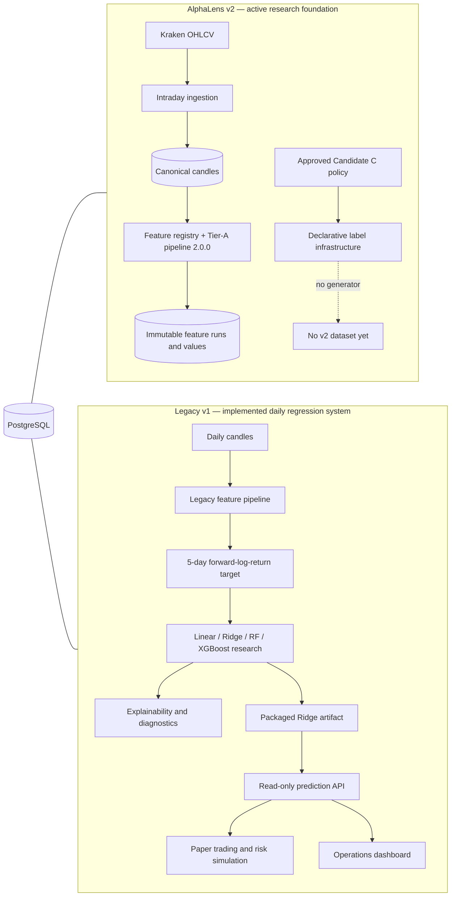
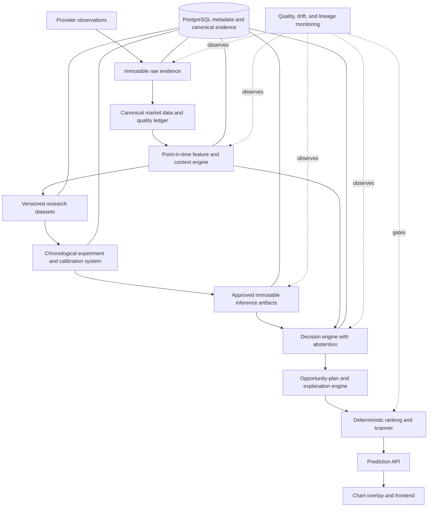

# AlphaLens v2 Strategic Architecture Review

**Review type:** Engineering and quantitative architecture audit  
**Review date:** 2026-07-30  
**Implementation status:** Paused by explicit instruction  
**Scope:** Current repository compared with the approved AlphaLens v2 product
vision and the capabilities required of a high-quality, continuously improving
trading-intelligence system  
**Authority:** Advisory blueprint only. This document does not modify an
approved contract, authorize implementation, approve a feature, select a model,
or establish a quantitative threshold.

---

## 1. Strategic Verdict

AlphaLens has a stronger foundation for auditability, chronology, deterministic
reproduction, and research governance than many early trading-analytics
projects. Its v2 data and feature pipeline is explicitly point-in-time, uses
completed candles, fails closed, records immutable provenance, versions
definitions, and hashes source and result artifacts. Those are meaningful
strengths.

The current repository is **not yet sufficient to demonstrate that AlphaLens
can outperform or meaningfully compete on prediction quality** with modern
AI-assisted trading systems. There is no valid empirical basis for such a
claim. AlphaLens v2 currently has:

- one instrument, BTC/USD;
- three intraday candle intervals, `5m`, derived `10m`, and `15m`;
- one keyless OHLCV provider, Kraken;
- a provider-limited recent history rather than a research-scale intraday
  archive;
- five numeric Tier-A outputs: four single-candle geometry values and true
  range;
- declarative label infrastructure, but no executable v2 label generator;
- no model-ready v2 dataset;
- no v2 experiment, model, calibration, decision, ranking, scanner, overlay, or
  production v2 prediction path.

The repository also contains an extensive **legacy v1 daily regression and
paper-trading stack**. That stack proves engineering patterns—immutable
experiments, prediction hashing, explainability, statistical diagnostics,
artifact packaging, APIs, deployment, and tests—but it answers a different
research problem and uses different feature, target, decision, and product
semantics. It is evidence of reusable infrastructure, not evidence that the v2
intraday product works.

The central strategic conclusion is:

> AlphaLens should preserve its evidence-first controls, but must materially
> deepen its data, market-context representation, research adequacy, decision
> semantics, and monitoring before model sophistication becomes the critical
> path.

The next year should not be organized around adding the largest number of
indicators or the most fashionable model. It should be organized around
building a defensible information set, proving incremental value through
chronological experiments, and converting only validated evidence into an
abstention-aware decision.

---

## 2. What Was Inspected

This review inspected the repository as a system rather than reviewing coding
style. The evidence set included:

### 2.1 Governance and product contracts

- `AGENTS.md`
- `RESEARCH_CONSTITUTION.md`
- `ARCHITECTURE.md`
- `ROADMAP.md`
- `ALPHALENS_V2_PRODUCT_CONTRACT.md`
- `ALPHALENS_V2_DECISION_CONTRACT.md`
- `ALPHALENS_V2_CONFIDENCE_POLICY.md`
- `ALPHALENS_V2_PHASE_1_BASELINE.md`
- `ALPHALENS_V2_INTRADAY_DATA_CONTRACT.md`
- `ALPHALENS_V2_PHASE_2_BASELINE.md`
- `ALPHALENS_V2_PHASE_3_FEATURE_ENGINEERING_PLAN.md`
- `ALPHALENS_V2_FEATURE_CATALOG_PROPOSAL.md`
- `ALPHALENS_V2_TIER_A_FEATURE_SPECIFICATION.md`
- `ALPHALENS_V2_PHASE_3_BASELINE.md`
- `ALPHALENS_V2_LABELING_SPECIFICATION.md`
- `ALPHALENS_V2_DATASET_SPECIFICATION.md`
- `ALPHALENS_V2_RESEARCH_PROTOCOL.md`
- `ALPHALENS_V2_LABELING_STRATEGY_PROPOSAL.md`
- `ALPHALENS_V2_LABELING_STRATEGY_RECOMMENDATION.md`
- `ALPHALENS_V2_CANDIDATE_C_QUANTITATIVE_POLICY.md`
- `TARGET_ARCHITECTURE.md`
- `COMPONENT_AUDIT.md`
- `IMPLEMENTATION_ORDER.md`
- `RISK_ASSESSMENT.md`
- `ASSUMPTIONS_AND_UNKNOWNS.md`

### 2.2 Data, feature, label, and research implementation

- `backend/app/market_data/`
- `backend/app/features/`
- `backend/app/labels/`
- `backend/app/targets/`
- `backend/app/validation/`
- `backend/app/research/`
- `backend/app/model_packaging/`
- `backend/app/inference/`

Key symbols inspected included:

- `KrakenMarketDataProvider`
- `fetch_btc_usd_intraday_native`
- `derive_btc_usd_10m_sample`
- `validate_candles`
- `FeatureDefinitionMetadata`
- `FeatureRegistry`
- `CandleGeometry`
- `TrueRange`
- `build_intraday_source_snapshot`
- `run_intraday_feature_pipeline`
- `LabelPolicyDeclaration`
- `LabelStrategyRegistry`
- `generate_development_splits`
- `access_final_holdout`
- `build_model_ready_dataset`
- `run_baseline_evaluation`
- `build_explainability_artifact`
- `build_statistical_validation_report`
- `build_residual_diagnostics_report`
- `build_market_regime_report`
- `build_final_model_selection_report`
- `build_holdout_evaluation_report`
- `load_ridge_inference_artifact`
- `ProductionPredictionService`

### 2.3 Persistence, application, and operations

- `backend/app/persistence/models.py`
- all persistence repositories under `backend/app/persistence/`
- Alembic revisions `20260729_0001` through `20260730_0027`
- `backend/app/main.py`
- `backend/app/api/application.py`
- `backend/app/prediction_api.py`
- `backend/app/backtesting/`
- `backend/app/paper_trading/`
- `backend/app/observability/`
- `backend/app/settings.py`
- `frontend/app/`, `frontend/components/`, and `frontend/lib/`
- `backend/Dockerfile`, `frontend/Dockerfile`, and `docker-compose.yml`
- `.github/workflows/backend.yml`
- `.github/workflows/frontend.yml`
- `.github/workflows/containers.yml`
- `API.md` and `DEPLOYMENT.md`
- 25 backend test modules and the frontend test files

The repository currently contains 114 Python application files, 25 backend test
modules, 27 Alembic migrations, and 42 frontend TypeScript/TSX files. This audit
did not execute tests; statements about previously passing tests come only from
the approved Phase 3 baseline.

### 2.4 Public capability references

Competitor comparison is limited to publicly documented capabilities, not
proprietary methods or independently verified performance:

- [TradingView multi-condition alerts](https://www.tradingview.com/support/solutions/43000761492-multi-condition-alerts/)
- [TradingView multi-timeframe analysis](https://www.tradingview.com/support/solutions/43000591555-leveraging-multi-timeframe-analysis/)
- [TradingView Pine Screener](https://www.tradingview.com/support/solutions/43000742436-tradingview-pine-screener-key-features-and-requirements/)
- [TradingView technical ratings](https://www.tradingview.com/support/solutions/43000614331-technical-ratings/)
- [TrendSpider product overview](https://trendspider.com/)
- [TrendSpider interface and multi-timeframe scanner](https://help.trendspider.com/kb/charting/interface-overview)
- [LuxAlgo product overview](https://www.luxalgo.com/)
- [LuxAlgo documentation](https://docs.luxalgo.com/docs/getting-started/introduction)
- [CryptoQuant institutional capabilities](https://cryptoquant.com/institutions)
- [CryptoQuant product guide](https://userguide.cryptoquant.com/what-is-cryptoquant/our-product)

These sources show market expectations around chart context, broad indicator
libraries, multi-timeframe analysis, screeners, alerts, pattern recognition,
backtesting workflows, alternative/on-chain data, and model-assisted research.
They do **not** prove superior forecasts, economic value, calibration, or
statistical rigor. Public claims for Tradevisor V2, GainzAlgo V2 Alpha,
ChartPal, and similar products were not sufficiently verifiable from
authoritative technical documentation during this review and are not used as
evidence.

---

## 3. Current System Architecture

### 3.1 Repository reality

The repository contains two overlapping generations:

The v2 path stops after feature persistence and label declarations. The v1 path
is end-to-end but is not the approved v2 research question.

### 3.2 Current dependency shape

The backend is a modular Python monolith with FastAPI and PostgreSQL. Major
dependencies are:

- features depend on market-data contracts and persistence;
- research depends on persisted datasets and experiment records;
- inference loads immutable artifact records;
- the API depends on inference, observability, and persistence;
- paper trading depends heavily on backtesting, features, inference,
  market data, and persistence;
- persistence imports types across most domains.

This is manageable at current scale, but `backend/app/persistence/models.py`
contains more than 3,800 lines and 39 model classes, and `backend/app/main.py`
combines ingestion, legacy research, and operational endpoints. These are
concentration points. The problem is not “monolith versus microservices”; the
problem is that legacy and v2 domain boundaries remain physically and
semantically mixed.

### 3.3 Data architecture

Strengths:

- the market-data provider contract is typed and provider-agnostic;
- Kraken public access avoids credentials;
- candles use exact `Decimal` values;
- validation checks chronology, duplicates, gaps, OHLC relationships, volume,
  timestamps, and completeness;
- `10m` data is deterministically derived from pairs of complete `5m` candles;
- provenance retains provider, retrieval, source-batch, and derivation
  evidence;
- database uniqueness constraints and idempotent persistence prevent duplicate
  canonical candles.

Limitations:

- Kraken is the only implemented provider;
- only OHLCV is available; there is no trade tape, bid/ask, spread, depth,
  liquidation, derivatives, funding, open interest, or on-chain evidence;
- Kraken's OHLC endpoint exposes only the latest 720 entries per requestable
  interval, explicitly documented at
  `ALPHALENS_V2_INTRADAY_DATA_CONTRACT.md:14-26` and `:122-140`;
- the current acquisition approach cannot independently reconstruct a deep
  intraday history after the fact;
- there is no cross-provider reconciliation or venue-normalized market
  identity;
- there is no event-time/watermark policy for streaming or late-arriving
  observations.

### 3.4 Feature architecture

The v2 feature infrastructure is well designed:

- `FeatureDefinitionMetadata` validates identifiers, versions, inputs,
  timeframes, warm-up, history type, lookback, continuity, availability,
  dependencies, implementation references, and decimal quantum
  (`backend/app/features/contracts.py:60-195`);
- `FeatureRegistry.configuration_hash` canonicalizes definitions and SHA-256
  hashes them (`backend/app/features/registry.py:20-101`);
- dependency order and duplicate output ownership fail closed
  (`backend/app/features/registry.py:103-129`);
- snapshot and result objects preserve source, registry, availability,
  provenance, and result hashes
  (`backend/app/features/intraday_pipeline.py:38-96`);
- the pipeline validates prefix invariance and completed-candle availability;
- transactionally persisted runs become active only after verification.

The implemented v2 information set is intentionally minimal:

| Definition | Outputs | History |
| --- | --- | --- |
| `candle_geometry` v1.0.0 | signed body/open, range/open, upper wick/open, lower wick/open | one completed candle |
| `true_range` v1.0.0 | true range | current candle plus prior close |

This gives robust primitives, not a competitive signal representation.
`backend/app/features/tier_a.py:45-187` contains the complete formula set.
There is no v2 trend, momentum, normalized volatility, relative volume,
market-structure, session, multi-timeframe, order-flow, or context feature.

The approved feature catalog already contains cautious candidates for lagged
returns, moving-average distances/slopes, RSI, ATR, realized volatility,
relative volume, candle-weighted price, support-like boundaries, breakouts, and
time encodings. These remain proposals, not approved features.

### 3.5 Label and dataset architecture

The approved Candidate C policy is a first-touch, volatility-scaled barrier
label with a 60-minute future path, `BUY` on first upper touch, `SELL` on first
lower touch, and `WAIT` only when neither barrier is touched. It has explicit
gap, equality, ambiguous dual-touch, chronology, overlap, purge, embargo,
protected-test, hashing, and provenance rules.

The current implementation does not execute that policy:

- `LabelPolicyDeclaration` can represent and hash an approved policy
  (`backend/app/labels/contracts.py:47-167`);
- the database has v2 label policy, generation run, observation, and source
  records (`backend/app/persistence/models.py:3548-3850`);
- no v2 label-generation module exists;
- no v2 dataset builder or dataset persistence exists;
- `FIRST_TOUCH_STRATEGY_DEFINITION` still says “no barrier policy is
  executable,” retains obsolete approval gates, and sets `executable=False`
  (`backend/app/labels/registry.py:92-118`).

That last point is a repository-state inconsistency: the policy document is
approved, while the declarative strategy registry still represents its earlier
blocked state. It is not corrected here because this review is read-only.

The quantitative policy also requires substantially more evidence before
modeling. Its minimum-adequacy section requires 365 calendar days of continuous
coverage per timeframe, at least 25,000 valid pre-protected-test labels per
timeframe after exclusions, at least 250 examples per class, and an eight-week
protected test. The approved Phase 3 live baseline contains only hundreds of
candles per timeframe, with the exact baseline counts recorded at
`ALPHALENS_V2_PHASE_3_BASELINE.md:410-451`.

### 3.6 Legacy research architecture

The v1 stack is unusually complete for an internal baseline:

- immutable forward-log-return targets;
- deterministic model-ready dataset hashes;
- expanding walk-forward validation, purge/embargo, and holdout isolation;
- minimum training-sample policy;
- Linear, Ridge, Random Forest, and XGBoost baselines;
- fold-level and pooled MAE, RMSE, and directional accuracy;
- immutable experiment records and prediction hashes;
- impurity, permutation, and TreeSHAP explainability;
- Wilcoxon, conditional paired t-tests, bootstrap intervals, effect sizes, and
  Holm correction;
- residual distributions, heteroscedasticity, autocorrelation, and plots;
- market-regime analysis;
- deterministic model selection;
- a one-time consumed holdout;
- a packaged Ridge inference artifact verified against official predictions.

This infrastructure demonstrates excellent reproducibility patterns. It does
not validate the v2 BUY/SELL/WAIT problem because it uses a daily
five-observation regression target and a legacy feature pipeline. Reusing its
patterns is appropriate; reusing its results is not.

### 3.7 API, frontend, and deployment

The production API is read-only and artifact-only. It validates exact feature
names, ordering, count, schema hash, and decimal values. It has request-size
limits, allowlist CORS, structured errors, immutable audits, in-process metrics,
and resource monitoring. OpenAPI documentation is disabled
(`backend/app/api/application.py:49-83`).

However, `/api/v1/model` and `/api/v1/predict` explicitly expose the legacy
Ridge `forward_log_return` target and five-observation horizon
(`backend/app/api/application.py:331-452`). They are not v2 decision endpoints.
`backend/app/main.py` separately exposes broad ingestion and legacy research
mutation endpoints without versioned v2 contracts.

The frontend is a polished read-only operations dashboard for legacy
prediction, paper portfolio, risk, trade history, and backtest records. It
displays a Ridge forward-return prediction and `BUY/HOLD/EXIT`, not the v2
canonical `BUY/SELL/WAIT`. It has no primary chart workspace, scanner,
decision overlay, evidence panel, or v2 context annotations.

Deployment is mature for a single-node application:

- locked Python and npm dependencies;
- backend, frontend, and PostgreSQL containers;
- health checks;
- read-only containers and dropped Linux capabilities;
- startup migration and artifact checks;
- CI for lint, compile, tests, type checks, builds, and container builds;
- structured logging and basic process metrics;
- documented backup and recovery procedures.

Missing operational capabilities include distributed scheduling, durable
queues, streaming ingestion, external metrics/tracing, drift monitoring,
feature freshness SLOs, data lineage observability, and safe model-promotion
workflows.

---

## 4. Competitive Capability Assessment

### 4.1 What public products establish as the expected workflow

Public documentation shows that mature user-facing products commonly combine:

- broad markets and data;
- rich charting and indicator libraries;
- multi-timeframe context;
- scanning and filtering;
- alerts and scheduled monitoring;
- pattern or structure recognition;
- strategy testing;
- explanations or AI-assisted research;
- rapid movement from a discovered opportunity to chart context.

TradingView documents multi-condition, multi-timeframe alerts and screeners
over custom indicators. TrendSpider documents automated pattern recognition,
multi-timeframe analysis, market scanners, strategy testing, and model-assisted
research. LuxAlgo documents indicator libraries, price-action concepts,
screeners, alerts, and backtesting. CryptoQuant documents on-chain, exchange,
alternative, and custom metrics.

AlphaLens is currently stronger in explicit research governance than these
public product pages demonstrate, but much narrower in data breadth,
contextual representation, continuous scanning, and chart-centered delivery.

### 4.2 What cannot be concluded

No repository evidence or comparable public benchmark permits these claims:

- AlphaLens is more accurate than any named product;
- a larger indicator library would improve AlphaLens;
- “AI” branding implies calibrated predictions;
- market-structure concepts are predictive;
- a deep model would outperform a regularized baseline;
- paper-trading or backtest results demonstrate live opportunity quality.

The correct competitive test is not feature-count parity. It is whether
AlphaLens can produce temporally valid, stable, net-of-friction opportunity
evidence with a defensible abstention policy and explanations that reproduce
from immutable inputs.

---

## 5. Readiness for the Required Decision Outputs

| Required output | Contract readiness | Runtime readiness | Research evidence | Verdict |
| --- | --- | --- | --- | --- |
| `BUY` | Canonically defined | Not implemented in v2 | Candidate C policy approved; labels absent | Not ready |
| `SELL` | Canonically defined as an opportunity, not an exit | Not implemented in v2 | Candidate C policy approved; labels absent | Not ready |
| `WAIT` | First-class and distinct from failure | Not implemented in v2 | Label semantics approved; no observed class study | Not ready |
| Entry price/region | Optional atomic plan contract exists | No approved plan policy | None | Not ready |
| Stop loss | Directional invariant exists | No approved invalidation policy | None | Not ready |
| Take profit | Ordered levels supported | No approved objective policy | None | Not ready |
| Risk/reward | Defined as plan-derived ratios | No runtime computation | None | Not ready |
| Expected hold time | Optional versionable record exists | No estimator or policy | Candidate label horizon is not automatically a hold-time estimate | Not ready |
| Trade reasoning | Reasons/evidence required by decision contract | No v2 reasoning engine | Feature metadata exists; attribution absent | Not ready |
| Prediction evidence | Strong generic provenance patterns | No v2 decision evidence | Phase 3 feature evidence only | Partially ready |
| Confidence | Correctly unavailable by default | Not exposed in v2 | No calibration research | Correctly unavailable |

### 5.1 Entry, stop, take-profit, and risk/reward require a separate problem

Candidate C barriers define research outcomes. They do not automatically define
executable or informational plan levels. The approved policy explicitly says
the reference price is not an entry recommendation. A future opportunity-plan
policy must separately define:

- what makes an entry region available after the decision is generated;
- how spread, slippage, latency, and next-observation execution affect it;
- whether invalidation is structural, volatility-scaled, or hybrid;
- whether objective levels are label barriers, structural levels, or separate
  estimates;
- how risk/reward is withheld when any plan component is unavailable.

Treating label barriers as plan levels without research would silently change
semantics and violate the decision contract.

### 5.2 Confidence is architecturally correct

The confidence policy is a strength. It requires an approved estimand,
population, chronological calibration protocol, adequacy threshold, acceptance
rule, scope match, provenance, and explicit approval. No placeholder score,
rank, class probability, softmax output, SHAP magnitude, or model agreement may
be relabeled as confidence.

The system should remain willing to ship decisions without confidence, or to
withhold decisions entirely, rather than manufacture a percentage.

---

## 6. Special-Focus Architecture Evaluation

The following table evaluates support, not predictive merit. “Research next”
means define and test a falsifiable, point-in-time representation before any
product use.

| Capability | Current support | Architectural disposition | Key constraints | Evidence |
| --- | --- | --- | --- | --- |
| ATR | True range primitive only | **Research next** | Approve smoothing, seed, period, normalization, and per-timeframe version | `tier_a.py:127-187`; feature catalog Candidate 13 |
| VWAP | No true VWAP | **Add after trade-level data** | Candle-weighted price must be labeled an approximation; true VWAP requires trade price/size | Feature catalog Candidate 19 and its explicit approximation warning |
| Anchored VWAP | None | **Defer** | Anchor ontology must be deterministic and point-in-time; avoid post-hoc anchor choice | No implementation or approved anchor contract |
| Volume Profile | None | **Research after data expansion** | Candle volume cannot reconstruct price-at-volume; require trade/tick evidence or an explicitly named approximation | Kraken ingestion stores OHLCV only |
| Market structure | Candidate rolling boundaries/breakouts only | **Research next** | Define pivots, confirmation delay, invalidation, and availability without repainting | Feature catalog Candidates 4, 21, 22 |
| Support/resistance | No implementation | **Research next** | Must be deterministic zones with confirmation timestamps, not visually selected lines | Decision annotation contract; feature catalog Candidate 21 |
| Liquidity zones | No direct evidence | **Add data first** | Require book/trade/spread evidence; OHLCV impact proxies must not claim liquidity | Feature catalog Candidate 20 explicitly says it is only a proxy |
| Order blocks | None | **Defer pending formal specification** | Common definitions are discretionary and prone to hindsight; require falsifiable ontology and prefix tests | No contract, data, or implementation |
| Fair Value Gaps | None | **Research cautiously** | Formalize exact three-candle geometry, fill semantics, lifecycle, and confirmation time | No contract or implementation |
| Multi-timeframe confluence | Separate 5m/10m/15m pipelines only | **High-priority add** | As-of joins must use only completed higher-timeframe values; derived 10m provenance must remain explicit | Phase 3 baseline `:509-554`; cross-timeframe policy unresolved |
| Trend regime | Legacy daily report only | **Research for v2** | Use continuous inputs first; thresholds must be preregistered and regime stability tested | `research/market_regimes.py`; no v2 regime feature |
| Volatility regime | Legacy daily report only | **Research for v2** | Point-in-time threshold estimation; avoid full-sample quantiles | Legacy `classify_market_regimes`; feature catalog Candidate 16 |
| Session analysis | No implementation | **Research** | BTC trades continuously; use UTC time encodings before assigning geographic session meaning | Feature catalog Candidates 23–24 |
| Market context engine | Contractual target only | **Add** | It must describe evidence, not decide; version context objects and availability | `TARGET_ARCHITECTURE.md`; decision annotation contract |
| Risk engine | Legacy portfolio risk engine exists | **Do not port as-is** | v2 is not a broker/portfolio manager; implement decision-support plan validation, not capital allocation or order controls | Product contract boundary; `backtesting/risk/` is execution-oriented |
| Explainability engine | Strong legacy research artifacts | **Adapt after v2 models** | Separate global research explanation from per-decision reasons; never infer causality | `research/explainability.py`; decision evidence/reason records |
| Feature importance | Impurity/permutation in legacy v1 | **Reuse methodology conditionally** | Report instability and correlation bias; no automatic feature selection | `build_explainability_artifact` |
| SHAP | TreeSHAP in legacy v1 | **Reuse for supported models** | Global/local attribution is model behavior, not market causality or confidence | `research/explainability.py`; confidence policy `:361-371` |
| LIME | None | **Defer** | Local sampling instability and time-series manifold violations require a separate validation protocol | No implementation |
| Random Forest | Legacy v1 baseline | **Candidate v2 baseline only after preregistration** | Fixed config first; class imbalance and probability calibration require care | `baseline_regression.py` legacy only |
| Gradient boosting | Legacy XGBoost regression | **High-value v2 candidate after baselines** | Fixed baseline before tuning; audit missingness and calibration | `baseline_regression.py`; dependency in `pyproject.toml` |
| Ensemble learning | None | **Defer** | Requires independently useful, diverse models and out-of-fold combination without leakage | No implementation or approved policy |
| LSTM research | None | **Defer until data adequacy** | Sequence length, state reset, dependence, and high variance demand much deeper history | Current 720-entry provider limit |
| Transformer research | None | **Defer until data breadth and scale** | Parameter count and attention do not create information; require sequence/event data and strict benchmarks | No implementation; current five-feature input |
| Reinforcement learning | None | **Do not prioritize** | Product does not execute trades; reward and simulator mismatch would introduce a different research question | Product contract excludes execution and portfolio management |
| Bayesian/HPO | None | **Defer and govern** | Must be nested inside development chronology with fixed budgets and trial registry; never touch protected test | Research protocol data-snooping rules |
| Drift detection | None | **Add before production decisions** | Monitor input, quality, feature, prediction, decision-rate, and calibration drift separately | Current observability has request/process metrics only |
| Automated retraining | None | **Automate candidate creation, not promotion** | Retraining needs immutable triggers, fresh temporal validation, champion/challenger review, and human promotion | No model lifecycle implementation |
| Model monitoring | Legacy API counts/latency only | **Add** | Need data freshness, schema, drift, abstention, calibration, and delayed-outcome monitoring | `api/metrics.py`; `observability/resources.py` |

---

## 7. Architecture Needed for a Continuously Improving AlphaLens

The approved target layers remain sound. They need more explicit evidence and
lifecycle boundaries, not a different product architecture.

### 7.1 Research layer

**Responsibility:** preregister questions, labels, datasets, baselines,
comparisons, calibration, and acceptance gates.

**Inputs:** immutable data/feature snapshots and approved policies.  
**Outputs:** immutable experiments, statistical reports, approved artifacts, or
documented rejection.  
**Boundary:** research may propose; it may not silently promote.  
**Required evolution:** a v2 experiment namespace separated from legacy daily
regression records, with model cards and explicit negative/null results.

### 7.2 Data pipeline

**Responsibility:** capture raw and canonical point-in-time market evidence,
quality, revisions, source identity, and availability.

**Inputs:** provider observations with event and retrieval times.  
**Outputs:** validated canonical snapshots plus quality and provenance ledgers.  
**Boundary:** never infer signals or repair gaps silently.  
**Required evolution:** deep history, continuous collection, provider
redundancy, trade/book evidence where approved, and reproducible snapshots.

### 7.3 Feature and market-context engine

**Responsibility:** compute versioned descriptive evidence and align multiple
timeframes without future information.

**Inputs:** immutable source snapshots.  
**Outputs:** features, regimes, structures, zones, and annotations with
`available_at`, definition, and evidence references.  
**Boundary:** context describes; it does not decide.  
**Required evolution:** domain registries for numeric features and geometric
context objects, with prefix-invariance and stability tests.

### 7.4 Decision engine

**Responsibility:** convert an approved inference result and current context
into exactly `BUY`, `SELL`, or `WAIT`.

**Inputs:** approved artifact, complete feature/context snapshot, freshness
state, and decision policy.  
**Outputs:** canonical decision object with evidence and limitations.  
**Boundary:** no order execution; operational failures are not `WAIT`.  
**Required evolution:** explicit abstention reasons, availability gates, and
separation between forecast, opportunity qualification, and decision.

### 7.5 Opportunity-plan engine

**Responsibility:** conditionally produce informational entry, invalidation,
objectives, expected duration, and risk/reward.

**Inputs:** actionable decision and approved point-in-time context.  
**Outputs:** complete atomic `opportunity_plan` or absence.  
**Boundary:** no capital allocation, brokerage, or execution claims.  
**Required evolution:** a separately researched plan policy; label barriers
must not be reused by assumption.

### 7.6 Explanation and evidence engine

**Responsibility:** construct factual, reproducible reasons at three levels:
data/context, model behavior, and decision-policy application.

**Inputs:** evidence graph, model attributions, context objects, and policy
trace.  
**Outputs:** reason codes, annotations, evidence references, limitations, and
artifact hashes.  
**Boundary:** no causal language without causal evidence; no attribution as
confidence.

### 7.7 Ranking and scanner

**Responsibility:** evaluate fresh decisions across approved instrument and
timeframe scopes, filter invalid/stale/unavailable items, and order remaining
opportunities deterministically.

**Inputs:** canonical decisions and approved ranking policy.  
**Outputs:** ranked opportunity snapshots or an empty valid result.  
**Boundary:** rank is not confidence. `WAIT` may be recorded but is not
misrepresented as an actionable opportunity.

### 7.8 API and frontend

**Responsibility:** expose and render canonical v2 contracts, evidence,
freshness, and limitations.

**Inputs:** persisted decision and scanner snapshots.  
**Outputs:** read-only API representations and chart overlays.  
**Boundary:** no local ML or business logic in the frontend.  
**Required evolution:** a v2 decision API separate from the legacy regression
API, then a chart-first UI rather than adapting paper-trading semantics.

### 7.9 Monitoring and lifecycle control

**Responsibility:** detect stale or invalid data, distribution shift, artifact
failure, calibration invalidity, and policy drift.

**Inputs:** data-quality, feature, inference, decision, outcome, and operational
telemetry.  
**Outputs:** immutable monitoring reports, alerts, suspension gates, and
candidate-research triggers.  
**Boundary:** detection may suspend output or open a research proposal; it must
not automatically promote a replacement model.

---

## 8. Top 10 Highest-Impact Recommendations

The ranking prioritizes expected improvement in defensible prediction quality,
then long-term architectural value. Effort is an estimate of engineering and
research complexity, not file count. “Prediction impact” is expected
directional impact, not a fabricated performance estimate.

| Rank | Recommendation | Prediction-quality impact | Effort | Long-term value |
| ---: | --- | --- | --- | --- |
| 1 | Build a research-scale intraday evidence program | Very high | XL | Foundational |
| 2 | Add market microstructure and liquidity evidence under a new approved data contract | Very high | XL | Foundational |
| 3 | Expand the v2 feature set through preregistered feature families, not indicator accumulation | Very high | L | Very high |
| 4 | Implement a point-in-time multi-timeframe market-context engine | High | L | Very high |
| 5 | Complete Candidate C labels and datasets only after adequacy gates pass | High | L | Foundational |
| 6 | Establish a v2 baseline-to-challenger experiment and calibration lifecycle | High | XL | Very high |
| 7 | Separate forecast, opportunity qualification, decision, and opportunity-plan policies | High | L | Very high |
| 8 | Build an evidence and explainability graph for every decision | Medium-high | L | Very high |
| 9 | Add drift, freshness, delayed-outcome, and model-lifecycle monitoring | Medium-high | L | Foundational |
| 10 | Isolate legacy v1 execution-oriented surfaces before building the v2 scanner/API/overlay | Medium | M | High |

### Recommendation 1 — Build a research-scale intraday evidence program

**Recommendation.** Continuously collect and version sufficient BTC/USD
intraday history for every approved timeframe, retain immutable raw provider
responses or equivalent source evidence, define snapshot identities, and
measure gaps, revisions, venue coverage, and survivorship over time. Approve a
second source only through the existing provider abstraction and a
cross-provider reconciliation policy.

**Why it matters.** More complex models cannot compensate for a few days of
OHLCV. The approved label policy itself requires a year of coverage and tens of
thousands of valid pre-test observations. Data adequacy is the current hard
constraint on every statistically meaningful result.

**Risks and trade-offs.** Storage and provider licensing may become material.
Cross-provider prices are not interchangeable. A deeper but changing-quality
dataset can be worse than a smaller well-characterized one.

**Evidence.**

- `ALPHALENS_V2_INTRADAY_DATA_CONTRACT.md:14-29,122-140` documents Kraken's
  latest-720-entry limitation.
- `backend/app/market_data/history.py:21` defines
  `KRAKEN_OHLC_PAGE_LIMIT = 720`.
- `ALPHALENS_V2_PHASE_3_BASELINE.md:410-451` records only 746/372/729 source
  candles at the Phase 3 baseline.
- `ALPHALENS_V2_CANDIDATE_C_QUANTITATIVE_POLICY.md:780-811` defines minimum
  data-adequacy gates.
- `backend/app/market_data/provider.py` and
  `KrakenMarketDataProvider` provide the reusable provider boundary.

### Recommendation 2 — Add microstructure and liquidity evidence

**Recommendation.** After a separately approved data contract, add event-time
trade data and top-of-book/depth snapshots sufficient to study spread,
imbalance, signed flow, realized execution friction, liquidation behavior, and
price-at-volume. Keep OHLCV, trades, and book evidence as separate versioned
source domains.

**Why it matters.** AlphaLens targets intraday entry-quality decisions.
OHLCV-only features cannot directly observe executable liquidity, spread, book
pressure, or within-candle path. These omissions are particularly important for
first-touch labels and ambiguous dual touches.

**Risks and trade-offs.** Order-book data is large, venue-specific, sensitive
to packet loss and clock semantics, and often costly. It must not be introduced
without timestamp, sequence, retention, and licensing decisions.

**Evidence.**

- `backend/app/market_data/models.py` represents OHLCV candles only.
- `backend/app/market_data/kraken.py` uses the public OHLC endpoint.
- Feature Catalog Candidate 20 explicitly states that candle-based impact is
  not direct liquidity evidence.
- `ALPHALENS_V2_CANDIDATE_C_QUANTITATIVE_POLICY.md:363-419` excludes or
  conservatively handles gaps and dual-touch ambiguity because OHLC paths are
  not observable.
- No trade, quote, order-book, spread, or liquidation model or migration exists.

### Recommendation 3 — Expand v2 features through preregistered families

**Recommendation.** Advance small, independently testable feature families:
lagged returns, normalized range/ATR, trailing realized volatility, relative
volume, trend distance/slope, breakout/boundary context, and cyclic time
encoding. Each family should have an approved hypothesis, parameter set,
warm-up, availability, missing-data behavior, and ablation plan before code.

**Why it matters.** The current five outputs largely describe one candle and
absolute range. They cannot represent persistence, mean reversion, relative
activity, volatility state, or temporal context.

**Risks and trade-offs.** Correlated indicator proliferation creates multiple
testing, unstable attribution, and overfitting. Feature count is not a product
metric. Features that fail incremental chronological tests should remain
auditable negative results rather than silently disappearing.

**Evidence.**

- `backend/app/features/tier_a.py:45-187` implements only candle geometry and
  true range.
- `backend/app/features/registry.py:20-129` already provides versioned registry
  and dependency enforcement.
- `ALPHALENS_V2_FEATURE_CATALOG_PROPOSAL.md` contains the existing candidate
  families and marks all unresolved parameters.
- `ALPHALENS_V2_PHASE_3_BASELINE.md:541-566` explicitly leaves additional
  candidates, windows, thresholds, and normalization unresolved.

### Recommendation 4 — Implement point-in-time multi-timeframe context

**Recommendation.** Define an as-of alignment contract in which a lower
timeframe observation may consume only higher-timeframe features whose candles
have completed by the lower timeframe's evidence cutoff. Build context objects
for trend, volatility, structure, and session state with explicit availability
and provenance.

**Why it matters.** The product is explicitly scoped to 5m, 10m, and 15m and
expects confluence and explanation. Independent per-timeframe predictions miss
shared context; naive joins leak unfinished higher-timeframe candles.

**Risks and trade-offs.** Alignment errors can create invisible look-ahead
bias. Derived 10m candles share 5m source evidence and are not statistically
independent. Context definitions can become discretionary unless formalized.

**Evidence.**

- `ALPHALENS_V2_PRODUCT_CONTRACT.md:35-50` defines the three timeframes.
- `ALPHALENS_V2_INTRADAY_DATA_CONTRACT.md:66-91` defines 10m derivation.
- `ALPHALENS_V2_PHASE_3_BASELINE.md:509-554` requires independent computations
  and marks cross-timeframe joins unresolved.
- `feature_available_at` in `backend/app/features/contracts.py:220-245`
  provides the availability primitive.
- TradingView and TrendSpider publicly document multi-timeframe context as a
  mature workflow capability; this is a capability comparison, not performance
  evidence.

### Recommendation 5 — Complete Candidate C only after adequacy gates pass

**Recommendation.** Resolve the stale strategy declaration, implement the
approved policy exactly, but do not authorize model research until all
per-timeframe adequacy, class, ambiguity, continuity, protected-test, and
provenance gates pass. Produce descriptive label-quality reports before
experiments.

**Why it matters.** Candidate C aligns labels with directional opportunities
and a first-class WAIT outcome, but overlapping 60-minute paths and barrier
ambiguity create dependence. A technically correct generator on an inadequate
sample would still yield invalid research.

**Risks and trade-offs.** Label parameters can dominate apparent model quality.
Exclusions may create selection effects. Independent 5m/10m/15m datasets share
underlying market events and must not be treated as three independent studies.

**Evidence.**

- The approved policy is fully specified in
  `ALPHALENS_V2_CANDIDATE_C_QUANTITATIVE_POLICY.md`.
- `backend/app/labels/contracts.py:47-167` supports immutable policy identity.
- `backend/app/labels/registry.py:92-118` is still non-executable and stale.
- v2 persistence records exist at
  `backend/app/persistence/models.py:3548-3850`.
- No label generator or v2 dataset builder exists.
- `ALPHALENS_V2_DATASET_SPECIFICATION.md:256-350` mandates leakage-safe,
  purged, embargoed chronological construction.

### Recommendation 6 — Establish a v2 baseline-to-challenger lifecycle

**Recommendation.** Preregister simple non-learned and linear baselines first;
then compare fixed Random Forest and gradient-boosted tree baselines. Only after
adequate tabular baselines should the team approve ensembles, LSTM, or
Transformer research. Any hyperparameter optimization must be nested inside
development-only chronology with a fixed budget, immutable trial registry, and
multiple-comparison control.

**Why it matters.** This ordering distinguishes information value from model
capacity. It avoids spending months optimizing models on weak or insufficient
features while preserving a path to more expressive methods when justified.

**Risks and trade-offs.** Repeated walk-forward reuse can overfit the
development process even without test leakage. Tree probabilities may be
uncalibrated. Deep sequence models can memorize regimes and require much more
history. Automated optimization expands the effective hypothesis count.

**Evidence.**

- `ALPHALENS_V2_RESEARCH_PROTOCOL.md:47-111` defines approval gates.
- `ALPHALENS_V2_RESEARCH_PROTOCOL.md:117-150` proposes non-learned and learned
  baseline families but leaves exact experiments unresolved.
- `backend/app/research/baseline_regression.py` demonstrates fixed,
  deterministic legacy baselines.
- `backend/app/validation/splits.py` demonstrates expanding walk-forward and
  holdout isolation.
- `RESEARCH_CONSTITUTION.md` prohibits random splitting, leakage, and
  unapproved quantitative changes.

### Recommendation 7 — Separate forecast, opportunity, decision, and plan

**Recommendation.** Use four versioned stages:

1. model output;
2. opportunity qualification and abstention;
3. canonical `BUY`/`SELL`/`WAIT` decision;
4. optional informational entry/stop/objective plan.

Each stage must have its own policy identity, inputs, availability, evidence,
and failure state. No stage may infer unavailable fields from another.

**Why it matters.** A correct directional class does not prove that an
opportunity is executable, high quality, or has a defensible plan. Separating
the stages preserves WAIT, prevents label barriers from becoming trading advice
by accident, and lets future engines change without breaking the canonical
decision object.

**Risks and trade-offs.** More contracts create operational complexity and
additional absence states. Consumers must distinguish unavailable evaluation,
WAIT, and absent optional plan/confidence.

**Evidence.**

- `ALPHALENS_V2_DECISION_CONTRACT.md:34-104` defines decision semantics.
- `ALPHALENS_V2_DECISION_CONTRACT.md:287-307,386-410` makes plans and hold
  periods optional and policy-governed.
- Cross-field invariants at `:432-457` prohibit incomplete or inconsistent
  plans and execution implications.
- Candidate C policy `:119-161` says the reference price is not an entry.
- Legacy `RidgeThresholdLongOnlyStrategy` directly maps predictions to
  `BUY/HOLD/EXIT`; that path conflicts with v2 semantics and must not be reused.

### Recommendation 8 — Build an evidence and explainability graph

**Recommendation.** Make every decision reference a deterministic evidence
graph containing source snapshots, feature/context values, artifact identity,
policy trace, model-local attribution where valid, reason codes, limitations,
and freshness. Provide global research explanations separately from local
decision explanations.

**Why it matters.** “Why?” is one of the two product questions. A list of SHAP
values is not sufficient: the user needs factual market context, what policy
condition was satisfied, what was absent, and which evidence can reproduce the
decision.

**Risks and trade-offs.** Attribution can be unstable under correlated
features. Natural-language generation can fabricate causal stories. Explanatory
text must be templated or constrained to verified evidence unless a separately
governed generation layer is approved.

**Evidence.**

- Product purpose at `ALPHALENS_V2_PRODUCT_CONTRACT.md:19-33`.
- Decision reason, evidence, annotation, and limitation records at
  `ALPHALENS_V2_DECISION_CONTRACT.md:254-275,412-430`.
- Legacy explainability implementation in
  `backend/app/research/explainability.py`.
- Immutable prediction and diagnostic evidence records in
  `backend/app/persistence/models.py`.
- Confidence policy `:361-371` prohibits treating explanations as confidence.

### Recommendation 9 — Add monitoring and governed retraining

**Recommendation.** Define point-in-time monitors for provider freshness,
missing/late data, validation failures, feature availability and distribution,
decision/action/WAIT rates, class-conditional delayed outcomes, calibration
validity, model input drift, and artifact integrity. Monitoring may suspend
outputs and propose a retraining candidate; production promotion must remain an
explicit reviewed act.

**Why it matters.** A validated model can become invalid as market structure,
venue behavior, and class prevalence change. Continuous improvement requires a
controlled feedback loop, not silent automatic refitting.

**Risks and trade-offs.** Drift tests themselves create multiple alerts and
need baselines. Outcome monitoring is delayed by the label horizon. Retraining
too frequently can chase noise; too slowly can preserve stale behavior.

**Evidence.**

- Current `backend/app/api/metrics.py` tracks request counts and latency only.
- `backend/app/observability/resources.py` tracks process uptime, CPU, and
  memory only.
- The confidence lifecycle in
  `ALPHALENS_V2_CONFIDENCE_POLICY.md:374-416` already defines active,
  suspended, retired, and historical states.
- No v2 drift, data-freshness SLO, delayed-outcome, retraining, champion/
  challenger, or promotion module exists.

### Recommendation 10 — Isolate legacy v1 before v2 delivery

**Recommendation.** Preserve legacy artifacts and reproducibility, but
namespace them as historical v1 research and prevent legacy regression,
`BUY/HOLD/EXIT`, portfolio-risk, paper-trading, and dashboard contracts from
becoming dependencies of the v2 decision path. Build the v2 API and chart
workspace only after canonical v2 decisions exist.

**Why it matters.** The current operational surface can appear more complete
than v2 actually is. Semantic leakage from legacy modules is a larger risk than
code reuse: `SELL` is an opportunity in v2, while `EXIT` is an execution action
in v1.

**Risks and trade-offs.** Physical separation may affect migrations,
dashboards, API startup, and deployment checks. Historical artifacts must never
be deleted or rewritten. A compatibility period may be required.

**Evidence.**

- `backend/app/api/application.py:331-452` exposes legacy Ridge
  forward-log-return inference.
- `backend/app/backtesting/models.py:14-17` defines `BUY/HOLD/EXIT`.
- `backend/app/backtesting/strategy.py:25-50` maps Ridge thresholds to those
  actions.
- `frontend/app/predictions/page.tsx` describes packaged Ridge outputs.
- `frontend/app/page.tsx` displays paper portfolio and forward returns.
- Product boundaries in `ALPHALENS_V2_PRODUCT_CONTRACT.md:87-118` exclude
  brokerage, execution, portfolio management, and paper trading.
- `COMPONENT_AUDIT.md` and `IMPLEMENTATION_ORDER.md` already identify this
  migration boundary.

---

## 9. Quantitative Research Risks

### 9.1 Sample dependence and overlapping labels

A 60-minute label horizon creates substantial overlap, especially at 5m.
Consecutive labels share much of their future path. Counts are therefore not
independent sample sizes. Purge and embargo protect split boundaries, but they
do not make within-fold observations independent. Confidence intervals,
significance tests, and calibration must use dependence-aware units or
block-based methods that are preregistered before results.

### 9.2 Multiple testing

Every feature, timeframe, barrier, model, threshold, regime, and ranking rule
adds a hypothesis. Versioning records changes but does not itself prevent data
snooping. The research system needs a trial ledger that includes rejected
experiments and a family-level error or false-discovery policy appropriate to
the approved comparisons.

### 9.3 Venue and market identity

“BTC/USD” from Kraken is not a universal BTC/USD market. Labels and features
are based on one venue's candles, liquidity, outages, and price path.
Cross-provider expansion must preserve venue identity rather than merge values
as if fungible.

### 9.4 Label-to-product mismatch

A first-touch label answers which barrier was touched first. It does not prove
fillability at the reference price, net profitability after costs, a valid stop
or take-profit plan, or that a prediction can be delivered before the
opportunity changes. Those are separate claims.

### 9.5 Calibration and selective prediction

WAIT changes the population on which BUY/SELL quality is measured. Any
confidence study must specify whether it estimates class correctness, barrier
touch probability, selective risk, or another quantity. Calibration should be
evaluated within instrument, timeframe, class, horizon, regime, and policy
scope as approved; pooled calibration can hide failure.

### 9.6 Nonstationarity

Market regimes, venue microstructure, volatility, and participant behavior
change. A single protected test gives one historical estimate, not permanent
validity. The system needs forward monitoring and explicit expiration or
suspension criteria while preserving the one-time nature of protected
development evidence.

### 9.7 Explainability risk

Feature importance and SHAP explain model dependence, not causal market
mechanisms. Correlated features can redistribute importance. Model
explanations must be paired with factual context and limitations.

---

## 10. Scalability and Engineering Assessment

### 10.1 What scales acceptably

- A modular monolith is appropriate for the current single-asset research
  scope.
- PostgreSQL is appropriate for metadata, immutable runs, canonical candles,
  and moderate feature volumes.
- Async provider and database access are appropriate.
- Deterministic hashes and append-only records support horizontal workers if
  job ownership is later defined.
- Container and CI foundations are adequate for reproducible deployment.

### 10.2 What will become a bottleneck

- OHLCV polling cannot support low-latency trade/book context.
- A single `models.py` spanning every research generation increases migration
  and ownership coupling.
- `main.py` exposes heterogeneous ingestion and legacy research operations in
  one application.
- There is no durable job queue, lease, watermark, or idempotency-key protocol
  for continuous scanning.
- In-process API metrics do not aggregate across workers.
- PostgreSQL rows may be inefficient for high-frequency order-book events or
  large immutable plot/artifact payloads.
- No partitioning, retention, archival, or snapshot materialization policy is
  defined.
- The frontend and prediction API are bound to legacy v1 schemas.

### 10.3 Evolution principle

Do not introduce premature microservices. First establish domain interfaces and
job semantics inside the modular monolith. Extract a service only when data
rate, independent scaling, failure isolation, or deployment ownership provides
measured justification. The approved architecture's logical layers do not
require one deployable service per layer.

---

## 11. Recommended 12-Month Architecture Sequence

This is a gated blueprint, not authorization to implement.

### Gate A — Evidence adequacy

1. Reconcile the approved Candidate C policy with the stale non-executable
   registry declaration.
2. Establish continuous intraday collection and quantify attainable historical
   depth.
3. Decide whether a paid or second provider is authorized.
4. Pass the approved per-timeframe adequacy gates.

**Exit evidence:** immutable coverage/quality report, source contract, no
unresolved provenance failure.

### Gate B — Information-set expansion

1. Approve small feature-family specifications.
2. Add ATR/normalized volatility, lagged returns, relative volume, trend, and
   time context before discretionary concepts.
3. Define multi-timeframe as-of alignment.
4. Decide whether trade/book data is authorized; only then research true VWAP,
   volume profile, and liquidity.

**Exit evidence:** prefix invariance, stability reports, ablation-ready
registries, no hidden full-sample transforms.

### Gate C — Labels and datasets

1. Implement the exact approved Candidate C generator.
2. Report ambiguity, gaps, exclusions, overlap, class balance, action rate, and
   time stability.
3. Freeze chronological datasets with purge, embargo, and protected test.
4. Reject modeling if adequacy fails.

**Exit evidence:** immutable label and dataset hashes, leakage report, protected
test sealed.

### Gate D — Baseline research

1. Preregister trivial and linear baselines.
2. Run fixed tree baselines only after baseline acceptance.
3. Measure per-timeframe and cross-regime stability.
4. Record all trials, including negative results.
5. Approve deep or ensemble research only if it answers a documented residual
   deficiency and the sample supports it.

**Exit evidence:** reproducible comparison, stable prediction evidence, no
holdout access.

### Gate E — Confidence and decision policy

1. Decide the confidence estimand, or keep confidence absent.
2. Research chronological calibration and selective risk.
3. Define opportunity qualification and abstention independently from class
   prediction.
4. Define the optional opportunity-plan policy independently from labels.

**Exit evidence:** canonical decisions reproduce from evidence; unavailable
fields remain absent.

### Gate F — Scanner and chart-centered delivery

1. Define ranking as a separate, deterministic, non-confidence contract.
2. Implement freshness-aware scheduling and empty-result semantics.
3. Expose canonical v2 decisions through a versioned read-only API.
4. Build scanner-to-chart navigation, evidence panels, and annotations.

**Exit evidence:** no legacy schema in the v2 path, stale outputs suppressed,
every visible claim traceable.

### Gate G — Monitoring and continuous improvement

1. Establish data, feature, decision, and outcome monitors.
2. Define model/calibration suspension policies.
3. Create automatic candidate-research triggers.
4. Retain human approval for artifact promotion.

**Exit evidence:** drift or integrity failure fails closed; every lifecycle
transition is immutable and auditable.

---

## 12. Assumptions and Unknowns

### 12.1 Verified facts

- The approved product is decision support and never executes trades.
- Initial v2 scope is BTC/USD at 5m, 10m, and 15m.
- Kraken is the sole implemented v2 market-data provider.
- The v2 feature registry contains only candle geometry and true range.
- Pipeline version is `2.0.0`; registry and availability schema versions are
  `1.0.0`.
- Candidate C has an approved quantitative policy document.
- Candidate C is not implemented in the current code.
- No v2 dataset, model, calibration, decision engine, scanner, or overlay
  exists.
- Legacy daily research and operational modules remain in the repository.

### 12.2 Could not be verified

- Independent predictive performance of any named competitor.
- Whether public competitor marketing claims correspond to statistically
  validated, calibrated, or non-repainting live behavior.
- Availability, price, licensing, history, and redistribution rights for a
  second provider suitable for AlphaLens.
- Whether the current local PostgreSQL contents still exactly match the
  Phase 3 baseline; this review did not query the database.
- Current CI status on the remote branch; workflow definitions exist, but this
  audit did not access GitHub run results.
- Production traffic, latency, uptime, incident history, or resource use.
- Whether the uncommitted Phase 3/4/5 files in the working tree have been
  formally approved beyond the approvals stated in their contents and the
  conversation context.
- The authoritative reason the approved Candidate C policy was not reconciled
  with `LabelStrategyRegistry`.

### 12.3 Human approvals required

- any new provider, paid data, credential, or redistribution arrangement;
- minimum historical depth beyond the already approved Candidate C adequacy
  policy if that policy is to change;
- every additional feature definition and parameter;
- multi-timeframe alignment semantics;
- trade, book, derivatives, liquidation, or on-chain data contracts;
- model families and fixed baseline configurations;
- hyperparameter-optimization protocol and budget;
- confidence estimand and acceptance criteria;
- decision/abstention policy;
- opportunity-plan semantics for entry, stop, objectives, and risk/reward;
- ranking policy;
- annotation ontology;
- monitoring thresholds, suspension criteria, and promotion workflow.

### 12.4 Missing research

- feature-family incremental value and stability;
- Candidate C descriptive label behavior on an adequate sample;
- transaction-cost and latency sensitivity appropriate to decision support;
- cross-timeframe dependence and incremental value;
- market-context definition stability;
- prediction/calibration drift;
- opportunity-plan validity;
- decision explanation fidelity;
- ranking utility when more assets are eventually approved.

### 12.5 Repository inconsistencies requiring resolution

1. The Candidate C policy document is approved, while
   `backend/app/labels/registry.py:92-118` still says it is non-executable and
   awaiting parameters.
2. The legacy API and frontend present daily forward-return and
   `BUY/HOLD/EXIT` semantics, while v2 requires intraday `BUY/SELL/WAIT`.
3. Legacy paper trading, portfolio, and execution-risk modules conflict with
   the v2 product boundary if treated as current product capabilities; they are
   valid historical engineering artifacts only.
4. `backend/app/main.py` combines unversioned research/ingestion operations with
   an architecture that now requires stable v2 contracts.
5. The working tree contains intentional but uncommitted Phase 3/4/5 artifacts;
   their checkpoint status is not encoded in Git history.

---

## 13. Final Assessment

### 13.1 Current strengths

- exceptional explicit governance for chronology, leakage, reproducibility,
  and fabricated claims;
- mature immutable provenance patterns;
- exact-decimal and fail-closed feature processing;
- strong versioned registry and snapshot hashing;
- a complete legacy example of experiments, diagnostics, explainability,
  packaging, API hardening, and deployment;
- correct refusal to expose confidence without statistical authorization;
- a technology-agnostic canonical decision contract;
- disciplined recognition that WAIT is a legitimate outcome.

### 13.2 Current weaknesses

- insufficient intraday depth for the approved research policy;
- only one OHLCV source and no microstructure evidence;
- an extremely small v2 feature representation;
- no v2 executable labels or datasets;
- no v2 empirical model evidence;
- no decision, plan, explanation, ranking, scanner, or overlay runtime;
- no drift or model-lifecycle monitoring;
- substantial legacy/v2 semantic overlap;
- no defensible basis for competitive prediction claims.

### 13.3 Strategic position

AlphaLens should not try to win by matching competitors indicator-for-indicator
or by adopting Transformers, reinforcement learning, or optimization before
the evidence supports them. Its credible differentiation is:

1. every input has an event and availability meaning;
2. every transformation is versioned and prefix-invariant;
3. every research result is chronologically reproducible;
4. every decision may abstain;
5. every optional claim—including confidence and trade-plan metadata—can be
   absent;
6. every visible reason points to immutable evidence;
7. every model or calibration artifact can be suspended when its scope becomes
   invalid.

If the data and context gaps are closed in that order, AlphaLens can become a
high-quality quantitative trading-intelligence system without redesigning its
approved logical architecture. If the project skips directly to sophisticated
models, it will produce a more complex system without establishing a stronger
information advantage.

The immediate architectural priority is therefore **research-scale evidence
and point-in-time market context**, not Phase 6 model breadth.

---

## 14. Review Boundary

This document created no production code, feature, label, dataset, model,
migration, database change, API, scanner, overlay, or governance amendment. It
does not authorize Phase 5, Phase 6, or Phase 7 implementation. All recommended
work remains subject to the existing approval and change-control process.
