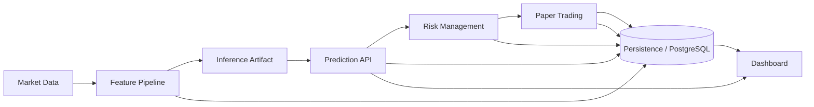

# AlphaLens

A deterministic quantitative research, inference, and trading-operations platform for financial time series.

[](#)
[](#license)
[](#tech-stack)
[](#tech-stack)
[](#tech-stack)
[](#tech-stack)
[](#tech-stack)
[](#deployment)
[](#deployment)

AlphaLens exists to make quantitative research and model deployment auditable end to end.

It was built for the failure modes that matter in financial systems: look-ahead bias, leaked labels, unverifiable predictions, hidden data revisions, and inconsistent model replay. AlphaLens treats reproducibility as a product requirement, not an afterthought. Every major artifact is versioned, hash-verified, and traceable to the data and configuration that produced it.

The current production surface serves a packaged Ridge Regression inference artifact through a read-only API. The same repository also contains the full research chain that produced that artifact: deterministic historical ingestion, feature engineering, walk-forward validation, explainability, statistical validation, residual diagnostics, market regime analysis, final model selection, holdout evaluation, backtesting, risk controls, paper trading, and a production dashboard.

> [!IMPORTANT]
> The live inference API is read-only. It does not train, fit, tune, or mutate models, and it fails closed when configuration, database state, or artifact hashes do not validate.

## Features

| Area | Implemented capability | Notes |
| --- | --- | --- |
| Data layer | Deterministic market-data ingestion and historical expansion | Kraken-backed BTC/USD OHLCV ingestion with pagination, validation, and provenance. |
| Data quality | Chronological validation and issue reporting | Detects ordering problems, gaps, duplicates, incomplete candles, and invalid values without fabricating fixes. |
| Feature engineering | Deterministic feature pipeline | Point-in-time time-series features with Decimal precision and immutable provenance. |
| Targets | Forward log-return generation | 5-day forward target with label availability timestamps and audit trail. |
| Validation | Walk-forward chronological validation | Purge/embargo logic and a protected final holdout. |
| Modeling | Approved baseline regressors | Linear Regression, Ridge Regression, Random Forest Regression, and XGBoost Regression. |
| Evaluation | Deterministic experiment registry | Immutable experiment records, split hashes, configuration hashes, and result hashes. |
| Explainability | Model explainability artifacts | Random Forest importance, permutation importance, and TreeSHAP for approved tree models. |
| Statistics | Statistical validation reports | Fold-level metrics, pairwise tests, confidence intervals, effect sizes, and multiple-comparison correction. |
| Diagnostics | Residual diagnostics | Distribution summaries, autocorrelation checks, heteroscedasticity tests, and deterministic plots. |
| Regimes | Market regime analysis | Deterministic regime classification and performance-by-regime reporting. |
| Selection | Final model selection | Deterministic selection report based only on prior evidence. |
| Holdout | One-time holdout evaluation | Protected holdout replayed exactly once and then marked consumed. |
| Inference | Immutable production artifact | Packaged Ridge artifact with schema, coefficient, scaler, and SHA-256 verification. |
| Serving | Live Prediction API | Read-only versioned inference endpoints with strict request and schema validation. |
| Operations | Backtesting engine | Deterministic strategy simulation, portfolio accounting, and reporting. |
| Risk | Risk management framework | Rule-based trade rejection, forced exits, and position sizing controls. |
| Trading simulation | Paper trading engine | Deterministic simulated trading over live market data. |
| UI | AlphaLens dashboard | Read-only views for predictions, portfolio state, trade history, risk events, backtests, and system health. |
| Deployment | Docker and GitHub Actions | Container builds, compose orchestration, and CI workflows for backend, frontend, and images. |
| Provenance | SHA-256 evidence chain | Immutable artifacts, logs, and report hashes are linked across the pipeline. |
| Testing | Automated verification | Backend, frontend, deployment, and repeatability tests. |

## Architecture



The repository separates research evidence from runtime services. PostgreSQL stores immutable research artifacts, operational reports, prediction evidence, and dashboard projections. The dashboard is a read-only consumer of verified backend data.

## Research Pipeline

AlphaLens already includes the completed research chain that led to the current production artifact.

1. Data ingestion and validation
   - Kraken-backed BTC/USD daily OHLCV ingestion
   - pagination and backfill support
   - duplicate, gap, ordering, completeness, and value checks

2. Feature engineering
   - deterministic time-series features
   - Decimal-based calculations
   - point-in-time correctness

3. Target generation
   - 5-day forward log return labels
   - label availability timestamps
   - immutable target provenance

4. Validation
   - chronological walk-forward splits
   - purge and embargo boundaries
   - protected final holdout

5. Explainability
   - impurity-based importance for Random Forest
   - permutation importance on development predictions
   - TreeSHAP for Random Forest and XGBoost

6. Statistical testing
   - fold-level comparison of approved baselines
   - Wilcoxon signed-rank tests
   - paired t-tests where assumptions were satisfied
   - deterministic bootstrap confidence intervals
   - Holm-Bonferroni correction

7. Residual diagnostics
   - distribution summaries
   - QQ plots
   - residual-vs-predicted and residual-vs-actual plots
   - autocorrelation and heteroscedasticity checks

8. Market regime analysis
   - deterministic trend and volatility regimes
   - regime-level model performance

9. Model selection
   - deterministic scoring across approved baselines
   - immutable final selection report

10. Holdout evaluation
    - one-time protected holdout replay
    - prediction hash verification
    - holdout consumption recording

## Engineering Pipeline

The engineering side packages the selected model and serves it safely.

- Inference packaging
  - Ridge coefficients, intercept, scaler state, schema, metadata, and SHA-256 verification are captured in an immutable artifact.
- Live Prediction API
  - Read-only REST endpoints serve deterministic predictions from the packaged artifact.
  - Request schema, feature ordering, and schema hashes are strictly validated.
- Backtesting
  - Strategies are simulated deterministically with portfolio accounting and performance metrics.
- Risk management
  - Trade gating, sizing controls, stop-loss logic, and portfolio protection rules are enforced before execution.
- Paper trading
  - The engine consumes live market data, generates predictions, applies risk rules, and records simulated trades.
- Dashboard
  - The frontend presents the verified operational and research evidence without recomputing it locally.
- Deployment
  - Docker, Compose, GitHub Actions, health checks, and startup validation support reproducible release workflows.

## Tech Stack

| Category | Technologies |
| --- | --- |
| Languages | Python 3.11+, TypeScript |
| Backend | FastAPI, Uvicorn, SQLAlchemy, Alembic |
| Research / ML | scikit-learn, XGBoost, SHAP, SciPy |
| Database | PostgreSQL 16 |
| Frontend | Next.js 16.2.12, React 19, Tailwind CSS, shadcn/ui, lightweight-charts |
| Tooling | `uv`, npm, Ruff, ESLint, Git, GitHub Actions |
| Testing | `unittest`, Vitest, testing-library, `docker compose config`, `actionlint`, `shellcheck` |
| Deployment | Docker, Docker Compose |
| Visualization | TradingView Lightweight Charts, SVG report artifacts |

## Repository Structure

```text
.
├── backend/
│   ├── app/
│   ├── alembic/
│   ├── scripts/
│   └── tests/
├── frontend/
│   ├── app/
│   ├── components/
│   ├── lib/
│   └── tests/
├── .github/
├── API.md
├── BACKTESTING.md
├── DEPLOYMENT.md
├── MODEL_INFERENCE_ARTIFACT.md
├── PAPER_TRADING.md
├── RISK_MANAGEMENT.md
├── docker-compose.yml
└── README.md
```

## Quick Start

> [!NOTE]
> The production prediction API is read-only and expects the approved database state and verified artifact hashes. A brand-new empty database is not production-ready.

### Clone

```shell
git clone https://github.com/Sonalingowda/alphalens.git
cd alphalens
```

### Backend

```shell
cd backend
uv sync --frozen --no-dev
cp .env.production.example .env.production
set -a
. ./.env.production
set +a
uv run python -m app.startup configuration
uv run alembic upgrade head
uv run python -m app.startup readiness
uv run uvicorn app.prediction_api:app \
  --host "$ALPHALENS_API_HOST" \
  --port "$ALPHALENS_API_PORT" \
  --workers "$ALPHALENS_API_WORKERS" \
  --no-access-log \
  --no-server-header \
  --no-proxy-headers
```

### Frontend

```shell
cd frontend
npm ci
cp .env.production.example .env.production.local
npm run build
npm start
```

For local development, `npm run dev` is also available.

### Docker

```shell
cp .env.example .env
docker compose config --quiet
docker compose up -d postgres
# Restore the approved production PostgreSQL backup before starting the API.
docker compose build --pull
docker compose up -d
```

## API

The production inference API is versioned under `/api/v1`. Root-path aliases are also available for compatibility.

### `GET /health`

Checks artifact verification and read-only service readiness.

```json
{
  "status": "healthy",
  "api_version": "1.0.0",
  "artifact_status": "verified",
  "artifact_identifier": "c288085a-54b6-4fa9-8a87-08f78745c34d",
  "read_only": true
}
```

### `GET /version`

Returns the API version and read-only inference mode.

```json
{
  "api_name": "AlphaLens Live Prediction API",
  "api_version": "1.0.0",
  "route_version": "v1",
  "inference_mode": "packaged_artifact_only",
  "read_only": true
}
```

### `GET /model`

Returns immutable model metadata and the exact ordered feature schema.

```json
{
  "api_version": "1.0.0",
  "artifact_identifier": "<artifact UUID>",
  "model_family": "ridge_regression",
  "artifact_version": "1.0.0",
  "artifact_sha256": "<64 lowercase hexadecimal characters>",
  "configuration_hash": "<64 lowercase hexadecimal characters>",
  "feature_pipeline_version": "1.1.0",
  "target_version": "1.0.0",
  "target_name": "forward_log_return",
  "horizon_observations": 5,
  "schema_hash": "<64 lowercase hexadecimal characters>",
  "feature_count": 12,
  "ordered_feature_names": [
    "bollinger_20_2_lower",
    "bollinger_20_2_middle",
    "bollinger_20_2_upper",
    "ema_20",
    "ema_50",
    "macd_12_26_9_histogram",
    "macd_12_26_9_line",
    "macd_12_26_9_signal",
    "rsi_14",
    "sma_20",
    "sma_50",
    "volume_sma_20"
  ]
}
```

### `GET /metrics`

Returns operational counters and latency metrics for the running API process.

```json
{
  "api_version": "1.0.0",
  "request_count": 3,
  "successful_request_count": 3,
  "error_request_count": 0,
  "prediction_count": 1,
  "average_latency_microseconds": 1250.0,
  "maximum_latency_microseconds": 2400,
  "health": "operational"
}
```

### `POST /predict`

Validates an exact ordered feature vector and returns a deterministic prediction from the packaged artifact.

```json
{
  "api_version": "1.0.0",
  "schema_hash": "<exact hash returned by GET /model>",
  "prediction_timestamp": "2026-07-28T00:00:00+00:00",
  "features": [
    {"name": "bollinger_20_2_lower", "value": "100000.000000000000000000"},
    {"name": "bollinger_20_2_middle", "value": "105000.000000000000000000"},
    {"name": "bollinger_20_2_upper", "value": "110000.000000000000000000"},
    {"name": "ema_20", "value": "105000.000000000000000000"},
    {"name": "ema_50", "value": "104000.000000000000000000"},
    {"name": "macd_12_26_9_histogram", "value": "100.000000000000000000"},
    {"name": "macd_12_26_9_line", "value": "500.000000000000000000"},
    {"name": "macd_12_26_9_signal", "value": "400.000000000000000000"},
    {"name": "rsi_14", "value": "55.000000000000000000"},
    {"name": "sma_20", "value": "105000.000000000000000000"},
    {"name": "sma_50", "value": "104000.000000000000000000"},
    {"name": "volume_sma_20", "value": "1000.000000000000000000"}
  ]
}
```

Successful response:

```json
{
  "api_version": "1.0.0",
  "prediction_timestamp": "2026-07-28T00:00:00Z",
  "inference_timestamp": "<UTC ISO-8601 timestamp>",
  "target_name": "forward_log_return",
  "target_version": "1.0.0",
  "horizon_observations": 5,
  "predicted_forward_log_return": "<deterministic decimal result>",
  "predicted_float_hex": "<exact IEEE-754 hexadecimal value>",
  "prediction_hash": "<64 lowercase hexadecimal characters>",
  "feature_vector_hash": "<64 lowercase hexadecimal characters>",
  "schema_hash": "<validated request schema hash>",
  "artifact_identifier": "<artifact UUID>",
  "artifact_sha256": "<verified artifact hash>",
  "configuration_hash": "<immutable artifact configuration hash>"
}
```

## Dashboard

The frontend dashboard is read-only and consumes the verified API and immutable report evidence.

| Page | What it shows |
| --- | --- |
| Dashboard | Current prediction, signal, portfolio value, daily P&L, unrealized P&L, open positions, closed trades, risk events, API health, artifact ID, and model version. |
| Predictions | Immutable prediction history, evidence hashes, and a prediction series chart. |
| Paper Trading | Paper portfolio state, signals, orders, trades, and performance summaries from simulated execution. |
| Portfolio | Equity curve, daily returns, drawdown, position exposure, and portfolio balances. |
| Trade History | Read-only simulated trade ledger and trade metadata. |
| Risk Events | Recorded risk rule triggers, rejects, and forced exits. |
| Backtest Reports | Immutable backtest reports, trade logs, and equity curves. |
| System Health | API, database, artifact, resource, and test status. |
| Settings | Runtime configuration, system metadata, and operational settings. |

## Testing

The repository uses deterministic automated tests at multiple layers:

- Backend unit and integration coverage for research, inference, persistence, API, deployment, and observability code.
- Frontend component, API-integration, and build verification tests.
- Repeatability checks for immutable artifacts, hashes, and report regeneration.
- Deployment checks for Compose validation, container builds, linting, and startup scripts.

Verified totals from the last release run:

- Backend tests: 112 passed.
- Frontend tests: 8 passed.

Additional verified checks included backend compilation, frontend type checking, frontend linting, production builds, `docker compose config --quiet`, `actionlint`, and `shellcheck`.

## Security

AlphaLens is designed to fail closed when integrity checks do not pass.

- Read-only inference: the public prediction API does not train, fit, tune, or mutate models.
- Immutable artifacts: model, report, and audit records are stored as hash-verified evidence.
- SHA-256 provenance: configuration, schema, prediction, and artifact hashes are recorded and verified.
- Configuration validation: production startup rejects malformed or placeholder configuration.
- CORS: production uses an explicit allowlist and does not permit wildcard origins.
- Request validation: prediction requests are schema-checked, size-limited, and order-sensitive.
- Audit logging: API requests and immutable audit records are recorded with traceable metadata.

## Deployment

Deployment is reproducible through Docker, Compose, and GitHub Actions.

- Dockerfiles exist for backend and frontend production images.
- `docker-compose.yml` provisions PostgreSQL and the application services with health checks.
- GitHub Actions workflows run backend tests, frontend tests, type checking, linting, and container builds.
- Startup validation checks configuration, migrations, database connectivity, and artifact verification before serving traffic.
- Recovery guidance and backup strategy are documented in [DEPLOYMENT.md](DEPLOYMENT.md).

## Roadmap

### Completed

- Deterministic historical market-data ingestion and validation
- Feature engineering and target generation
- Chronological validation and holdout isolation
- Baseline model training and deterministic evaluation
- Explainability, statistical validation, residual diagnostics, and regime analysis
- Final model selection and one-time holdout evaluation
- Immutable inference artifact packaging
- Live Prediction API
- Backtesting engine
- Risk management framework
- Paper trading engine
- AlphaLens dashboard
- Docker deployment and CI/CD

### Future

- Additional market data providers
- Additional research targets and label families
- Additional model families beyond the current approved set
- Broker connectivity
- Live trading
- Authentication and authorization
- Multi-asset and multi-strategy expansion
- Expanded operational observability

## Contributing

Contributions should preserve determinism, provenance, and chronology.

1. Branch from `main`.
2. Keep changes scoped and reviewable.
3. Run the backend and frontend verification commands before opening a PR.
4. Do not alter immutable research artifacts without explicit approval.
5. Document any assumption that affects reproducibility, auditability, or operational behavior.

## License

No license file is currently present in the repository. Usage terms are therefore unspecified.
