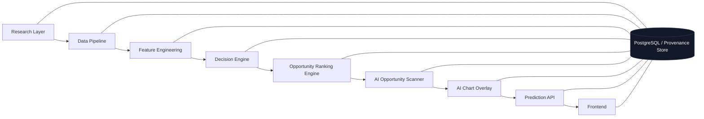

# AlphaLens v2 Target Architecture

This document describes the intended AlphaLens v2 architecture after
migration. It is a target-state blueprint, not a description of the current
code.

## Architecture overview

The architecture is intentionally centered on opportunity identification, not
trade execution. There is no broker, no order router, no portfolio manager,
and no paper-trading subsystem in the product boundary.

## Layer-by-layer design

### 1. Research Layer

**Responsibility**

- Define research hypotheses.
- Generate labels and evaluation evidence for intraday opportunity behavior.
- Run offline validation, calibration, explainability, and regime analysis.
- Materialize immutable experiment artifacts.

**Inputs**

- Historical intraday candles.
- Approved feature sets.
- Decision labels and evaluation configuration.
- Provenance and time-sliced validation boundaries.

**Outputs**

- Versioned research artifacts.
- Model/evidence registries.
- Calibration summaries.
- Explainability reports.
- Research provenance hashes.

**Interfaces**

- Persistence-backed research job APIs.
- Report builders.
- Offline replay interfaces.

**Dependencies**

- PostgreSQL.
- Data pipeline.
- Feature engineering.
- Evaluation and reporting utilities.

### 2. Data Pipeline

**Responsibility**

- Ingest BTC/USD intraday market data.
- Normalize and validate candles.
- Track provider provenance and completeness.
- Persist historical data with immutable audit fields.

**Inputs**

- Kraken public market data or another approved provider.
- Ingestion scheduling configuration.

**Outputs**

- Canonical intraday candle store.
- Ingestion batch records.
- Validation reports.

**Interfaces**

- Provider abstraction.
- Ingestion/backfill services.
- Persistence repositories.

**Dependencies**

- Market-data provider layer.
- PostgreSQL.
- Validation rules.

### 3. Feature Engineering

**Responsibility**

- Convert validated candles into point-in-time features.
- Maintain versioned feature pipelines.
- Enforce leakage-safe lookbacks.
- Persist feature runs and feature values.

**Inputs**

- Validated candle series.
- Feature pipeline configuration.

**Outputs**

- Feature vectors aligned to timestamps.
- Feature provenance records.
- Feature hashes and pipeline version metadata.

**Interfaces**

- Feature pipeline contract.
- Feature store persistence.

**Dependencies**

- Data pipeline.
- Time-series feature library.
- Provenance store.

### 4. Decision Engine

**Responsibility**

- Evaluate approved point-in-time evidence under a versioned decision policy
  to produce BUY, SELL, or WAIT.
- Enforce abstention when evidence is insufficient.
- Keep decision semantics deterministic.

**Inputs**

- Point-in-time feature vectors and other approved evidence.
- Approved decision-policy configuration.

**Outputs**

- Decision objects.
- Optional decision-support opportunity context.
- Decision metadata.

**Interfaces**

- Decision contract API.
- Policy configuration.
- Replayable evaluation hook.

**Dependencies**

- Feature engineering.
- Research/evaluation evidence.

### 5. Opportunity Ranking Engine

**Responsibility**

- Rank candidate opportunities by quality.
- Filter low-quality setups under the approved ranking policy; apply
  confidence criteria only when calibrated confidence is available and
  explicitly authorized.
- Surface only the highest-priority items to the scanner.

**Inputs**

- Decisions.
- Optional approved calibration metadata.
- Regime metadata.
- Quality scores.

**Outputs**

- Ranked opportunity feed.
- Priority metadata and optional calibrated confidence metadata.

**Interfaces**

- Queryable ranking API.
- Pagination/filtering contracts.

**Dependencies**

- Decision engine.
- Approved ranking policy and research/evaluation evidence.
- Optional approved calibration evidence when explicitly used by the ranking
  policy.

### 6. AI Opportunity Scanner

**Responsibility**

- Continuously scan supported markets and timeframes.
- Produce the ranked opportunity feed.
- Maintain scanner status and freshness.

**Inputs**

- Market data.
- Features.
- Decisions.
- Rankings.

**Outputs**

- Opportunity list.
- Scanner health/freshness state.
- Latest ranked setups.

**Interfaces**

- Scanner API.
- Scheduling interface.
- Dashboard feed.

**Dependencies**

- Data pipeline.
- Feature engineering.
- Decision engine.
- Opportunity ranking engine.

### 7. AI Chart Overlay

**Responsibility**

- Render BUY / SELL / WAIT, entry, stop loss, take profit, risk/reward,
  hold time, and reasoning directly on the chart.
- Display regime/annotation layers such as trend, support, resistance,
  breakout, liquidity, volatility, and market regime.

**Inputs**

- Scanner output.
- Decision metadata.
- Chart data.
- Annotation metadata.

**Outputs**

- Chart overlay objects.
- Annotation payloads.
- View-ready opportunity context.

**Interfaces**

- Overlay rendering API.
- Chart annotation schema.
- Frontend chart component contract.

**Dependencies**

- Opportunity scanner.
- Frontend charting library.
- Decision engine.

### 8. Prediction API

**Responsibility**

- Expose the authoritative runtime contract for scanner and overlay data.
- Serve deterministic opportunity/decision payloads.
- Validate request shape and schema hashes.
- Remain read-only and auditable.

**Inputs**

- Ranked opportunities.
- Decision objects.
- Chart overlay metadata.

**Outputs**

- API responses.
- Audit records.
- Health and version metadata.

**Interfaces**

- REST endpoints.
- Versioned request/response schemas.

**Dependencies**

- Decision engine.
- Opportunity scanner.
- PostgreSQL audit/provenance store.

### 9. Frontend

**Responsibility**

- Present the chart-first workspace.
- Display ranked opportunities and AI overlay annotations.
- Provide system status and evidence inspection.

**Inputs**

- Prediction API responses.
- Scanner feeds.
- Dashboard/evidence payloads.

**Outputs**

- User-facing views of charts, overlays, scanner results, and system state.

**Interfaces**

- Next.js App Router pages.
- Chart components.
- Read-only API client.

**Dependencies**

- Prediction API.
- UI primitives.
- Charting library.

## System boundaries

### What is inside the product boundary

- research and validation for opportunity identification;
- market data ingestion and feature generation;
- decision and ranking logic;
- chart overlays and scanner UX;
- read-only API serving those artifacts; and
- immutable provenance storage.

### What is outside the product boundary

- broker connectivity;
- live order execution;
- portfolio management;
- paper trading;
- backtesting as a product feature;
- copy trading; and
- any trading-operations surface that suggests AlphaLens executes trades.

## Interfaces and contracts

The v2 migration should treat the following as stable contracts:

- intraday candle schema and provenance keys;
- feature vector order and feature pipeline version;
- decision object shape;
- opportunity ranking contract;
- scanner freshness/health contract;
- chart overlay annotation schema;
- immutable report hash contracts; and
- dashboard view contracts.

The current repository already contains strong precedents for contract
discipline in:

- `backend/app/api/schemas.py`
- `backend/app/inference/service.py`
- `backend/app/persistence/models.py`
- `frontend/lib/types.ts`

Those patterns should be retained, but the contracts themselves will need to
change for v2.

## Future extensibility

The v2 architecture should be extensible in the following ways:

- more assets can be added without changing the core scanner contract;
- more timeframes can be added without changing the chart overlay contract;
- new annotation types can be added without changing the decision engine;
- ranking policies can evolve without changing the raw data pipeline; and
- confidence rules can tighten without altering the front-end rendering
  model.

The key design principle is that research evidence, decision evidence, and
UI evidence remain separable.

## Evidence from the current repository that informs this target

- `backend/app/main.py:61-260`
- `backend/app/api/application.py:49-355`
- `backend/app/market_data/*`
- `backend/app/features/*`
- `backend/app/validation/splits.py`
- `backend/app/research/*`
- `backend/app/persistence/models.py:32-3241`
- `frontend/app/*`
- `frontend/components/dashboard/*`
- `frontend/lib/*`
- `README.md:15-49, 71-144`
- `frontend/README.md:3-57`

The current repository already provides many platform primitives, but the v2
target architecture is a different product.
